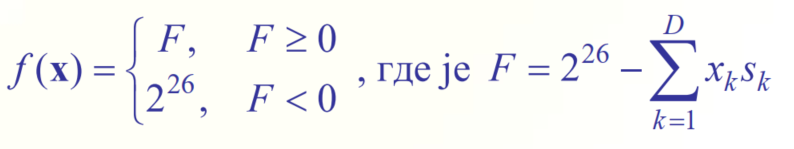

# Genetic Algorithm

## Simulation of Survival

- **Basic Idea:** Implementation of survival algorithms from nature.
- The Genetic Algorithm (GA) is one of the general approaches to optimization.
- It is based on the principle of natural selection and the survival of the fittest individuals in the environment.
- GA belongs to the class of stochastic algorithms for global optimization.
- The algorithm is often described using strict mathematical definitions that require abstract definitions of operators.

## Elements of GA: Individuals, Genes, and Fitness

- A possible solution to an optimization problem (a point in the optimization space) is called an individual and consists of genes.
- The vector of optimization variables is an individual \( x = (x_1, x_2, \ldots, x_D) \).
- Each individual has as many genes as there are variables in the optimization function (the number of genes equals the dimensions of the optimization space, \( D \)).
- One optimization variable for a given problem instance represents one gene.
- A gene is the smallest unit for recombination (search space exploration).
- The value of the optimization function, \( f(x) \), at a point in the optimization space is called the fitness of the individual.
  - One gene does not have \( f \).
  - A group of genes defining an individual has \( f \).

## Elements of GA: Population and Generation

- GA performs operations on a set of solutions in the optimization space.
  - Other previously described algorithms operate with only one (best) solution, which they improve.
  - The NM simplex works with a set of exactly \( D+1 \) solutions, but one (best) solution is constantly monitored.
- The set of individuals (solutions) is called a population.
- The population size must be greater than one—typically 100, 1000, or (much) more.
- During optimization, the current population is replaced by the next population of solutions.
- The population in one algorithm step is called a generation.

## Basic Idea of GA and Formation of the Initial Generation

- Idea: The next generation of solutions is formed from the best solutions of the previous generation, which (should) be better.
- By forming successive generations, increasingly better solutions to the optimization problem are obtained.
- GA starts by forming an initial population (starting set of solutions), usually called the initial or zero generation.
  - Typically, it is a set of random vectors in the optimization space.
  - It can also be formed in other ways (deterministically, uniformly, based on estimates, etc.).
  - GA does not delve into the method of forming the zero generation.

## Block Diagram and Formal Steps of GA

- One GA step consists of three operations:
  - Selection
  - Crossover
  - Mutation
- Using these operations, the next generation is obtained from the previous generation.
- This is the most general case of the algorithm; by skipping certain operators, special cases are obtained.

## Binary and Continuous GA

- Depending on the representation of genes, two classes of GA are distinguished:
  - Binary GA
  - Continuous GA
- In literature, GA often refers to binary GA.
- The representation of genes determines the realization of crossover and mutation operators.
- There are conflicting opinions in the literature on which representation is better (it depends on the specific problem).

## Gene Representation

- In nature, genes of living organisms are represented by a discrete set of elements.
  - The maximum number of possible combinations of the human genome is \( 43,000,000,000 \).
- For this reason, in the first applications of GA, optimization parameters were represented binarily.
- Binary representation is very suitable for discrete combinatorial optimization problems (SAT, TSP).
- For real variables, conversion and discretization are required, complicating the implementation of the algorithm.
- Genes can also be real numbers, accurate to machine precision.
- All optimization problems (SAT, TSP, NLP) can be solved using GA.

## Selection Operator

- Within the current generation, a set of parent solutions is selected.
  - In nature, these are the population members who have offspring.
- This set is used to create the next generation, while other members of the current generation do not participate in forming the next generation.
- This favors the propagation of good solutions and allows their further improvement.
- Selection can be realized:
  - Stochastically
  - Deterministically

## Selection Strategies

- Commonly used selection strategies:
  - Decimation
  - Proportional (roulette) selection
  - Tournament selection
- There are variations for each of these strategies.
- Many other strategies have been proposed in the literature and used in practice.
- There is no conclusion on which strategy is (the best).

### Decimation

- Population decimation:
  - Sorting the population according to the optimization function.
  - Then, a subset of the top \( k \) (best) solutions is selected.
- The advantage of this approach is the simplicity of implementation.
- The disadvantage is the too-rapid loss of genetic diversity within the population.

### Elitism and Decimation

- When forming the next generation, the best-selected solutions can be:
  - Retained (elitist approach).
  - Completely discarded.
- Although it may seem beneficial to retain at least the best solution from the previous generation, numerical experiments (statistical) show otherwise.
- The elitist strategy:
  - Contributes to faster algorithm convergence.
  - Increases the probability of converging the entire generation to a local minimum, from which it takes the algorithm a long time to escape.
- The elitist approach is not suitable in general but can be used as an option to accelerate algorithm convergence.

### Proportional (Roulette) Selection

- Each individual is assigned a selection probability \( p_i \) proportional to its fitness \( f_i \).
- One individual is randomly selected to participate in creating the next population.

- Illustration: For a population of 5 individuals, a random variable from the set [0,1] selects one individual.

- By repeatedly selecting, a group of individuals for crossover is obtained.
- This favors the best solutions but retains a finite probability that a poor (but "lucky") solution will participate in crossover.
- Genetic diversity is increased during optimization, but the specific implementation of selection becomes more complex.
- This slows down the convergence of GA.

### Tournament Selection

- A random subset of \( N \) individuals is selected from the population.
- Binary tournaments (N=2) are commonly used.
- In the chosen subset, the individual with the best fitness is selected for crossover.
- The selected individual is removed from the primary population to avoid being selected again.
- Repeating this process obtains all individuals for crossover.
- Reduces the probability of rapid genetic diversity loss.
- Has lower complexity and computational requirements than proportional selection, making it more suitable for implementation.

## Selection Operator: Conclusions

- Selection is based on the optimization function (fitness).
- Choosing the selection strategy involves a trade-off between the algorithm's convergence speed and the likelihood of finding a local instead of a global minimum.
- The choice of selection strategy does not depend on the representation of the optimization problem.
- All described selection strategies can be applied to any optimization problem (SAT, TSP, NLP).
- Formally, any operation that selects a subset of solutions from the current generation is a selection operator.
  - Random selection: GA = random search.

## 2. Crossover Operator

### Group Selection
- By selecting two or more solutions from the set of the best ones, a group of solutions for crossover is formed.
- New solutions are generated by crossing these solutions.

### Types of Crossover
- **Stochastic Crossover**: 
  - Crossover probability is the likelihood that the selected group of individuals will cross over, typically ranging from 0.6 to 0.9.
- **Deterministic Crossover**:
  - The specific implementation of the crossover operator depends on the problem representation.

#### Binary Crossover (SAT Problems)
- Genes are binary: \( x_k = \{0,1\} \).
- Individuals (solutions) are sequences of bits.
  - Example: \( x = (0,1,1,0,1,0,0,1) \)
- Two selected solutions are crossed over by randomly choosing a crossover point.
- The resulting subsequences form two new offspring solutions.

#### Example of Binary Crossover
- Crossing two 16-bit solutions:
  
- This process is called one-point crossover.
- Modifications are possible to have two, three, or more crossover points.

#### Continuous Crossover (NLP Problems)
- Continuous representation of genes (real variables, \( x_k \in \mathbb{R} \)).
- Crossover is often done using a linear combination of vectors representing parents (\( r1 \) and \( r2 \)), with a parameter \( 0 < \alpha < 1 \):
  - \( d1 = r2 + \alpha(r1 - r2) = \alpha r1 + (1 - \alpha) r2 \)
  - \( d2 = r2 - \alpha(r1 - r2) = -\alpha r1 + (1 + \alpha) r2 \)
  - \( d3 = r1 + \alpha(r1 - r2) = (1 + \alpha) r1 - \alpha r2 \)

#### Example of Continuous Crossover
- Example with two parents \( r1 \) and \( r2 \), and three offspring \( d1, d2, d3 \):
  
- Different implementations of crossover operators for NLP are suggested in literature.
- Different crossovers did not drastically improve the convergence of the algorithm on a larger number of optimization examples.

#### Crossover for TSP Problems
- TSP problems are represented as sequences of permuted elements.
- Example solutions: \( x1 = \{1,3,2,4,5\} \), \( x2 = \{3,2,5,4,1\} \).
- Creativity is required for crossing two permutations.
- The simplest method uses one parent and swaps a few genes.

### Illustration of TSP Crossover with Two Cuts
- Sequence with 10 variables:
  - Two crossover points are selected from the first parent.
  - Genes between the crossover points are copied to the new solution, and the remaining genes are copied from the second parent.
  - Example:
    - \( x1 = (7, 1, 5, 8, 6, 3, 2, 10, 9, 4) \)
    - \( x2 = (2, 3, 8, 6, 1, 4, 9, 10, 7, 5) \)
    - Result: \( x = (5, 8, 6, 3, 2, 1, 4, 9, 10, 7) \)

### Illustration of TSP Crossover with k Genes
- Sequence with \( D = 10 \) variables, selection of \( k = 3 \) genes:
  - Select \( k \) genes from the first parent and copy them into the new solution.
  - The remaining \( D - k \) genes are copied from the second parent.
  - Example:
    - \( x1 = (7, 1, 5, 8, 6, 3, 2, 10, 9, 4) \)
    - Selected genes: 1, 5, 2
    - \( x2 = (2, 3, 8, 6, 1, 4, 9, 10, 7, 5) \)
    - Result: \( x = (1, 5, 2, 3, 8, 6, 4, 9, 10, 7) \)

### Illustration of TSP Crossover with k Swaps
- Sequence with 10 variables, \( k = 2 \) (two swaps):
  

### Conclusions on Crossover Operator
- Crossover generates new solutions to the optimization problem (new individuals) from selected solutions.
- It is repeated as many times as needed to form all the solutions (individuals) for the next generation.
- The choice of crossover method depends on the problem representation.
- Each type of problem (SAP, TSP, NLP) has specific crossover implementations.
- Formally, any operation that generates new solutions from one or more selected solutions is a crossover operator.

## 3. Mutation

### Stochastic Implementation
- Mutation is always stochastic.
- With a predetermined probability, genes within the newly formed generation are randomly changed.
- Mutation adds new genetic material to the next generation (introduces new information about the optimization space).
- It allows the exploration of unexplored parts of the optimization space.
- The mutation probability is usually small, typically from 0.01 to 0.15.
- Edge values for mutation probability:
  - \( \approx 1 \): GA = random search
  - \( \approx 0 \): GA = local search

### Mutation for SAT, NLP, TSP
- **SAT**: Changes a bit in the genetic sequence with a predetermined probability.
  - Original: \( x = (1,0,1,1,0,1,0,0) \)
  - Mutated: \( x = (1,0,0,1,0,1,1,0) \)
- **NLP**: The entire gene is replaced with a random value within the allowable range, with a predetermined mutation probability.
  - Original: \( x = (0.81, 0.24, 0.93, –0.35) \)
  - Mutated: \( x = (0.81, –0.62, 0.93, –0.35) \)
- **TSP**: A subset of genes is randomly changed (similar to crossover with k swaps).

### Mutation Operator
- Random change in the value of a gene in one solution.

## Termination Criteria

### Stopping Conditions
- The algorithm stops when a solution is found or when genes of the entire generation differ by less than a predetermined threshold.
- If optimization is performed long enough, mutations will eventually find the global minimum.
- Practically, it's often unacceptable to wait that long, so the algorithm stops after a certain number of generations if the termination criteria are not met earlier.
- Experimentally, it is found that after ~50 generations, the algorithm converges for populations up to 200,000 individuals.

## GA Parameters

### Key Parameters
- **Population Size (Npop)**
- **Number of Generations (Ngen)**
  - Total number of iterations (optimization function calculations) is \( Npop \times Ngen \).
- **Variable Representation**
- **Implementation of Each Operator (selection, crossover, and mutation)**
- **Choice of Probabilities for Stochastic Operators**

### Optimal GA Parameters
- Population size should be greater than the number of optimization variables.
- Larger population results in better solutions but requires more iterations.
- Number of generations: 30-100 is sufficient for relatively small populations (up to 200,000).
- Encoding: binary or continuous depending on the problem.
- Crossover probability: 0.8
- Mutation probability: 0.1
- Number of individuals that crossover: \( \approx \text{population} / 5 \)

## GA Implementation

### Tools and Languages
- **MATLAB**: Genetic algorithm (Global Optimization Toolbox)
- **Mathematica, Python, C/C++**: Only "unofficial" codes exist.
- The algorithm is complex and implementations have many degrees of freedom.
- It is difficult to use a GA implementation you are not familiar with due to the high number of degrees of freedom.

## GA Variations

### Different Implementations
- **Multipopulation GA**: Multiple populations coexist with the exchange of several individuals in each generation.
- **Micro GA**: Multiple repetitions of GA with relatively small populations.
- **Use of Local Optimization Algorithms** in conjunction with GA (multi-stage optimization).
- **GA with Algorithm Parameters** associated with optimization variables \( x_{tot} = (x_{opt}, x_{GA}) \):
  - GA parameters are variables that change during optimization.
  - GA self-adjusts its parameters (possible oscillations and divergence).

### Conclusions on GA
- Group of solutions (population) instead of one solution.
- **Advantages**:
  - Finds a global solution (after enough time, a mutation will occur that moves the algorithm to the vicinity of the global minimum).
  - Extremely easy to parallelize (adapted to the architecture of modern computers).
  - The larger the number of optimization variables, the more efficient the algorithm compared to other algorithms.
- **Disadvantages**:
  - The algorithm has many parameters.
  - Relatively complex to implement.
  - Slow convergence to the solution
