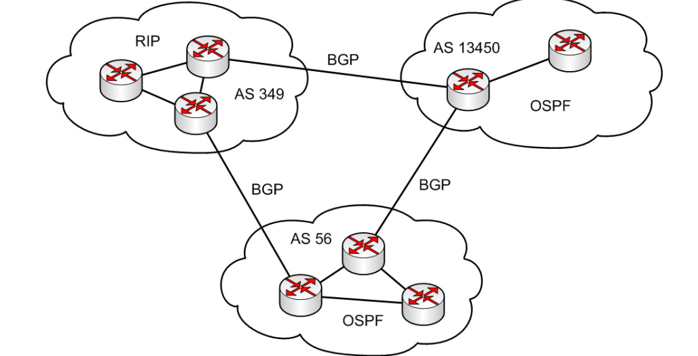
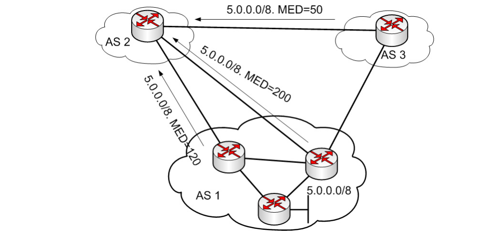

# Border Gateway Protocol (BGP)

BGP, or Border Gateway Protocol, is used to exchange routing information between autonomous systems (AS), which are primarily networks operated by Internet Service Providers (ISPs). BGP-4 is the current version, replacing the earlier Exterior Gateway Protocol (EGP) used during the NSFNET era. Unlike internal routing protocols that optimize for the most technically efficient path, BGP also considers non-technical factors like political and commercial agreements.

### Autonomous Systems

Autonomous systems are identified by unique AS numbers. The range from 64,512 to 65,535 is reserved for private use. Types of AS include:
- Single-homed (one exit point)
- Multi-homed nontransit (multiple exit points, no transit traffic)
- Multi-homed transit (multiple exit points, with transit traffic)

#### Single-homed AS

A single-homed AS can:
- Use a default route to forward traffic to the Internet.
- Be part of its provider’s IGP protocol.
- Operate as a private AS within the provider's AS.

#### Multi-homed AS without Transit

#### Multi-homed AS with Transit

### When Not to Use BGP
BGP may not be used in situations where:
- There is only one connection to the Internet or ISP.
- The network's routing policy is the same as the ISP's policy.
- Border routers do not support BGP or lack the resources to run BGP.
- The bandwidth between two networks is very low.

### Path Length to Internet Destinations
The distribution of AS path lengths to destinations on the Internet can be observed in BGP data from AS 6447 (University of Oregon) and AS 131072 (APNIC R&D).

### Basic Characteristics of BGP

1. **Distance-Vector Protocol**: BGP is a distance-vector routing protocol with mechanisms to prevent routing loops.
2. **Routing Decisions**: BGP makes routing decisions based on rules set by the network administrator.
3. **BGP-4**: The current version, defined in RFC 1772 and updated to RFC 4271, supports CIDR and route aggregation.
4. **TCP-Based**: BGP uses TCP port 179 for message exchanges, requiring IP connectivity between two routers.
5. **Route Management**: BGP maintains a table of routes and the autonomous systems from which these routes were learned to prevent loops.
6. **Extensibility**: BGP is easily extendable, supporting functionalities like IPv6, VPNs, and Multicast through various RFCs (e.g., RFC 2283, RFC 2858, RFC 4760).

### BGP Peers and Operation

When two routers establish a BGP connection, they become "BGP peers." Each router running BGP is known as a "BGP speaker." The process involves:

1. **Connection Establishment**: Routers exchange BGP messages to establish the connection (Open).
2. **Configuration Check**: If configuration parameters (AS numbers, IP addresses) do not match, the session fails, and Notification messages are sent.
3. **Route Exchange**: Once a session is established, routers exchange all known routes (Update). Subsequent updates are incremental.
4. **Keepalive Messages**: Sent every 60 seconds to maintain the session. These messages are 19 bytes in size.

### BGP Message Types

BGP messages have a common header and include:

- **Open**: Establishes a BGP session.
- **Keepalive**: Maintains the session.
- **Notification**: Indicates errors.
- **Update**: Contains routing information such as prefixes, AS paths, and attributes.

### BGP Session State Machine

The BGP session establishment involves several states:
1. **Idle**: Initial state waiting for an event to start the connection.
2. **Connect**: Attempts to establish a TCP session.
3. **Active**: Retries TCP session establishment if the initial attempt fails.
4. **OpenSent**: Waits for an Open message from the peer.
5. **OpenConfirm**: Waits for Keepalive or Update messages to transition to Established state.
6. **Established**: Regular operation where Update messages are exchanged.

In case of any errors, BGP reverts to the Idle state.

### Full Internet Routing Table Size (IPv4, 2023)

As the number of routes in the full Internet routing table grows, BGP routers must manage increasingly complex routing information to ensure efficient and accurate data delivery across the global Internet.

### EBGP Multihop

External BGP (EBGP) neighbors typically need to be directly connected on the same network segment to establish an EBGP session. However, when direct connectivity is not possible, EBGP multihop is used to establish the session over multiple hops, requiring IP connectivity between the routers.

### Different Types of BGP Sessions

### EBGP and IBGP

In BGP, routers do not advertise routes learned from their Internal BGP (IBGP) peers to other IBGP peers. This is to prevent routing loops within the autonomous system (AS).

- **EBGP** is used for routing between different ASes.
- **IBGP** is used for routing synchronization and coordination within the same AS.

### Continuity of BGP within an AS

For IBGP routers to learn all routes within an AS, they need to be fully meshed, meaning each IBGP router must have a direct connection to every other IBGP router in the AS. This full IBGP mesh can be logical rather than physical.

### Synchronization within an AS

BGP must be synchronized with the Interior Gateway Protocol (IGP) within an AS before it can advertise routes learned from IBGP to external peers. This synchronization ensures that all internal routes are known to the internal routers, avoiding potential routing issues.

### Solutions for Synchronization

1. **Redistribution of all routes into the IGP**: This can cause scalability and performance issues in the IGP.
2. **Internal routers using default routes to an exit router**: This method can lead to suboptimal routing.
3. **Full IBGP mesh within the AS**: All routers have direct IBGP sessions with each other, and synchronization can be disabled.

### Example BGP Commands

To check the current BGP routing information, the following commands can be used:

- **`show ip bgp`**: Displays the current BGP routing table.
- **`show ip bgp paths`**: Shows the paths for the BGP routes.

### Path Attributes in BGP

In BGP, path attributes are essential components in route and path configuration. Each route in BGP has specific attributes which fall into four categories:

1. **Well-known mandatory**: These attributes must be included in every BGP update message associated with a specific Network Layer Reachability Information (NLRI). Their absence results in an error.
2. **Well-known discretionary**: Recognized by all BGP implementations but not required to be included with every NLRI.
3. **Optional transitive**: These attributes may not be recognized by all BGP implementations but are forwarded to other BGP peers if they are not recognized.
4. **Optional nontransitive**: These attributes may not be recognized by all BGP implementations and are not forwarded if not recognized.

### Common Path Attributes

Below are common BGP path attributes and their types:

- **1-ORIGIN**: Well-known mandatory
- **2-NEXT-HOP**: Well-known mandatory
- **3-AS_PATH**: Well-known mandatory
- **4-MULTI_EXIT_DISC**: Optional nontransitive
- **5-LOCAL_PREF**: Well-known discretionary
- **6-ATOMIC_AGGREGATE**: Well-known discretionary
- **7-AGGREGATOR**: Well-known discretionary
- **8-COMMUNITY**: Optional transitive
- **9-ORIGINATOR_ID**: Optional nontransitive
- **10-Cluster list**: Optional nontransitive

### BGP Routing Process

When there are multiple BGP routes to a destination, BGP advertises only the best route to its peers. The selection of the best route can be controlled using various BGP attributes such as Next Hop, AS_Path, Atomic Aggregate, Aggregator, Local Preference, Weight, Multiple Exit Discriminator (MED), and Origin.

### Next Hop Attribute

The Next Hop attribute does not necessarily need to be on the directly connected network segment. The rules for the Next Hop attribute are as follows:

- In EBGP sessions, the Next Hop is the IP address of the EBGP neighbor that advertised the route.
- In IBGP sessions, if routes are advertised within the same AS, the Next Hop is the IP address of the router within the AS that advertised the route.
- In IBGP sessions, if routes are advertised into the AS from another AS via EBGP, the Next Hop received via EBGP is used unchanged in IBGP.

If a router does not have a route to the Next Hop attribute for a given route, that route will not be included in the routing table.

### AS Path Attribute

- Each AS that advertises a route adds its AS number to the AS_PATH attribute.
- If a router sees its own AS number in the AS_PATH attribute, it discards the route to prevent loops.
- BGP uses the AS_PATH attribute to help select the best path, with shorter AS paths typically being preferred.

Sometimes AS path prepending is used to artificially lengthen the AS_PATH attribute to influence route selection.

Private AS numbers must be taken off the AS Path atribute before the route hits the rest of the internet. 

### Origin Attribute

The Origin attribute indicates the origin of the route or prefix and is used in route selection. There are three types of Origin attributes:

1. **IGP**: The prefix was learned from the IGP within the AS.
2. **EGP**: The prefix was learned from BGP.
3. **Incomplete**: The prefix was learned through redistribution.

Routes with a lower Origin attribute type are preferred (IGP < EGP < Incomplete).

### Atomic Aggregate Attribute

The Atomic Aggregate attribute indicates route aggregation and loss of information in the AS_PATH attribute. It can be either True or False:

- **True**: The prefix was aggregated from multiple prefixes.
- **False**: No aggregation was performed.

### Aggregator Attribute

This attribute identifies the router that performed the aggregation and includes the Router ID of the aggregating router.

### Local Preference Attribute

Local Preference indicates the priority of a route within an AS. Routes with higher Local Preference values are preferred. This attribute is only exchanged within an AS and influences outbound traffic from the AS.

### Multiple Exit Discriminator (MED) Attribute

The MED attribute suggests the preferred path into an AS when there are multiple connections with another AS. Lower MED values are preferred, and the attribute is nontransitive, meaning it is not passed beyond the receiving AS.

### Weight Attribute

The Weight attribute is Cisco-specific, local to a router, and not exchanged with other routers. It influences the selection of outbound routes within an AS.

### Best Path Selection Process in BGP

1. If the Next Hop attribute is not in the routing table, the route is ignored.
2. (If the Weight attribute exists, the route with the highest Weight is selected.)
3. If Weight values are the same, the route with the highest Local Preference is selected.
4. If Local Preference values are the same, the route advertised by the current router is chosen.
5. If previous criteria are the same, the route with the shortest AS_PATH is selected.
6. If AS_PATH lengths are the same, the route with the lower Origin type is chosen.
7. If Origin types are the same, the route with the lower MED is selected.
8. If MED values are the same, routes learned via EBGP are preferred over those learned via IBGP.
9. The route with the lower IGP metric to the BGP Next Hop is preferred.
10. If all previous criteria are the same, the route that was received first is chosen.
11. If still tied, the route from the neighbor with the lower Router ID is preferred.
12. The path with the shorter cluster length is chosen.
13. The route from the neighbor with the lower IP address is preferred.

