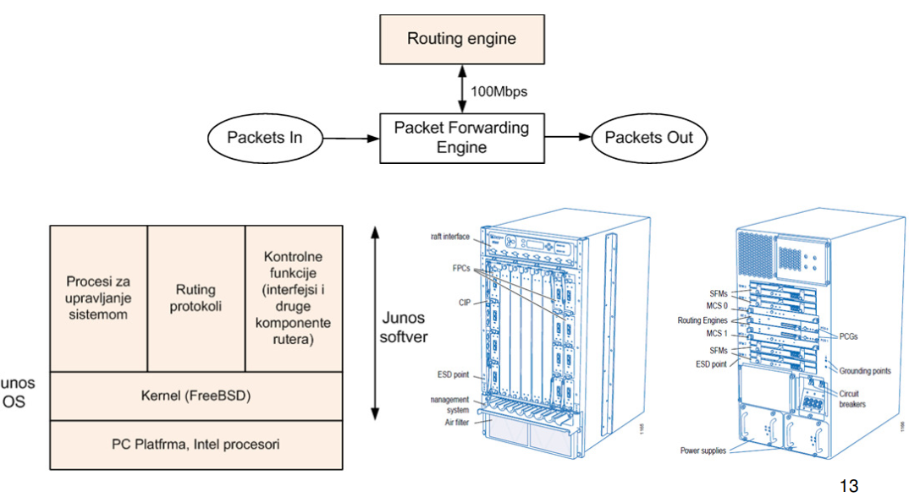

# Page 1

## 1VPN, MPLS, L2TP, IPsec

### Virtual Private Networks - VPN

- A virtual private network is a network of an institution or a group of users implemented over a public or shared infrastructure (Internet, provider networks).
- VPN technologies:
  - Frame Relay
  - ATM
  - IP VPN technologies:
    - MPLS
    - IPsec
    - SSL
    - L2TP
    - GRE
    - Q-in-Q
    - ...

# Page 2

## Reasons for Introducing VPN

- Need for new applications:
  - e-commerce, e-business
  - Bandwidth on demand
  - Voice/Video over IP
  - Mobility
- Security issues
- Better traffic organization, routing
- Lack of QoS support
- The problem of IP address shortage and migration to IPv6

### Types of VPN Devices

- Classified by ownership and location in VPN:
  - C – customer
  - CE – customer edge
  - PE – provider edge
  - P – provider

# Page 3

## VPN Classifications

- By who implements them:
  - Provider provisioned
  - Customer enabled
- By service type:
  - Site-to-site (LAN-to-LAN):
    - Intranet (locations of a single institution)
    - Extranet (connecting different institutions)
  - Remote Access:
    - Compulsory (access server initiates VPN connection)
    - Voluntary (client initiates VPN connection)
- By working layer: L1, L2, L3
- By data confidentiality:
  - Trusted VPN
  - Secure VPN

## MPLS Technology

- Classic IP cannot provide some services that have become significant over time for serious telecommunications service applications (QoS, traffic engineering, VPN, etc.)
- ATM was conceived as a technology to solve these problems, but it failed to become the dominant technology.
- In 1996, the MPLS group was formed within IETF. The first RFC was in 1999.

# Page 4

## IP Problem – Traffic Routes Along Paths with the Lowest Cost

## Problem of L2 and L3 Technologies Relationship

- L2 technologies (FR, ATM) can provide some required services.
- L2 technologies cannot forward based on IP addresses.
- Non-optimal routing
- Static setting of L2 logical connections
- Lack of scalability
- Difficult assessment of required bandwidth for FR, ATM

# Page 5

## Problem – IP Routing is Relatively Slow

- Classic IP routing – each packet is processed independently, and an independent decision is made for each packet.
- It is possible to avoid destination-based routing – Policy based routing, but it is slow and processor-intensive.
- Additionally, the IP header contains more information than necessary for packet forwarding, making its processing slower.

### Packet Processing

- When a packet arrives at the router, the following activities are performed:
  - L2 checksum is checked
  - IP header checksum is checked
- When the packet is forwarded:
  - Source and destination MAC addresses are changed
  - TTL is decremented
  - New IP header checksum is calculated
  - New L2 checksum is calculated

# Page 6

## Types of Packet Forwarding

- Process/interrupt switching:
  - Forwarding in software
  - Each packet is forwarded independently
- Fast switching (cache):
  - The first packet intended for a destination is forwarded using the process switching method, creating an entry in the switching cache.
  - The switching cache contains the destination IP address, next hop, L2 rewrite info.
  - Other packets from the same flow are forwarded faster, based on the switching cache entry.
- Hardware forwarding:
  - Separate control plane and data plane
  - Forwarding table is populated based on the routing table

### Cisco Express Forwarding (CEF)

- FIB (Forwarding Information Base) table and Adjacency table (on specific ASIC chips)
- FIB is populated from the routing table
- Adjacency table – L2 information required to write in the outgoing packet
- There is centralized CEF (FIB and Adjacency tables on the central Route processor) and distributed (FIB and Adjacency tables on each interface card).

# Page 7

## Juniper Architecture

(M5, M10, M40, M160)

## Juniper PFE

- Different platforms have different architectures:
  - Forwarding Engine Board (FEB) (M5/M10 routers)
  - System and Switch Board (SSB) (M20 routers)
  - Switching and Forwarding Module (SFM) (M40e and M160 routers)
- Based on ASIC chips
- M40e/M160 SFM (forwards, filters, and forwards up to 40Mpps):
  - Forwarding table in synchronous SRAM (Internet Processor II ASIC)
  - Management of shared memory (buffers) for FPC (interface card concentrators) is done on the Distributed buffer management ASIC (DBM) – incoming packets are stored in buffers
  - Another DBM forwards packets to the outgoing FPC where the packet is prepared for sending
  - Internet Processor II ASIC sends error information and control packets to the processor on SFM, which forwards them to the Route engine

# Page 8

## MPLS (RFC 3031)

- MPLS – a mechanism for fast packet forwarding, not necessarily based on destination address, with the ability to provide various services
- Idea: classify traffic into FEC classes and determine NextHop for each FEC class
- FEC – Forwarding Equivalence Class
- Packets are labeled according to FEC class upon entering the network (PE device)
- The label is called a label

### MPLS (RFC 3031)

- After entering the network, packets are forwarded based on the label on P devices
- All PE and P devices have tables of pairs (label, next_hop) and forward packets to the MPLS network based on the label
- Labels are not unique for a FEC throughout the network; they change at each device
- Differences from WAN technologies:
  - Labels are assigned based on IP addresses
  - There can be a series of labels

# Page 9

## Packet Path Through MPLS Network

### MPLS Forwarding

- Labels are most commonly assigned based on the destination IP address of the packet but are not encoded in the label.
- Labels can also be assigned based on other parameters, such as the interface through which the packet arrived, based on the router, etc.
- This changes the basic paradigm of IP routing, which is exclusively based on the destination address.
- In MPLS, different paths to the same destination can be taken by packets that entered the network through, for example, different routers or different interfaces of one router.
- MPLS source routing – predefined path for a FEC

# Page 10

## Label Format (RFC 3032)

- Exp – Experimental – for queue organization
- S – Bottom of Stack bit – 0 if there is another label after the given label, 1 if there are no more labels
- Labels from 0 to 15 are reserved
- There is no field in the Label for the layer 3 protocol encapsulated by the label, so routers must implicitly consider that certain labels encapsulate a certain layer 3 protocol when assigning labels.

### Why Multiprotocol?

- The label is placed between layer 2 and layer 3 protocols.

# Page 11

## MPLS Terminology

- LSR – Label Switching Router
- Ru – Upstream router
- Rd – Downstream router
- Label L is outgoing for Ru, and incoming for Rd
- Ru and Rd must agree that a certain L corresponds to a FEC so that they know how to perform label switching.

### Label Assignment

- A router closer to the destination (downstream) assigns the label to a FEC.
- Labels then propagate to upstream routers.
- Labels are "downstream assigned."
- Labels can also have associated attributes.
- Routers inform each other about the method of associating FEC and labels through different protocols:
  - LDP
  - MPBGP
  - RSVP

# Page 12

## Label Distribution Protocol – LDP (RFC 3036)

- LDP uses TCP protocol on port 646
- Neighbor relationships are established via Hello packets
- Labels and prefixes are exchanged
- LDP operating modes:
  - Unsolicited vs. On demand
  - Independent vs. Ordered control
  - Liberal retention vs. Conservative retention
- Different combinations of operating modes are allowed

### Unsolicited vs. On demand

- Unsolicited – the router sends its pairs (FEC (prefix), label) to all neighboring routers without being asked. The router compares the next hop route in its routing table with the router from which the pair was received. If the pair is received from the next hop router for the given prefix (which is the downstream router), the label is accepted.
- On demand – the router sends its pairs (FEC (prefix), label) upon request from the neighboring router.

# Page 13

## Independent vs. Ordered Control

- Independent control – the router assigns labels to prefixes in its routing table and sends them regardless of whether the router has received a label mapping for that route from the downstream router.
- Ordered control – the router sends its (FEC, label) pairs only for those FECs for which it has received

 a mapping from the downstream router.

### Liberal Retention vs. Conservative Retention

- Liberal retention – the router keeps all pairs (FEC, Label) received from all neighbors and forwards packets based on the labels received from the downstream router.
- Conservative retention – the router keeps only those pairs (FEC, Label) received from the downstream neighbor for the given FEC (from Next Hop).
- Liberal – more memory, faster convergence.
- Conservative – less memory, slower convergence.

# Page 14

## Frame-mode MPLS

- Mode when MPLS is used as a replacement for classic destination-based routing.
- MPLS relies heavily on IP routing and internal routing protocol, and labels are assigned based on routes in the routing table.
- The LDP operating mechanism is most often: independent control with unsolicited downstream and liberal retention.

### Label Propagation

- The picture shows only the active topology.
- In reality, labels propagate to all neighboring routers.

# Page 15

## Tables in MPLS Devices

## Architecture of MPLS LSR Routers

# Page 16

## Architecture of MPLS Edge LSR Routers

# Page 17

# Page 18

# Page 19

# Page 20

## Loops in MPLS Network
- The unsolicited downstream method violates the split horizon rule.
- MPLS Frame mode relies on routing protocols to ensure there are no loops.
- LDP has a loop protection mechanism that can be enabled depending on the LDP operating mode.
- Loop detection is similar to BGP – pairs (label, prefix) in LDP messages can send Path vector attributes listing all routers that advertised the pair.

## MPLS Network Convergence
- A change in the routing table causes a change in labels (new labels or disappearing labels).
- Convergence time = IGP convergence time + LDP convergence time.
- Independent control with unsolicited downstream and liberal retention operating mode is chosen because it provides the fastest convergence.

# Page 21

## LDP and BGP
- All routes obtained by the BGP protocol have the same label as their Next hop!
- BGP prefixes do not have their own labels!
- P routers do not need to exchange BGP routes, they only need a route (label) to the Next Hop network.

- A complete IBGP graph is not needed.
- P routers do not need to run the BGP process at all.
- In the case of full Internet routing tables, significant resource savings.

# Page 22

## Traceroute in MPLS
- For the traceroute mechanism to function, the router where packets are discarded must have a route in the routing table to the source address.
- What if the packet needs to be discarded by a P router that does not have a full routing table?
- TTL from the IP packet must be mapped to the TTL in the label.

# Page 23

## PHP (Penultimate Hop Popping)
- The last (egress) router in the MPLS network should:
  - Receive a packet with a specific label.
  - Check in the label table what to do with that packet.
  - Remove the label and forward it out of the network using classic IP routing (look at the IP routing table).
- Double table lookup is suboptimal.
- Therefore, it is good to remove the label at the penultimate router (Penultimate Hop Popping), and forward the packet from the penultimate to the last router using classic IP.
- The last router sends the "implicit null" label to the penultimate router.

## L3 VPN Models
- Overlay
  - Provider creates virtual leased circuits for the customer.
  - Clear separation between PE and CE.
- Peer to peer
  - PE and CE exchange route information.

# Page 24

## Advantages of Peer to Peer Model
- Simplified routing (from the user's perspective) – only exchange routes between CE-PE.
- Optimal routing between CE devices.
- Simplified provisioning of guaranteed bandwidths.
- Simplified addition of new locations – scalability.

## MPLS/VPN
- Creating private networks over MPLS infrastructure.
- Requirements:
  - Each private network can have an arbitrary set of addresses.
  - Each private network can have independent internal routing (exchanging route information within one of the locations).

# Page 25

## VRF - VPN Routing and Forwarding Instance

- VRF stores addresses and routes from a given VPN and exchanges them with other VRF instances of the given VPN.
- Allows working with arbitrary address spaces.
- Exists on PE routers.
- Multiple VRF can exist on one PE router.
- A PE router interface can belong to only one VRF; the interface is assigned to a specific VRF.
- One VPN can have one or more VRF on a single PE router.
- Can VRF use independent routing protocols? MPLS VPN1.

## Route Distinguisher
- PE routers exchange user routes marked with a "route distinguisher".
- Each interface in a VRF instance is assigned a RD.
- Route distinguisher marks routes belonging to a specific VRF instance ≈ VPN identifier (a VPN can have multiple RD).
- RD is a 64-bit value; most common format is provider ASN:number.
- RD + IP prefix = VPN prefix.
- User routes are exchanged between PE routers via MP-BGP – the most scalable solution.

# Page 26

## Propagation of Routes through MPLS VPN

## Packet Forwarding
- To distinguish traffic between different VPNs, packets must be marked in some way.
- Marking is done with another set of labels, encapsulated in labels for packet transport over the MPLS network.

# Page 27

## Detailed Packet Forwarding

# Page 28

## Detailed Packet Forwarding

# Page 29

## MPLS VPN Example

## Client Router Configuration
### R9 - VPNB

# Page 30

## Routing Table of Client Routers - VPNB

# Page 31

# Page 35

## MPLS TE – RFC 2702
- **Traffic Engineering**: A set of methods used to optimally utilize network resources.
- **Main Idea**: Enable packet forwarding based on:
  - Network topology
  - Set of constraints
  - Available resources
- **MPLS TE**: A series of mechanisms that automate the creation of TE LSP (Traffic Engineering Label Switched Path).

### Attributes (Constraints) for Determining the Optimal LSP
- Destination
- Bandwidth
- Affinity (each link has 32 "colors" based on delay, link characteristics, etc.)
- Preemption
- Optimized metric
- Protection using Fast Reroute mechanism

# Page 36

## Preemption
- Higher priority LSPs have the right to terminate lower priority LSPs if resources are insufficient.
- **Example**:
  - Total bandwidth required for LSPs T1, T2, T3, T4 exceeds available bandwidth.
  - T1 has a higher priority than T2, T3, T4.
  - The LSP with the lowest priority will be terminated.

### What if no TE-LSP meets the set conditions?
- A fallback sequence of different conditions can be created for the given TE LSP.
- The last type of TE LSP in this sequence can be created along the IGP path.
- During re-optimization, the headend router will try to establish the TE LSP again starting from the first set of conditions.

# Page 37

## Optimized Metric
- **"Second" Metric**: Defined in RFC 3785.
- One metric is the classic IGP metric.
- The second metric is for CBR (Constant Bit Rate).
- For a single LSP, the path is determined based on one of these two metrics.
- Finding the optimal path using both metrics simultaneously is an NP-complete problem.

### Determining TE LSP
- **Offline**:
  - LSP is calculated outside the router and implemented on them.
  - Optimal paths.
- **Online**:
  - Routers themselves calculate the best LSP (CSPF - Constrained Shortest Path First).
  - Non-optimal paths.
  - Resistant to network changes.
  - More scalable.

# Page 38

## CSPF, CBR
- **CBR**: Constrained Based Routing.
- **CSPF**: Constrained Shortest Path First.
- No defined standard.
- Extensions exist for OSPF and ISIS.
- **Principle**:
  - Dijkstra algorithm is applied to the base graph, removing edges that do not meet certain criteria.
  - Among the remaining edges, the one with the lowest cost is chosen.
  - If multiple paths exist, the one with the highest minimum bandwidth is chosen.
  - If this doesn't resolve the path, the one with the fewest hops is chosen.
  - If this still doesn't resolve, a random choice is made.

## CSPF Example
- Without constraints - classic SPF.
- 80>BW>50
- 100>BW>80

# Page 39

## TE Extensions to Routing Protocols
- Administrators configure how much bandwidth can be occupied by LSPs on all links.
- Each new LSP with a specific bandwidth requirement causes a change in the available bandwidth on a link, generating an LSA and triggering a new Dijkstra calculation.
- There is a mechanism to ignore small changes in available bandwidth.
- The "headend" router may have an inaccurate view of the bandwidth occupancy in the network.

### OSPF-TE
- **RFC 3630**:
  - New type of LSA - Type 10, exchanged within a single area.
  - LSA Type 10 carries new attributes for each link:
    - 1 - Link type (1 octet)
    - 2 - Link ID (4 octets)
    - 3 - Local interface IP address (4 octets)
    - 4 - Remote interface IP address (4 octets)
    - 5 - Traffic engineering metric (4 octets) - TE metric
    - 6 - Maximum bandwidth (4 octets) - Link BW
    - 7 - Maximum reservable bandwidth [bps] (4 octets) - Admin configured
    - 8 - Unreserved bandwidth (32 octets) - 8 values for 8 preempt priorities
    - 9 - Administrative group (4 octets) - Affinity, color

# Page 40

## Establishing TE-LSP
- **RSVP**: Resource reSerVation Protocol - IntServ QoS architecture.
- Uses RSVP protocol extension - RSVP-TE.
- PATH messages go downstream, with a special LABEL_REQUEST field describing the parameters (constraints) of the requested LSP.
- RESV messages go upstream and allocate labels.

# Page 41

## Packet Forwarding
- If T1 disappears, T2 will switch to a shorter path.
- MPLS TE has a "make-before-break" optimization.
- A mechanism exists to prevent "double booking".
- Re-optimization can be triggered manually, by a timer, or by an event.

# Page 42

## Fast Reroute
- A mechanism enabling quick discovery of an alternative path (LSP).
- The alternative LSP is formed during the formation of the primary LSP.
- Switching time: a few tens of milliseconds.

## L2TP
- Layer 2 Tunneling Protocol.
- Originated from L2F and PPTP protocols.
- Latest version: L2TPv3 (RFC 3931).
- Used for transmitting various L2 technologies over IP networks:
  - Ethernet
  - 802.1q
  - Frame Relay
  - HDLC
  - PPP

# Page 43

## L2TP Application: "Compulsory Remote Access VPN"
- Can be used for providing ADSL or dial-VPN services.
- PPP session extends from the individual user to the destination network to ensure authentication and other services provided by PPP.
- Devices involved in tunnel creation:
  - **LAC**: L2TP Access Concentrator
  - **LNS**: L2TP Network Server

### Basic Mechanism of Compulsory Remote Access VPN
- PPP > IP > PPP > IP > IP > L2TP
- Telephone network, xDSL > Provider IP network > User network
- LAC > LNS

# Page 44

## L2TPv3
- Allows transmission of various L2 technologies, enabling the creation of site-to-site L2 VPNs over IP networks - L2TPv3 pseudowire.
- L2TPv3 pseudowire can transmit non-IP traffic (AppleTalk, IPX).
- L2TPv3 pseudowire can be used as a mechanism for transitioning to IPv6.

### IP in IP – RFC 2003
- Intended for use in Mobile IP.

# Page 45

## Mobile IP
- **Home Address**: Address from the home network.
- **Care-of Address**: Address in the new network.
  - Foreign Agent CoA (all mobile nodes in the foreign network have the same CoA).
  - Collocated CoA (mobile nodes in the foreign network have different addresses).
- **Home Agent**: Router in the home network.
  - Mobility binding table: Pairs (home, care-of).
- **Foreign Agent**: Router in the new network.
  - Visitor table: Pairs (home address, home agent).

### Finding Agents
- Mobile agents advertise their presence periodically through Agent Advertisement messages. These messages contain one or more care-of addresses.
- A mobile device receiving an Agent Advertisement can determine if it is a home or foreign agent, indicating whether it is in its home network or a foreign network.
- If the mobile device does not want to wait for periodic Agent Advertisement messages, it can send its own Agent Solicitation messages to prompt agents to send advertisements.

# Page 46

## Registration
- If the mobile device is in its home network, it continues to communicate without using the IP mobility mechanism.
- If the mobile device is in a foreign network, it registers its presence with the foreign agent by sending Registration Request messages containing its home address and the IP address of its home agent.
- The foreign agent forwards the registration messages to the mobile device's home agent, appending the care-of address used in communication with the mobile device.
- Upon receiving the registration message, the home agent updates its records to associate the mobile device's IP address with the new care-of address.
- The home agent sends an acknowledgment to the foreign agent and begins forwarding packets to the mobile device.
- The foreign agent forwards the acknowledgment to the mobile device.

# Page 47

## Communication Flow
- Computers send packets to the home address.
- The home agent intercepts the packets and checks its mobility binding table to see if the mobile device is in its home network.
- If the mobile device is not in its home network, the home agent performs IP in IP tunneling, using its address as the source and the care-of address as the destination.
- When the encapsulated packet reaches the care-of address (agent or device), it is decapsulated and forwarded to the mobile device.
- In the reverse direction, packets can be sent directly to the communicating device or returned through the tunnel to the home agent.

# Page 48

## LISP (Locator/ID Separation Protocol)
- Defined in RFC 6830 (January 2013).
- **"Dirty Slate"** approach to changing the Internet architecture (no changes for end users).
- Aims to solve:
  - The problem of the number of routes on the Internet.
  - Multihoming.
  - Mobility.

### Components
- **EID**: Endpoint Identifier.
- **RLOC**: Routing Locator.
- **Mapping EID to RLOC**: How to map EID to RLOC.
- **Internet Routing Table**: RLOC table.

### Diagram
