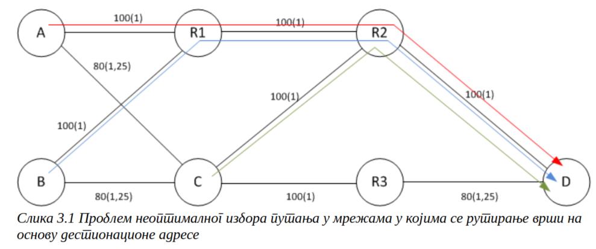
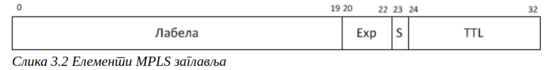

**Content Delivery Networks (CDNs)**

Today, numerous companies offer content delivery services over the internet, with Akamai being the most prominent. Recently, many internet service providers and traditional telecommunications companies have entered this market. CDNs are not special networks but consist of numerous servers located in data centers connected to the internet globally. For instance, as of 2017, Akamai has over 200,000 servers in more than 120 countries.

Content owners (e.g., TV stations, news companies, audio delivery companies) who want efficient distribution of their content make agreements with CDN networks to copy the original content onto CDN servers. This enables the distribution of the same content to different points on the internet, so users in a particular country access a copy of the content that is usually located on servers in that country or region, rather than the original content stored by the content owner. This reduces the distance the content needs to travel to reach the user, minimizing transmission delays. When many users from a region access the same content from a local server, it reduces international traffic towards the original content source.

A common CDN operation method is the "non-cooperative pull-based" approach. The key element of this method is the specific operation of the DNS service. The content delivery process starts when a user initiates a request (e.g., wants to watch a movie on www.sadrzaj.com). If the client's computer doesn't have the IP address of the site saved, it requests the DNS server to resolve the domain name. If the local DNS server doesn't have the IP address, it contacts the DNS server responsible for the domain. The CDN network maintains the domain, and the CDN's DNS server responds with the IP address of a local CDN server near the user.

If the requested content isn't on the CDN server, the CDN server fetches it from the content owner's server and delivers it to the user. This initial fetch doesn't save network resources or improve efficiency, but the CDN server stores a copy of the content. Future users from the same region requesting the same content will receive it directly from the CDN server, offloading the content owner's server and reducing network traffic.

In the "non-cooperative pull-based" approach, CDN servers don't communicate or inform each other about content replicas, and content is pulled from the provider's server as needed. There are also proposed cooperative schemes where CDN servers exchange information and push-based mechanisms where content is pre-delivered to CDN servers, but these are more theoretical than practical.

A key element of CDN networks is the algorithm by which the DNS server dynamically decides which CDN server's address to return to the user. Factors influencing this decision include the network distance between the user and server, current server load, network congestion, and delays. In cases of heavy regional server load, two users from the same provider network might receive content from different CDN servers to balance the load. Therefore, large CDN networks have complex monitoring mechanisms and often publish high-quality reports on the internet's status.

CDN networks are particularly suitable for distributing static front-end content such as images and pre-recorded (offline) video or audio content. If the bottleneck in a multi-layered internet-accessible application is not in the front-end layer, replication of the application or back-end layer can be performed using edge computing methods and database replication. This replication is typically not handled by CDN providers.

### **Virtual Private Networks (VPNs)**

The architecture, fundamental principles, and key protocols of modern computer networks (IP and TCP) were standardized in the early 1980s. At that time, email was the most significant application, typically accessed via command-line programs. Graphical user interface operating systems for personal computers began to emerge around the same time as the adoption of the IPv4 RFC. Given the state of computer systems at that time, before the rise of the global internet, it was difficult to foresee the diverse applications and needs that computer networks would eventually serve. Consequently, the architecture and technical solutions in key protocols have inherent limitations discovered later.

For financial transactions and online commerce, data protection is essential to prevent misuse and theft. For image and sound transmission (videoconferencing, video on demand, etc.), ensuring guaranteed throughput from source to destination is necessary to maintain quality of service. Mobile networks, which developed alongside the internet, and the mobility of modern user devices, require support for continuous communication as devices move within networks. These applications, now commonplace, were not supported by the basic versions of network protocols, necessitating enhancements to the existing protocol stack and network operations.

Researchers approached these issues in different ways. Some advocated for a "clean slate" approach, which entailed introducing entirely new network principles and protocols to replace the existing ones. Others supported an evolutionary approach, making incremental improvements to existing mechanisms. Due to the rapid growth of the internet and its daily use by billions for various applications, the clean slate approach was deemed unacceptable and risky. It would involve network downtime during the transition to new protocols, uncertain reliability during the implementation phase, and potential scaling problems not foreseeable through laboratory testing. Hence, the history of computer networks and the internet is characterized by numerous small evolutionary advancements, with some key mechanisms in use today being 20 to 30 years old.

One solution to some of these challenges was the introduction of various VPN technologies and packet tunneling. VPNs create a virtual network topology not composed of physical devices and connections but implemented over existing infrastructure (internet or service provider networks). They are typically used by organizations or user groups (hence "private"), with packets marked and logically separated from those of other users. Full communication privacy can also be achieved through packet encryption. Depending on the type, VPNs can be implemented over the internet or through service provider networks. Technically, VPNs often involve packet tunneling, adding new headers for network forwarding (bypassing traditional IP routing) to provide new network functionalities.

Recently, with the rise in popularity of virtualization technologies and cloud services, the concept of virtual network devices has developed. This includes virtual switches that connect multiple virtual machines on a server, virtual routers, and firewalls implemented on a server's virtual machine in a data center. This concept, known as Network Function Virtualization (NFV), allows for the easier implementation of certain network functionalities without the need for physical devices, as well as the provision of new services in the cloud. However, these network virtualization techniques are not the focus of this chapter.

**3.1. Forwarding Based on Labels - MPLS**

The increase in link speeds between communication devices has led to the need for faster and more streamlined packet processing as they pass through network devices. This necessity has driven the development of a completely new packet forwarding method in network devices: not based solely on IP addresses, but on a new field in packets called labels. The development of `MultiProtocol Label Switching (MPLS)` technology was completed in the early 2000s [3.2], and since the mid-2000s, MPLS has emerged as a key technology for providing `Virtual Private Network` (VPN) services to business customers. 

In addition to accelerating packet processing, MPLS technology was introduced to enable the separation of traffic from different users over a shared network infrastructure. It also aimed to address problems that arose in computer networks, such as suboptimal resource utilization, which will be described in the following chapter.

Sure, here is the continuation of the text:

**3.1.1. Problems of Traditional Computer Networks**

**3.1.1.1. Suboptimal Network Resource Utilization**

Routing decisions in computer networks are typically made by querying the routing table based on the destination IP address of the packet. Routes in the routing table are determined by standard routing protocols based on the network's topological characteristics (e.g., number of routers in the path, link capacities, etc.). This method of operation, where optimization is performed without considering the actual available resources in the network, can lead to suboptimal network utilization. Figure 3.1 illustrates this problem. The capacities of links and routing protocol metrics are listed in parentheses in the given network (assuming the metric is calculated similarly to OSPF protocol as the reciprocal of capacity multiplied by some constant, in this case, 100). 

If we examine the packet paths from sources A, B, and C to destination D, we can observe that paths with the lowest metrics all lead through router R2 via link R2-D in all three cases. This routing organization can lead to congestion on the R2-D link, even though there are completely unused links in the network (links A-C, B-C, and C-R3-D).

This suboptimal utilization occurs because traditional routing protocols typically do not dynamically adapt to real-time changes in network conditions, such as varying traffic loads or link failures. As a result, traffic tends to follow predetermined paths that may not be the most efficient at any given moment, leading to underutilized resources and potential congestion in some parts of the network.

In the next sections, we will explore how MPLS technology addresses these challenges and enhances network efficiency and performance through the use of labels for packet forwarding.

The mentioned problem could be addressed if:

1. Routing protocol metrics take into account additional link parameters (e.g., current load/usage of links). Alternatively,
2. Routers could route packets based on additional packet information (e.g., incoming packet interface, type of transport protocol, or port number of the transport protocol), allowing different parts of a packet from a source to a specific destination to be sent via different paths.

The first approach to solving the problem exists in some less popular routing protocols, such as the Cisco-specific EIGRP protocol, which has the capability to include the load of individual links in metric calculations. However, this protocol is only found on routers from one manufacturer and is rarely applied in practice in this manner because the default configuration of the protocol does not take link load into account. Further discussion on the implications of dynamically determining metrics based on variable link parameters will be provided in Chapter 3.1.8.3.

The second approach to addressing the problem is feasible in modern routers by configuring special policies through Policy Based Routing (PBR), which enables the definition of packet routing rules not solely based on destination address, thus supplementing the routing table in decision-making. The issue with policy-based routing lies in the fact that packet processing in such cases is always done in software within interrupt routines, without the use of specialized chips capable of high packet throughput and enabling large link capacities. Additionally, policy-based routing is executed through individual router configurations without the capability for automatic neighbor notification of network events and topology changes. Therefore, implementing policy-based routing can lead to routing loops in the entire or part of the traffic and is rarely recommended.

For these reasons, one of the motivations for introducing MPLS technology was to enable automated and rapid packet forwarding based on criteria other than destination address. This was ultimately realized through MPLS traffic engineering mechanisms, which are detailed in Chapter 3.1.8.

Now, let's continue with the next section, focusing on MPLS (MultiProtocol Label Switching) and its role in addressing network routing challenges.

**3.1.1.2. Complex Processing of Packets**

At the time of the inception of Ethernet, TCP, and IP protocols, connections were relatively unreliable with a higher percentage of packet loss compared to today, where optical links, resistant to interference, are commonly used even within local networks. This led to the introduction of error-checking mechanisms in both Ethernet (Ethernet Frame check sequence) and IP protocols (IP header checksum), which introduce redundant verification in parts of each packet. Additionally, processing each individual packet on routers involves not only these checks but also decrementing and verifying the TTL (Time-to-Live) and forming a new Ethernet header, making the processing of IP packets in routers complex and affecting forwarding speed and device capacities. Another motivation for introducing MPLS was to simplify packet processing during routing, speeding up forwarding and reducing the size of the headers used for packet forwarding.

Now, let's proceed with the next section, continuing the discussion on MPLS technology and its impact on network performance and efficiency.

**3.1.2. MPLS Labels**

A key element of MPLS technology is the MPLS header, which is added to the packet between the Layer 2 (typically Ethernet) and IP protocol headers. In networks where MPLS is active, routing is based on this MPLS header rather than the IP header. The MPLS header, which is only 32 bits long, is depicted in Figure 3.2.

Key elements of the header include MPLS labels of 20 bits in length, 3 experimental bits used to define 8 levels of packet priority and organize queues in routers (detailed in Chapter 6), one "Bottom of stack" bit - S, and the TTL field. MPLS technology allows the addition of multiple labels to a packet, one after another. The "Bottom of stack" bit has a value of 0 if there is another label following it, and a value of 1 if it is the last (innermost) label before the IP protocol header. When the MPLS header is added to a packet, the TTL value is copied from the IP header and inserted into the MPLS header, decrementing as the packet traverses through routers. Packets are routed based on MPLS labels, of which there can be a total of 2^20 (approximately 1 million). The first 15 labels are reserved, while the rest can be used flexibly.

As seen, one of the simplifications achieved by MPLS routing is the elimination of error checking for the IP header during packet forwarding. Additionally, the MPLS header does not contain a field indicating which protocol is encapsulated within it. This information is left to the link layer protocol, where Ethernet headers use the EtherType field with values 0x8847 and 0x8848 for unique and multicast packets, respectively.

All packets sharing the same label are said to belong to the same Forwarding Equivalence Class (FEC). The effectiveness of routing achieved depends on how packets are classified into FEC classes. In the following sections, three cases will be discussed: Frame mode MPLS, MPLS VPN, and MPLS Traffic Engineering.

The term "multiprotocol" in MPLS highlights its ability to insert labels between arbitrary layer 2 protocols (e.g., Frame Relay, ATM, ...) and the IP protocol. However, today Ethernet has become the predominant protocol, so MPLS is encountered almost exclusively in this environment.

This completes the explanation of MPLS labels and sets the stage for further exploration into specific MPLS applications and their impacts on network operations and efficiency.

