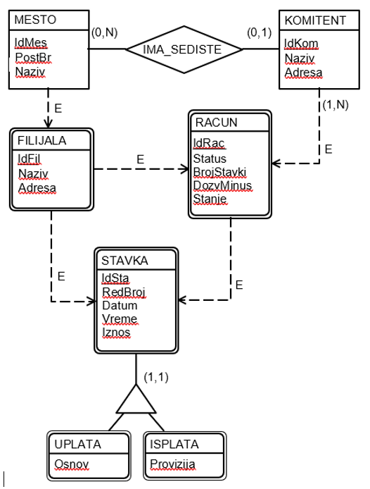

# SQLAlchemy Tasks

<div align="justify">

Before starting the tasks, it is necessary to initialize the database using the script `init.sql`. The description of the database on which queries are executed is provided below:

The bank, through its branches (filijale), operates in various places (mesta) (tracking name and address), serving its clients (komitenti) (tracking name and address) who may not have a place initially, but upon their first appearance in the bank, they declare their headquarters in a specific place. Each client can have multiple accounts in each branch (filijala) (tracking status, number of items, overdraft limit, and balance), but must have at least one account. Account status can be active, blocked, or closed. An account becomes blocked when it goes into unauthorized overdraft and becomes active when the balance returns to authorized levels. Clients conduct transactions from their accounts through transaction items (stavke prometa) (tracking sequence number, date, and time), which can be deposits (tracking basis and amount) or withdrawals (tracking amount and commission), and this can occur at any branch (filijala).



## Task 1

```sql
-- SELECT all data from Komitent table
SELECT * FROM Komitent;
```

## Task 2

```sql
-- SELECT all data from Racun table
SELECT * FROM Racun;
```

## Task 3

```sql
-- SELECT names of all komitenata
SELECT Naziv FROM Komitent;
```

## Task 4

```sql
-- SELECT name and address of each komitent
SELECT Naziv, Adresa FROM Komitent;
```

## Task 5

```sql
-- SELECT all data from Komitent table ordered by Naziv ascending
SELECT * FROM Komitent
ORDER BY Naziv;
```

## Task 6

```sql
-- SELECT all data from Komitent table ordered by Naziv descending
SELECT * FROM Komitent
ORDER BY Naziv DESC;
```

## Task 7

```sql
-- SELECT all data from Komitent table ordered by Naziv ascending, then by Adresa ascending
SELECT * FROM Komitent
ORDER BY Naziv, Adresa;
```

## Task 8

```sql
-- SELECT name and address of each komitent ordered by Naziv ascending, then by Adresa descending
SELECT Naziv, Adresa FROM Komitent
ORDER BY Naziv, Adresa DESC;
```

## Task 9

```sql
-- SELECT all data from Racun table for accounts with exactly -55000 dinara balance
SELECT * FROM Racun
WHERE Stanje = -55000;
```

## Task 10

```sql
-- SELECT all data from Racun table for accounts with positive balance
SELECT * FROM Racun
WHERE Stanje > 0;
```

## Task 11

```sql
-- SELECT all data from Racun table for blocked accounts only
SELECT * FROM Racun
WHERE Status = 'B';
```

## Task 12

```sql
-- SELECT all data from Racun table for blocked accounts with balance less than -50000 dinara
SELECT * FROM Racun
WHERE Status = 'B' AND Stanje < -50000;
```

## Task 13

```sql
-- SELECT all data from Racun table for blocked accounts or accounts with balance less than -50000 dinara
SELECT * FROM Racun
WHERE Status = 'B' OR Stanje < -50000;
```

## Task 14

```sql
-- SELECT balance from Racun table for blocked accounts with balance less than -50000 dinara
SELECT Stanje
FROM Racun
WHERE Status = 'B' AND Stanje < -50000;
```

## Task 15

```sql
-- SELECT all data from Racun table for accounts with balance between 10000 and 12000 dinara
SELECT *
FROM Racun
WHERE Stanje BETWEEN 10000 AND 12000;
```

## Task 16

```sql
-- SELECT balance, interest rate, and interest value for accounts in negative balance (interest rate is 3%)
SELECT Stanje, 3 AS "Kamatna stopa", Stanje * -0.03 AS Kamata
FROM Racun
WHERE Stanje < 0;
```

## Task 17

```sql
-- SELECT all data from Racun table with additional information on whether they will exceed the allowed overdraft after interest calculation for accounts currently in negative balance
SELECT *, CASE WHEN Stanje * 1.03 < -DozvMinus THEN 'Da' ELSE 'Ne' END AS "Izvan dozvoljenog minusa"
FROM Racun
WHERE Stanje < 0;
```

## Task 18

```sql
-- SELECT balance, interest rate, and interest value for accounts in negative balance (interest rate is 3%), renaming columns as specified
SELECT Stanje AS "Stanje", 3 AS "Kamatna stopa", Stanje * 0.03 AS "Kamata"
FROM Racun
WHERE Stanje < 0;
```

## Task 19

```sql
-- SELECT all data from Racun table, showing how much more can be withdrawn for accounts that are not in overdraft
SELECT IdRac, Stanje + DozvMinus AS "Maksimalno podizanje"
FROM Racun
WHERE Stanje > -DozvMinus;
```

## Task 20

```sql
-- SELECT all distinct names of komitenata (without repetition)
SELECT DISTINCT Naziv
FROM Komitent;
```

## Task 21

```sql
-- SELECT all data from Racun table for accounts that have been closed (accounts with NULL balance)
SELECT *
FROM Racun
WHERE Stanje IS NULL;
```

## Task 22

```sql
-- SELECT all data from Racun table for accounts that have not been closed (accounts with non-NULL balance)
SELECT *
FROM Racun
WHERE Stanje IS NOT NULL;
```

## Task 23

```sql
-- SELECT sum of all balances in Racun table
SELECT SUM(Stanje)
FROM Racun;
```

## Task 24

```sql
-- SELECT minimum balance from Racun table for accounts with positive balance
SELECT MIN(Stanje) AS "Minimum"
FROM Racun
WHERE Stanje > 0;
```

## Task 25

```sql
-- SELECT average balance from Racun table
SELECT AVG(Stanje) AS "Prosečno stanje"
FROM Racun;
```

## Task 26

```sql
-- SELECT name of komitenta and balance from Racun table for each account
SELECT K.Naziv, R.Stanje
FROM Komitent K, Racun R
WHERE K.IdKom = R.IdKom;
```

## Task 27

```sql
-- SELECT name of filijale, amount, and id of racun from Stavka table for each transaction
SELECT F.Naziv AS "Naziv filijale", S.Iznos, S.IdRac
FROM Filijala F, Stavka S
WHERE F.IdFil = S.IdFil;
```

## Task 28

```sql
-- SELECT name of filijale for each transaction, amount, id of racun, and name of matična filijala where racun was opened
SELECT FSt.Naziv AS "Mesto uplate/isplate",
       S.Iznos,
       R.IdRac,
       FRac.Naziv AS "Matična filijala"
FROM Filijala FSt, Stavka S, Racun R, Filijala FRac
WHERE FSt.IdFil = S.IdFil AND S.IdRac = R.IdRac AND FRac.IdFil = R.IdFil;
```

## Task 29

```sql
-- SELECT name of filijale for each salary transaction
SELECT F.Naziv AS "Naziv filijale", S.Iznos
FROM Filijala F, Stavka S, Uplata U
WHERE F.IdFil = S.IdFil AND S.IdSta = U.IdSta AND U.Osnov = 'Plata';
```

## Task 30

```sql
-- SELECT total balance on each racun id
SELECT IdRac, SUM(Stanje) AS "Suma na racunima"
FROM Racun R
GROUP BY IdRac;
```

## Task 31

```sql
-- SELECT total racun and account pay-in amount and amount of suma pay
FROM Stavka S, Uplata U
WHERE S.idSta = U.idSta
GROUP BY S.IdRac;

```

## Task 32

```sql
-- SELECT the total balance on each of their accounts.
SELECT idKom, SUM(Stanje) AS "Suma na racunima"
FROM Racun R
GROUP BY idKom;
```

## Task 33

```sql
-- For each customer with at least one active account, select the number of active accounts they have.
SELECT K.Naziv, COUNT(*) AS "Broj racuna"
FROM Komitent K, Racun R
WHERE K.idKom = R.idKom AND R.Status = 'A'
GROUP BY K.idKom, K.Naziv;
```

## Task 34

```sql
-- Ispisuje broj racuna na kojima je stanje pozitivno, samo za korisnike koji imaju bar jedan pozitivan racun.
SELECT K.Naziv, COUNT(*) AS "Broj racuna"
FROM Komitent K, Racun R
WHERE K.idKom = R.idKom AND Stanje >= 0
GROUP BY K.idKom, K.Naziv;
```

## Task 35

```sql
-- Ispisuje sve racune komitenata koji imaju ukupno pozitivno stanje na racunima.
SELECT K.Naziv, SUM(Stanje) AS "Suma na racunima"
FROM Komitent K, Racun R
WHERE K.idKom = R.idKom
GROUP BY K.idKom, K.Naziv
HAVING SUM(Stanje) >= 0;
```

## Task 36

```sql
-- Ispisuje sve komitente koji imaju tacno dva racuna.
SELECT K.Naziv
FROM Komitent K, Racun R
WHERE K.idKom = R.idKom
GROUP BY K.idKom, K.Naziv
HAVING COUNT(*) = 2;
```

## Task 37

```sql
-- Ispisuje sve komitente koji imaju tacno dva aktivna racuna.
SELECT K.Naziv
FROM Komitent K, Racun R
WHERE K.idKom = R.idKom AND R.Status = 'A'
GROUP BY K.idKom, K.Naziv
HAVING COUNT(*) = 2;
```

## Task 38

```sql
-- Ispisuje sve racune koji su imali transakcije u dve ili vise razlicitih filijala.
SELECT IdRac
FROM Stavka
GROUP BY IdRac
HAVING COUNT(DISTINCT IdFil) >= 2;
```

## Task 39

```sql
-- Ispisuje sve racune koji su imali transakcije u dva ili vise razlicitih mesta.
SELECT S.IdRac
FROM Stavka S, Filijala F
WHERE S.IdFil = F.IdFil
GROUP BY S.IdRac
HAVING COUNT(DISTINCT F.IdMes) >= 2;
```

## Task 40

```sql
-- Prikazuje sve filijale cija adresa ne sadrzi rec "trg" (vrsiti case insensitive pretragu).
SELECT *
FROM Filijala F
WHERE LOWER(F.Adresa) NOT LIKE '%trg%';
```

### Additional Notes

- Please ensure that the `init.sql` script is executed before running any queries.
- The ER model of the database is provided in `image.png`.
- Python code for table classes is in `main.py`.

<div>
