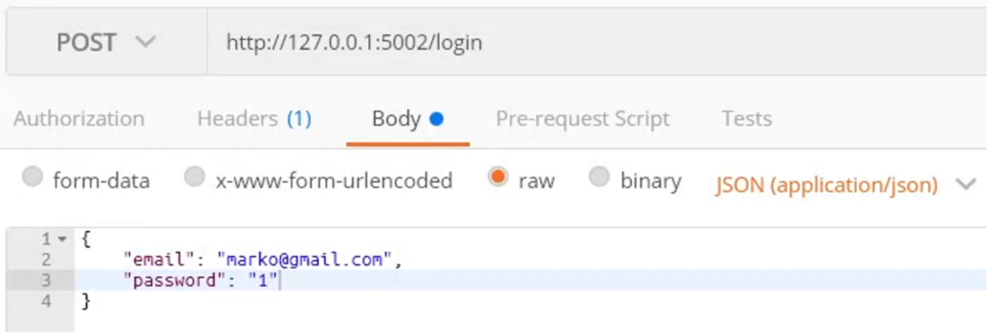
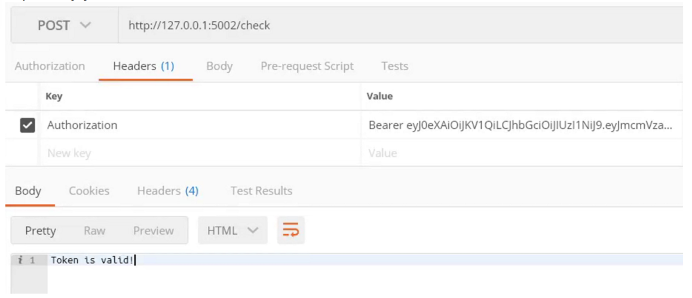

# JWT Notes

## Overview

JSON Web Tokens (JWT) are tokens used for secure information exchange between different parties. They are primarily used for authentication and authorization. A JWT is a string composed of three parts (header, payload, and signature), separated by dots:

```python

header.payload.signature
```

The payload part contains the data we store within the token, known as claims (e.g., email, name, etc.).

## JWT Application

### Models for Users and Roles

```python
from flask_sqlalchemy import SQLAlchemy

database = SQLAlchemy()

class UserRole(database.Model):
    id = database.Column(database.Integer, primary_key=True)
    user_id = database.Column(database.Integer, database.ForeignKey("user.id"), nullable=False)
    role_id = database.Column(database.Integer, database.ForeignKey("role.id"), nullable=False)

class User(database.Model):
    id = database.Column(database.Integer, primary_key=True)
    email = database.Column(database.String(256), nullable=False, unique=True)
    password = database.Column(database.String(256), nullable=False)
    forename = database.Column(database.String(256), nullable=False)
    surname = database.Column(database.String(256), nullable=False)
    roles = database.relationship("Role", secondary=UserRole.__table__, back_populates="users")

class Role(database.Model):
    id = database.Column(database.Integer, primary_key=True)
    name = database.Column(database.String(256), nullable=False)
    users = database.relationship("User", secondary=UserRole.__table__, back_populates="roles")
```

### Configuration

```python
class Configuration:
    # SQLALCHEMY_DATABASE_URI = "sqlite:///database.db"
    SQLALCHEMY_DATABASE_URI = f"mysql+pymysql://{DATABASE_USERNAME}:{DATABASE_PASSWORD}@{DATABASE_URL}/{DATABASE_NAME}"
    JWT_SECRET_KEY = "JWT_SECRET_KEY"
    JWT_ACCESS_TOKEN_EXPIRES = timedelta(minutes=15)
    JWT_REFRESH_TOKEN_EXPIRES = timedelta(days=30)
```

- The first commented line connects to a SQLite database.
- The second line connects to a MySQL server (running via Docker in `development.yaml`).
- The last three lines configure the JWT tokens (the `JWT_SECRET_KEY` should be a long, hard-to-guess string).

### Database Initialization

After starting, the database must be created using the models, including creating two roles: admin and user. This must be done in a while loop to wait for the MySQL server to start when the `development.yaml` file is run:

```python
database_created = False
while not database_created:
    try:
        with application.app_context():
            database.create_all()
            admin_role = Role.query.filter(Role.name == "admin").first()
            user_role = Role.query.filter(Role.name == "user").first()
            if admin_role is None:
                database.session.add(Role(name="admin"))
            if user_role is None:
                database.session.add(Role(name="user"))
            database.session.commit()
            database_created = True
    except Exception as error:
        pass
```

### Registration and Login Methods

#### Registration

```python
@application.route("/register", methods=["POST"])
def register():
    new_user = User(
        email=request.json["email"],
        password=request.json["password"],
        forename=request.json["forename"],
        surname=request.json["surname"]
    )
    database.session.add(new_user)
    database.session.commit()
    role_name = request.json["role_name"]
    role = Role.query.filter(Role.name == role_name).first()
    user_role = UserRole(
        user_id=new_user.id,
        role_id=role.id
    )
    database.session.add(user_role)
    database.session.commit()
    return "OK"
```

#### Login

```python
from flask_jwt_extended import create_access_token, create_refresh_token, JWTManager

jwt = JWTManager(application)  # Initialize JWT manager

@application.route("/login", methods=["POST"])
def login():
    email = request.json["email"]
    password = request.json["password"]
    user = User.query.filter(User.email == email, User.password == password).first()
    if not user:
        return "Invalid credentials", 401  # 401 status code for error

    claims = {
        "forename": user.forename,
        "surname": user.surname,
        "roles": [role.name for role in user.roles]
    }
    access_token = create_access_token(identity=user.email, additional_claims=claims)
    refresh_token = create_refresh_token(identity=user.email, additional_claims=claims)
    return jsonify(access_token=access_token, refresh_token=refresh_token)
```

To send these data via Postman:

- Body -> raw -> select JSON and write the request body as a JSON object.



### Checking Token Validity

```python
from flask_jwt_extended import jwt_required, get_jwt_identity, get_jwt

@application.route("/check")
@jwt_required()
def check():
    identity = get_jwt_identity()
    claims = get_jwt()
    return f"IDENTITY: {identity}, CLAIMS: {claims}"
```

- `jwt_required` is a decorator indicating that access to this route is allowed only if the user provides a valid JWT token in the request header.

#### How to Pass JWT Token in Request

- In Headers, write that the key Authorization passes the value: `Bearer token_value`
- `Bearer` must be written to indicate that a token is being sent, followed by a space and the token value copied from the response of the login method call.



### Refreshing Tokens

In the configuration, we set the access token duration to 15 minutes and the refresh token duration to 30 days. When the access token expires, if we pass the same token to the `check` route created above, we will get the message: "token has expired".

#### Refresh Function

```python
@application.route("/refresh")
@jwt_required(refresh=True)
def refresh():
    identity = get_jwt_identity()
    claims = get_jwt()
    return create_access_token(identity=identity, additional_claims=claims)
```

- `@jwt_required(refresh=True)` is a decorator indicating that access to this route is allowed only if the user provides a valid refresh JWT token in the request header.
- This function creates a new token using the `create_access_token` method with the corresponding identity and necessary data and returns the newly created token as the function's response.

### Decorators

Decorators are function wrappers that change their behavior or perform some checks.

#### Example Decorators

```python
def dashes_decorator(function_to_decorate):
    def wrapper():
        result = function_to_decorate()
        return "----" + str(result) + "-----"
    return wrapper

def stars_decorator(function_to_decorate):
    def wrapper():
        result = function_to_decorate()
        return "****" + str(result) + "****"
    return wrapper
```

- The decorator function takes a function as an argument and defines another function inside it, which performs the decoration and returns it as the return value.

If we want a decorator that takes some additional arguments for decoration:

```python
def decorator_with_an_argument(argument):
    def decorator(function_to_decorate):
        def wrapper():
            result = function_to_decorate()
            return str(argument) + str(result) + str(argument)
        return wrapper
    return decorator
```

#### Using Decorators with Arguments

```python
@decorator_with_an_argument(argument="xxx")
def function():
    return "String"
```

#### General-Purpose Decorator

```python
def general_purpose_decorator(argument):
    def decorator(function_to_decorate):
        def wrapper(*function_args, **function_kwargs):
            result = function_to_decorate(*function_args, **function_kwargs)
            return str(argument) + str(result) + str(argument)
        return wrapper
    return decorator
```

- Here, two arguments are added for the wrapper function: a pointer to the list of arguments and a dictionary of arguments (general definition for any function, the list and dictionary can be empty if the function has no arguments).

### Role-Based Access Control Decorator

```python
def role_check(role):
    def decorator(function):
        @jwt_required()
        @wraps(function)  # This decorator makes it clear which function is being decorated
        def wrapper(*args, **kwargs):
            # verify_jwt_in_request()  # Not needed because we used @jwt_required
            claims = get_jwt()
            if role in claims["roles"]:
                return function(*args, **kwargs)
            else:
                return "Invalid role", 401
        return wrapper
    return decorator
```

#### Using the Role-Based Access Control Decorator

```python
@application.route("/user_check")
@role_check("user")  # No need to write @jwt_required, as it is done within @role_check
def user_check():
    identity = get_jwt_identity()
    claims = get_jwt()
    return f"IDENTITY: {identity}, CLAIMS: {claims}"

@application.route("/admin_check")
@role_check("admin")
def admin_check():
    identity = get_jwt_identity()
    claims = get_jwt()
    return f"IDENTITY: {identity}, CLAIMS: {claims}"
```

- This way, methods can be created that are allowed only for admin or user (in all these functions, the token must be provided in the header).
