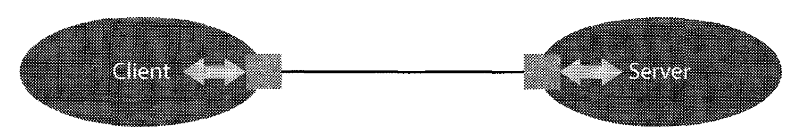
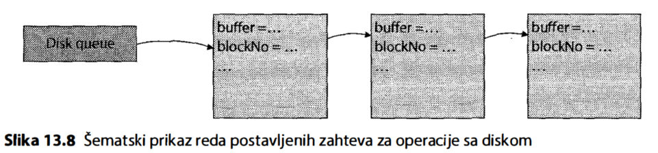

# Operativni Sistemi 1

<div align="justify">

## [Part IV Input/Output Subsystem](#part-iv-inputoutput-subsystem)

### [CHAPTER 12 Interface of the Input/Output Subsystem](#chapter-12-interface-of-the-inputoutput-subsystem)

[DEVICE AND SERVICE CHARACTERISTICS](#device-and-service-characteristics)

[Generic Approach to Devices](#generic-approach-to-devices)

[Character Streams](#character-streams)

[Printing](#printing)

[Message Exchange via Sockets](#message-exchange-via-sockets)

[Memory-Mapped Files](#memory-mapped-files)

[Real-Time](#real-time)

[Image and Sound](#image-and-sound)

### [Chapter 13 Implementation of the Input-Output Subsystem](#chapter-13-implementation-of-the-input-output-subsystem)

[Device Drivers](#device-drivers)

[Techniques for Accessing Devices](#techniques-for-accessing-devices)

[Disk Management](#disk-management)

[Caching](#caching)

[Buffering](#buffering)


# Part IV Input/Output Subsystem

## CHAPTER 12 Interface of the Input/Output Subsystem

### DEVICE AND SERVICE CHARACTERISTICS

Input/output (I/O) devices that can be connected to modern computers or are part of their configuration are extremely diverse in purpose, functionality, data transfer method and speed, data storage method and capacity, etc. As with any complexity and diversity, the fundamental method for mastering this complexity is abstraction. Abstraction is the process of ignoring less significant differences in favor of highlighting common characteristics and classifying (grouping) different entities based on these common characteristics.

Based on this approach, I/O devices are classified into different categories according to various characteristics (aspects).

**I/O devices can be classified by purpose into the following categories:**

-   **User action input devices:** keyboard, pointing devices - mouse, pointer, touchpad, touchscreen, and similar.
-   **Image display devices:** display, projector, and similar.
-   **Data storage devices:** hard disk drive (HDD), solid state drive (SSD), storage, magnetic tape, CD, DVD, and similar.
-   **Printer:** printer.
-   **Sound recording and playback devices:** microphone, loudspeakers, earphones, and similar.
-   **Network communication and device connection devices:** network adapter, Universal Serial Bus (USB), Wi-Fi, Bluetooth, Thunderbolt, and similar.
-   **Video recording devices:** photo/video cameras, and many other devices.

**According to the direction of data flow, devices are classified as:**

-   **Input:** Data flow direction is only from the device to the computer (i.e., to the main memory); examples include keyboard, mouse, microphone, CD-ROM, etc.
-   **Output:** Data flow direction is only from the computer's main memory to the device; examples include display, loudspeaker, printer, etc.
-   **Input/output:** These devices have data flow in both directions; basic examples are data storage devices that allow both reading and writing data.

**According to the data transfer unit, devices are classified as:**

-   **Character-oriented:** They transfer small units of data, typically individual characters or bytes; examples include line printer, keyboard, and character display.
-   **Block-oriented:** They transfer larger blocks of data, either fixed or variable length; examples include disks, network adapters, etc.

According to the method of data access, devices can be:

-   **Sequential:** Data access is determined by the natural, physical, spatial, or temporal order in which the data arrives or is sent, and they cannot be accessed in an arbitrary order; examples include keyboard, loudspeaker, network adapter, and magnetic tape (data is read or written in the order of tape passage).
-   **Direct access:** Data can be accessed (for reading or writing, depending on the type of device) in an arbitrary order, regardless of their spatial arrangement or the time they arrived; examples include disks and raster displays.

**According to shareability, i.**e., whether concurrent processes can send partial operations simultaneously or not, devices can be:

-   **Non-shareable or dedicated:** One process must complete the entire operation with such a device before another process performs its large operation; a typical example is a printer, where it makes no sense for one process to send a few characters and then another process does the same.
-   **Shareable:** These devices can be used concurrently or time-multiplexed by multiple processes; examples include keyboard, display, mouse, disk, etc.

According to **the timing characteristics of data transfer**, devices can be:

-   **Synchronous:** Data transfer occurs at regular or predictable times or intervals, or with predictable response.
-   **Asynchronous:** Data transfer occurs at irregular or unpredictable times or intervals, or with unpredictable response.

Operating systems provide services related to devices to users and their processes in various ways through system programs or calls. An important characteristic of these system calls is whether control returns to the caller, i.e., whether the calling control flow continues immediately or only when the entire I/O operation is completed:

-   **Synchronous or blocking calls:** The calling process or control flow is suspended as needed and continues only when the requested operation is completed.
-   **Asynchronous or non-blocking calls:** The calling process or control flow continues immediately, the system call immediately returns control, and the requested operation is performed later, asynchronously.

Intermediate variants are also possible, e.g., the system call immediately returns control along with information on whether the operation was fully, partially, or not at all completed (synchronous non-blocking call).

### Generic Approach to Devices

A significant and widely used category of operating system services related to I/O operations **involves accessing files stored on these devices**, which will be discussed in detail in the next part of the book.

Unix-like systems have special files (device files) that processes see as virtual files in the virtual directory /dev. Processes can perform usual operations on them as with ordinary files. These operations are directed directly to the corresponding devices. These special files are installed by the system administrator using the mknod system command or call. Prefixes in the names of these files refer to the type of device, which determines how the I/O operations will be interpreted; for example: lp (line printer), tty1 (terminal), hd (hard drive, IDE disks), etc. These special files can allow character-oriented or block-oriented operations.

The system call that allows such files to be directly sent requests interpreted by the device in a specific way for functions looks like this:

int *ioctl*(int fd, unsigned long request, ...);

where **fd** is the descriptor of a previously opened device file.

Other operating systems, including Windows, have similar concepts. The Win32 API system call similar to ioctl is called DeviceIoControl.

### Character Streams

In Unix-like systems (and other systems with similar concepts and principles), every process is always associated with three standard character-oriented, sequential "devices":

-   **stdin** - standard input device.
-   **stdout** - standard output device.
-   **stderr** - standard error output device for usual error reporting during process execution, e.g., for printing messages using the error system call.

These devices are inherited by the process from its parent process by default. In this way, the command line interpreter (CLI), as a process working with the console as its stdin and stdout devices, directs standard devices to the same console but can also redirect them in the command line to actual text files:

myprogram \<input.txt \>output.txt 2\>error.txt

Here, **\<input.txt** redirects stdin to the file input.txt, **\>output.txt** redirects stdout to the file output.txt, and **2\>error.txt** redirects stderr to the file error.txt.

These devices are seen by the process as character-oriented text files identified by the constants stdin, stdout, and stderr of type FILE\* defined in the header \<stdio.h\>. Such sequential, character-oriented files or devices are called character streams.

Library functions of the standard C library (\<stdio.h\>) and C++ library (\<iostream\>) that work with character streams rely on two elementary system calls:

int *getc*(FILE*\**);

int *putc*(int c, FILE*\**);

The **getc** function reads and returns one character from the specified input character stream, while the **putc** function sends the given character to the specified output character stream.

The functions **getchar** and **putchar** assume input and output to the standard input and output stream:

-   **getchar()** is equivalent to **getc(stdin)**.
-   **putchar(c)** is equivalent to **putc(c, stdout)**.

More complex functions of the standard C library, such as those from the scanf and printf family, as well as the operator functions operator\<\< and operator\>\> of the C++ library, perform conversion and formatting of their parameters' values and then rely on successive calls to these elementary system services to read or write one character at a time to the specified character stream.

The standard input or output stream of a child process can be programmatically redirected as follows (this is an explanation of how CLI works when redirection is specified):

*const* char\* inputFileName = ...;

int fd = *open*(inputFileName, O_RDONLY);

*if* (fd \< 0) *handle_error*("Cannot open input file.");

int pid = *fork*();

*if* (pid == 0) {

*dup2*(fd, 0);

*execlp*(...);

*handle_error*("Cannot open exe file.");

}

...

The **dup2(oldfd, newfd)** system call copies the file descriptor given by oldfd to the file descriptor newfd, so that newfd points to the same file as the descriptor oldfd. The value 0 of the descriptor always denotes the descriptor for stdin, 1 denotes the descriptor for stdout, and 2 for stderr. This way, the stdin of the child process created by fork will point to the file previously opened by the open system call, which the fd descriptor returned by that system call points to. Details of the file opening mechanism and the precise meaning of file descriptors will be explained in the next section on the file system.

### Printing

The earliest line printers were simple, sequential character devices that printed character by character, line by line. Therefore, they can be accessed from programs in the same way as other output character streams.

Today's printers allow entire files with content to be sent for printing, recorded in some standard formats. Printers will certainly recognize and print text content as plain text but also recognize more complex, standard vector formats for describing arbitrary page content, such as PostScript.

On Unix-like systems, there is a system program (command) called **lpr** or **lp** (both names mean the same thing) which sends the content of a file specified by an argument to the printer configured as the default in the system; if no argument is given, this program takes the content from its standard input. Thus, the following equivalent variants are possible:

lpr mydoc.txt

cat mydoc.txt \| lpr

The exact same concept exists in the Windows system and its command line interpreter called PowerShell: instead of the **cat** command, the **Get-Content** command is used, and instead of the **lpr** command, the **Out-Printer** command is used, while the notation for the pipeline is the same (the **\|** sign).

One way to do this programmatically is to use the **popen** system call, which starts a new process, just like the **fork** system call, and then executes the program given as the first argument (like **exec**) in the context of that process, creating a pipeline between the current process and that new child process, as if everything was invoked from the command line. This pipeline is seen by the calling process as an output character stream directed by the descriptor returned by this system call. For example:

FILE \*lpr = *popen*("lpr", "w");

*fprintf*(lpr, "This text is printed.\\n");

*pclose*(lpr);

For printing more complex content, the program's responsibility is to, typically using some ready-made library, prepare the content for printing in a standard format (e.g., PostScript or PDF) and write it to a file, and then send the file to the printer.

One available open-source API that enables printing on various operating systems in a portable way is a product from Apple called CUPS. This API is complex, but simplified printing looks like this:

\#include \<cups/cups.h\>

int jobid = *cupsPrintFile*("myprinter", "filename.ps", "title", num_options, options);

The Windows operating system offers services that allow the content of a document to be defined programmatically (printing and drawing page content), as well as sending documents to print, managing print jobs, etc. The programmatic interfaces for these services are complex and are called the Print Document Package API, Print Spooler API, Print Ticket API, and XPS Document API.

### Message Exchange via Sockets

Today's operating systems support message exchange between processes most commonly through the standard socket concept previously mentioned. A socket is an operating system resource that allows message exchange between processes on the same or remote computers. Processes use this mechanism via system calls contained in the socket API, a small part of which was shown earlier in the section on inter-process communication in Chapter 11. The socket API is available on practically all operating systems and in most programming languages, implemented in a standard way, allowing message transmission over the network (including the Internet) using standard protocols (TCP, but also others) and between programs written in different languages or systems.

Processes on the same or remote computers, client and server processes, each allocate their socket from their operating system, establish a connection between them, and then exchange messages of arbitrary content and length (a sequence of characters or bytes) through appropriate system calls (Figure 12.1).

****

**Figure 12.1: Data exchange between processes via sockets**

Using this mechanism already falls into the domain of concurrent programming, and its implementation falls into the domain of computer networks and communication protocols, so it will not be discussed further here. Interested readers are directed to numerous sources and learning materials available in books and on the Internet.

### Memory-Mapped Files

Modern operating systems allow a process to request a service that maps a portion of its virtual address space to a file. **This concept is called memory-mapped files**, and the system call used is one variant of the **mmap** system call we have seen before:

void*\** *mmap* (void *\**addr, size_t length, int prot, int flags, int fd, off_t offset);

The content of the file that was previously opened and whose descriptor is given in **fd**, starting from offset **offset** and of length **length**, is mapped to a part of the memory space starting from address **addr**. If **addr** is **null**, the kernel will choose a free part of the virtual address space for the process. The parameter **length** must be a multiple of the page size obtained by the call **sysconf(_SC_PAGE_SIZE)**.

After that, the process sees its part of the virtual address space and accesses it in the usual way, organizing its data in that space. This mapping is undone by the call:

int *munmap* (void *\**addr, size_t length);

The operating system saves these pages, mapped to the file, in the appropriate parts of the file content when it evicts them and loads them into memory when it handles page faults, i.e., when the process accesses a page and it is not loaded into memory. All of this is completely transparent to the process, and it does not see that the content is being saved to the file and loaded from it, as the process does not perform any explicit operations with that file.

Operating systems typically allow such parts of memory to be shared between processes, enabling processes to exchange information this way, even without the file they are mapped to or with it:

-   if the **MAP_SHARED** bit is set in the **flags** argument, the mapping will be shared between processes that have the mapping to the same file, so changes made by one process will be visible to the others;
-   if the **MAP_PRIVATE** bit is set in the **flags** argument, the mapping will be private to the given process, and it will have its independent copy (copy-on-write technique is applied), so changes made by it will not be seen by other processes, nor will they be written to the file.

### Real-Time

Modern general-purpose operating systems also provide processes with certain real-time services. Some of these services are available through commands in the CLI. For example, the following POSIX calls exist:

-   a system call that returns information about the current real-time, i.e., returns the number of seconds that have elapsed since January 1, 1970, at midnight:

    time_t *time* (time_t*\** tloc);

-   there are also library functions in **\<time.h\>** that return calendar time, broken down into date and time, etc., based on the **time** system call: **asctime**, **ctime**, **gmtime**, **localtime**;
-   a system call that suspends the calling process for the given time ("sleeping"):

    unsigned int *sleep* (unsigned int seconds);

-   there is also a system call with finer resolution in nanoseconds, **nanosleep**.
-   calls by which the calling process can wait for events-conditions or synchronization primitives, but time-limited, so-called timeout controls; if the process is not unblocked in the given time, it will be unblocked due to the timeout; for semaphores, for example, the function is:

int *sem_timedwait* (sem_t *\**sem, *const* struct timespec *\**abs_timeout);

Operating systems for use in real-time systems also possess other services important for these systems, such as periodic activation of processes, control of deadline overruns, and others.

### Image and Sound

Earlier monitors were character-oriented, accessed from programs as any other output character stream. Today's monitors are raster-based, having an image defined by a pixel matrix, but they can sometimes support a text mode where they can receive simple character streams and display them linearly.

Some operating systems, such as Windows or Mac OS X, have a GUI as part of the kernel, providing user processes with services (through a complex API) for managing graphical interface resources managed by the kernel, such as windows and GUI controls, as well as services for drawing characters and graphics on the process's window, etc.

In other systems, such as Linux, the GUI is not part of the kernel but is created as a separate shell. To access the screen, a process, including the one running the shell, needs to use a library (e.g., Xlib, Wayland) or a framework that implements the GUI, such as GTK+ or Qt, and that implementation then uses low-level operating system services.

To access a video display device, the operating system provides a mechanism for the process to access a special part of the operating memory called the video buffer. This part of the operating memory is also used by the video adapter (the device for generating the output video signal for the screen), and the operating system can provide a service that maps a part of the process's virtual address space to that part of the operating memory. This part of the memory is used as a buffer with a bitmap of one frame that the video adapter (hardware) then uses to convert into an output video signal. On the Linux system, this part of the memory is called the framebuffer. This buffer is also seen as a generic device **/dev/fb0**.

For audio playback and recording services, operating systems provide different levels of services. In different systems, there are different types of support for these services, either as operating system services or as APIs implemented by libraries, which then use low-level system services.

For example, the Windows operating system has a function **PlaySound** that plays sound recorded in a given file. On older versions of the Linux system and some other Unix-like systems, the sound playback device exists as **/dev/dsp**, and a sound file can be sent to it. Newer versions of the Linux kernel use the ALSA (Advanced Linux Sound Architecture) module to access sound card services, and there is a library for processes that implements the ALSA API.

## Chapter 13 Implementation of the Input-Output Subsystem

### Device Drivers

Input-output devices are extremely diverse in all their characteristics. Hardware manufacturers continually design and produce new devices. This raises the logical question of how to make user processes independent of the variety and constant change of these devices. This is precisely the task of the operating system - to isolate processes from the hardware, providing them with an abstract and standardized API, i.e., sets of system calls as shown in the previous chapter.

But how can the operating system itself be implemented to support all devices, including those that appear after the operating system has already been created? There is no easy solution here. As with all other technical and complex software systems, achieving these goals requires adhering to all principles of software engineering. Some of the most urgent principles here are:

-   **Standardization** involves prescribing and accepting standards that device manufacturers should adhere to, at the level of electrical parameters and software interfaces, to make devices compatible with the computers they connect to.
-   **Abstraction** is the process of ignoring differences and highlighting the common characteristics of different entities, to classify them into groups and treat them in the same way.
-   **Modularization** involves clear separation of software component responsibilities to simplify their interactions.
-   **Encapsulation** involves clearly defining the interface of a module through which it is accessed, while hiding its implementation.

Additionally, due to the nature of this subsystem, the architecture of the input-output subsystem is often organized in a layered manner as follows. Each module, or layer, uses the services of the module below it, relying on their interface, raising the level of abstraction, and providing its services to the layers above it.

For a device to be connected to a computer, it must meet appropriate technical standards and implement a corresponding hardware interface that allows its connection. Additionally, the device often has to implement a corresponding software protocol through which the computer (processor) can exchange data with it.

Each device belongs to a certain class of devices recognized by the computer and the given operating system. The device presents itself to the computer as a member of that class: as a keyboard, mouse, disk, etc. To make the rest of the kernel independent of the device, and to prepare the kernel to accept new devices continuously, a special part, a kernel module, exists for communication with each device class. This module implements the appropriate interface to the rest of the kernel for the given device class. This interface consists of a set of operations that the kernel calls for this device class (e.g., transferring a character, transferring a block of data). This module is responsible for direct communication with the hardware device at the lowest level. Such a module is called a **device driver**.


When a new device is connected to the computer, if it meets generic, standard requirements, the operating system already has a ready, standard generic driver used for communication with that device. This is now most often the case, as standards are increasingly widespread and accepted in the industry. If the device is highly specific and non-standard, in the sense that the generic driver does not suit it, the manufacturer must provide a driver for that operating system along with the device. Every operating system has a mechanism for installing a new driver into the system. This driver must meet the interface for the given device class that the operating system expects. In any of these cases, when the device is connected, the kernel registers that device as available, considers it a device belonging to the appropriate class, satisfies the corresponding interface, and directs operations supported by that device class to the driver for that device. This ensures that the operating system is resistant to the diversity and continuous emergence of new devices, accepting and using them. Unfortunately, standards and interfaces for drivers apply only to a specific operating system, so the driver is not portable to another operating system - the given device must have drivers for every operating system it is used on.

From an object-oriented perspective, the kernel's input-output subsystem sees devices as objects that meet an interface defined by an abstract class with abstract operations. To perform operations with devices, the kernel calls these polymorphic operations of these objects. Concrete derived classes implement these abstract operations. Since systems are typically made in the C language, this polymorphism is implemented, as previously explained, by dynamic binding. The driver is actually a software module that provides the implementation of a set of subroutines (polymorphic operations) that the kernel expects from the given device class. The specific device is registered in the kernel as a data structure containing device attributes and a pointer to a table of pointers to function implementations in the driver. Registering the driver means forming such structures in the kernel.


### Techniques for Accessing Devices

Today's input-output devices and communication protocols with them are extremely complex, having been developed and improved over decades. Numerous large expert teams dedicated and specialized only in certain types of devices are engaged in their development. There are numerous standards and implementations of these standards for connecting and communicating with input-output devices. To study and specialize in one of them, an individual needs to devote a good part of their professional career to that job.

However, some fundamental principles are quite simple and have not changed over time. These will be briefly presented here using a simple, generic model of an input-output device and the task of transferring a block of data of a certain size from memory to the device (output operation) or vice versa (input operation). The hardware implementation of the device is specific but is not of interest here. The only thing of interest is the hardware interface of that device, the device controller.


This controller provides the interface, i.e., the coupling with the rest of the computer. The controller has certain registers appropriately connected to the computer bus so that the processor can access them by addressing them through the addresses they respond to. These registers belong to one of three characteristic groups (types):

-   **Control register** or multiple control registers are typically connected to the computer bus so that the processor can only write to them, while the device controller's control unit interprets the value of this register's bits. The bits of this register have corresponding meanings for the given device, but in principle, through their values, the processor, i.e., the program the processor executes, can set the device's operating mode, issue a command, command parameters, start an operation, etc. Here, we will use the start bit as an example, which starts an operation on the device (this is just an illustrative and generic example).
-   **Status register** or multiple status registers are typically connected to the computer bus so that the processor can only read from them, while the control unit of the device controller writes to this register. The bits of this register have corresponding meanings for the given device, but in principle, through their values, the device reports the status of the executed operation, the existence of an error, the result, etc.
-   **Data register** or multiple data registers are connected to the computer bus so that the processor can read from them if it is an input device and/or write to them if it is an output device. This register is used for data transfer from and to the device.

The processor can access any of these registers by executing instructions that read or write values to the address to which the register responds. This means that during the execution of a given instruction, the processor sets the appropriate address on the computer's address bus, the value from the address bus passes through the address decoders, and only one output line, the one corresponding to the address given to the decoders, becomes active. This line reaches the appropriate register and does the following:

-   Together with the read control signal on the bus, which the processor sets during the read cycle, it passes through a logical AND gate whose output opens the tri-state buffers connected to the outputs of that register towards the data bus; thus, the value of the addressed register is set on the data bus, from where the processor writes it into one of its receiving registers.
-   Together with the write control signal on the bus, which the processor sets during the write cycle, it passes through a logical AND gate whose output activates the control input load for writing the value into the addressed register; the value to be written comes from the data bus to which it was placed by the processor during the write cycle.

Suppose now that the processor executes part of the program, i.e., instructions to transfer a series of data (words or bytes, depending on the width of the bus and the data register), from memory to the device (if it is an output operation) or vice versa (if it is an input operation). This procedure proceeds as follows:


The processor executes an instruction that transfers one piece of data through the data register of the device controller:

-   If it is an input operation, the processor performs a read operation from this register.
-   If it is an output operation, the processor performs a write operation to this register.

When it finishes transferring one piece of data, the processor could execute the next instruction that transfers the next piece of data in the same way. However, it cannot do this immediately because the peripheral controller might not have finished the previous transfer:

-   If it is an input operation, the data register still contains the old data, the new data has not yet arrived, i.e., the controller has not yet written it into that register.
-   If it is an output operation, the controller has not yet finished transferring the previous data in the data register, so writing a new value would disrupt the transfer of the previous data.

Therefore, the processor must wait for the device controller to be ready for a new transfer - synchronization of these two devices is needed!

To signal readiness for a new transfer, the controller uses a specific bit in the status register, the ready bit. This bit is used to synchronize the processor and the peripheral controller as follows:

-   When the processor writes a new value into the data register or reads a value from it, this ready bit is cleared (the same signal for writing to the data register or opening its tri-state buffers towards the bus is used to reset the ready bit).
-   When the device controller finishes the previous operation, it will set this ready bit.
-   The processor must not proceed to the next transfer until it reads this bit as set.

The processor needs to wait and, before each transfer, read the status register in a loop and check the ready bit. This technique is called polling, and the process of checking in a loop is called busy waiting because the processor executes these instructions instead of waiting and wasting its time.

The next question is how the processor, or the program it executes, can determine that the readiness bit is set. There are two primary methods for this:

-   The processor, or the program it executes, reads the value of the controller's status register by executing a read instruction from the appropriate address and checking the readiness bit, repeating this, or waiting for the readiness bit to be set. This is busy waiting, also known as polling, where the processor asks the device if it is ready.
-   The output of the readiness bit of the status register is connected to an interrupt request input of the processor, so the processor can perform another task, and the interrupt signals the controller's readiness for a new operation.

In both of these techniques, the processor transfers data from memory to the data register or vice versa by executing data transfer instructions. Therefore, both techniques are called programmed input/output (PIO). The drawback of polling is the unnecessary consumption of processor time waiting, unless the wait is very short.

In the following examples, the method of transferring a data array of a given length using programmed input/output will be shown. It is assumed that a single transfer request is given in an IORequest structure; these requests can be queued, for example, by linking in a list. It is also assumed that the signal field in this structure specifies what to do when the request is serviced, for example, by pointing to a function to call, or it can represent a semaphore to signal since a process (or thread) waiting for that operation is dependent on the construction of this part of the kernel.

The definitions of the used data types and constants are as follows:

```cpp
typedef volatile unsigned REG;

REG* r_control = (REG*)0x...;
REG* r_status = (REG*)0x...;
REG* r_data = (REG*)0x...;

struct IORequest {
    void* buffer;
    size_t len;
    void (*signal)();
};

const REG C_START = 0x...;
const REG C_STOP = 0x...;
const REG C_READY = 0x...;
```
REG is a synonym for an integer type of the required width, depending on the width of the controller registers. The constants r_control, r_status, and r_data represent the specific addresses of the corresponding controller registers. The IORequest structure represents a single request with the following field meanings:

-   buffer: the address of the data array in memory to be transferred;
-   len: the length of the data array in memory to be transferred;
-   signal: a pointer to the function to be called when the transfer specified by this request is completed.

The C_START constant represents the specific binary value to be written to the device controller's control register when starting the operation. Similarly, the C_STOP constant represents the specific binary value to be written to the control register after the operation is completed. The C_READY constant contains a mask for checking the readiness bit: its binary value is 1 in the position of the readiness bit, and 0 in all others, assuming that a value of 1 in the readiness bit indicates the controller's readiness (not the opposite).

Here is an example of a program part that transfers a data array using the programmed input/output technique of polling; the transfer is specified by a single IORequest:

```cpp
void transfer(IORequest* req) {
    REG* buf = (REG*)(req->buffer);

    *r_control = C_START;

    for (size_t i = 0; i < req->len; i++) {
        while (!(*r_status & C_READY));
        *r_data = buf[i];
    }

    *r_control = C_STOP;
    req->signal();
}
```

If it is necessary to start the controller at the beginning of the transfer, to set its mode, to start the operation, this must be done by writing the corresponding value C_START to the control register at the address r_control. The for loop performs the transfer one word at a time. At the beginning of the body of this loop, for each word, busy waiting (polling) is required, which is performed by the while loop: it reads the value from the status register, masks the readiness bit (the result of the operation & with the mask C_READY will be 0 if the readiness bit was 0) and repeats all this until the readiness bit is set. After that, a single data transfer from the buffer is performed. At the end, if necessary, the value C_STOP is written to the control register of the controller to indicate that an operation is completed. Finally, the signal function is called to mark the request as completed.

The part of the program that transfers a data array using programmed input/output with interrupts looks like this:

```cpp
REG* pending_req;
size_t pending_cur;

void transfer(IORequest* req) {
    pending_req = req;
    pending_cur = 0;
    *r_control = C_START;
}

interrupt void device_ready() {
    REG* buf = (REG*)(pending_req->buffer);
    *r_data = buf[pending_cur++];

    if (pending_cur == pending_req->len) {
        *r_control = C_STOP;
        pending_req->signal();
        pending_req = 0;
    }
}
```


The static pointer pending_req points to the current request being processed, and pending_cur is the index of the current element in the array to be transferred. These variables are global and static because they need to be accessible in the interrupt routine and persist through one call of the interrupt routine. The transfer function is called when the transfer starts; it only starts the device by writing the value C_START to the controller's control register. The device_ready function represents the interrupt routine for the given device. It is called when the device controller signals readiness. If this interrupt, handled by this routine, only causes the readiness bit to be set, then there is no need to check that bit in this routine. If the same interrupt causes something else, for example, another event such as a transfer error, the readiness bit and possibly other bits in the status register should be checked and then actions should be taken based on their values. Further in this routine, the transfer of a single piece of data is performed by writing to the controller's data register (this is an output operation). In the end, if the last piece of data has been transferred, the transfer is completed by calling the signal function; otherwise, it only returns to the interrupted flow. It should be noted that the signal function is called in the context of the interrupt routine, so its duration should not be too long, and its execution certainly should not be blocking. Usually, this execution contains only changing some data or signaling a semaphore.

When using an interrupt, the processor executing an independent control flow and the device controller perform operations in parallel, simultaneously. When the device is ready for a new transfer, it generates an interrupt to the processor, and the processor performs the transfer of the next piece of data in the interrupt routine.


Both described techniques share that the processor, by executing instructions, transfers data from memory to the controller's data register or vice versa, and it controls the loop (counting, moving to the next piece of data, checking the loop's end). However, these tasks of simple data transfer from memory to the data register or vice versa, with loop control, are too trivial for such a sophisticated device as the processor, which can perform much more useful and complex tasks. Therefore, a special hardware device was designed, the Direct Memory Access (DMA) controller, which is specialized only for transferring a block of data from memory to the device or vice versa.

The processor initiates the DMA controller, like any other device: it sets the request parameters by writing to the appropriate DMA controller registers intended for receiving these parameters. The request parameters are the address of the data array (buffer) in memory to be transferred, the length of that array, the operating mode, and so on. After setting the parameters and starting the operation, the processor can execute another, independent control flow. The DMA controller then performs synchronization with the device, either by directly handling (direct signal exchange) with the device controller or by reading the status register and waiting for the readiness bit, as well as the actual data transfer (reading or writing to memory and the controller's data register). Therefore, the DMA controller performs bus cycles, so hardware support is necessary for mutual exclusion of bus access between the processor and the DMA controller.

All that the DMA controller does during the transfer is completely invisible to the processor; the processor, or its program, only needs to know that the entire request is processed, i.e., that the entire block transfer is completed. Therefore, the DMA controller typically generates an interrupt request when it completes the entire operation.

Here is an example of a program part that performs the same data array transfer using a DMA controller:

```cpp

REG dma_control = (REG)0x...;
REG dma_addr = (REG)0x...;
REG dma_size = (REG)0x...;
REG pending_req;

void transfer(IORequest* req) {
    pending_req = req;
    dma_addr = req->buffer;
    dma_size = req->len;
    dma_control = C_START;
}

interrupt void dma_transfer_complete() {
    dma_control = C_STOP;
    pending_req->signal();
    pending_req = 0;
}

```

The constants defined at the beginning contain the addresses of the DMA controller registers:

-   dma_control is the address of the control register;
-   dma_addr is the address of the register used to write the address of the data array in memory;
-   dma_size is the address of the register used to write the size of the data array to be transferred.

The transfer operation initializes the transfer by writing the transfer parameters to the appropriate DMA controller registers, writing the address and size of the data array to be transferred. The interrupt routine for the DMA controller interrupt is called when the entire data array is transferred, and the transfer is completed, so it has no other task but to finalize the transfer. Now the processor only initializes the transfer and then performs some independent control flow. The DMA controller takes over the entire job of synchronization with the device and data transfer.


Computers have long had DMA controllers as a mandatory part of their architecture, usually more than one. Variants are also possible where one DMA controller, with a unique interface to the processor, has multiple channels, i.e., can perform multiple concurrent transfers independently, and each transfer can be specified through the given interface. Data transfer using DMA controllers is very intensively used in today's I/O subsystems and is typically indispensable for data transfer with block devices. The described techniques are used at the lowest level of abstraction, in the lowest layers of the kernel or device drivers, those that directly access devices and perform the actual transfer.

When registering, device drivers can request the kernel to use DMA channels and/or interrupt request entries in the vector table. The kernel thus keeps track of occupied and free DMA channels and vector table entries and assigns the driver the one it occupies for it. The driver can then configure the interrupt controllers or devices by writing these parameters into their registers, used for I/O operations. For devices that are mandatory parts of the architecture of a given computer (e.g., PC architecture), the routines that perform such elementary operations with devices at the lowest level are part of the code in the computer's ROM and used by the kernel, i.e., device drivers - BIOS (Basic Input/Output System) routines.

Many different variants of the mentioned approaches are possible, as well as other techniques, which greatly depend on specific devices.


### Disk Management

Disk drives (English: hard drive) here refer to all block-oriented direct access input-output devices, either integrated into a computer or connected as external units, which serve for data storage. These devices are particularly important not only because they store the operating system and user files (both programs and data), but also because the operating system itself uses disks for storing swapped-out process pages. Therefore, the disk management subsystem, its organization, and performance, are of special significance for the functioning of the entire system.

The basic common characteristics of disks that make them specific and important for the mentioned use are as follows. First, they are input-output devices, as they allow both reading and writing of data. Second, their content is persistent (English: persistent, non-volatile), meaning that once written, the content remains permanently stored until it is overwritten, regardless of power interruptions (shutting down) of the computer, unlike RAM operational memory which is non-persistent (English: non-persistent, volatile). Furthermore, they are block-oriented (English: block-oriented), which means they allow transfer of whole blocks of fixed size only (e.g., 512 bytes); to modify a single byte recorded on the disk, the entire block must be loaded into operational memory, modified as needed, and then the whole block is written back to the disk. Finally, these devices allow direct access (English: direct access), which means that blocks can be accessed in any order, independently of their physical location and positioning on the disk. Each block on the disk has its own logical address, the serial number of that block on the disk, which identifies the block.

Therefore, the basic operations with such devices are only two (these are the basic operations of the driver):
- Read the contents of a block with a given logical address and load it into a specified place in memory, for example:
  ```cpp
  int readBlock(BlockNo block, void* buffer);
  ```
- Write the contents of a block from a specific place in memory to the block on the disk with a given logical address, for example:
  ```cpp
  int writeBlock(BlockNo block, void* buffer);
  ```

The term "disk" originates from the construction of magnetic disks, although today not all block devices for data storage are such. However, this term has become entrenched in the Serbian language, and the author has not found a suitable Serbian translation for the English term "hard drive," which is somewhat more general. Even in English, there is no entirely appropriate term that generalizes all such devices, and terms indicating the specific construction of such devices (hard disk drive, solid state drive) are often used. Sometimes, such a device can be called "storage" (English: storage), but this English term is now mainly used in practice for more complex assemblies of individual disks.

Based on their construction, disks can be:
- Magnetic (English: magnetic disk, hard disk drive, HDD); on such disks, the recording is magnetic and is located on circular rotating disks accessed electromechanically;
- Electronic, flash memory (English: flash, solid state drive, SSD); in such devices, the memory is electronic, and there are no mechanical parts or movements.

Regardless of the construction technology, both types of disks are viewed by the operating system in the same way, as block-oriented, persistent, input-output devices, and accessed through the same interface. Additionally, their characteristics include access time, which is the time required to access a block of data once that block is addressed, and transfer speed, which refers to the speed of data transfer to and from the device. The access time for these devices is significantly longer than for operational memory, but much shorter than for other input-output devices.

SSD devices have uniform access times that do not depend on the block being addressed, and which are significantly shorter than the access times of magnetic disks. However, they have certain technological limitations, such as a limited number of writes to the same location. Although SSD devices are increasingly used in computers, magnetic disks still have significantly larger capacities (hundreds of GB or terabytes) and much lower cost per unit of data quantity. Therefore, magnetic disks are still widely used and important for computer systems.

The internal structure of a magnetic disk device (Figure 13.7a) contains multiple coaxial thin circular plates, disks, arranged on the same axis that continuously rotates at high speed in a nearly vacuum environment (extremely low density, for lower resistance). Each disk has a magnetic layer with very fine granulation on its surface, which can be polarized (magnetized) differently, thereby recording bits (Figure 13.7b). The recording is organized into tracks or concentric rings containing linear bit recordings. Each track is divided into sectors that contain block data records. One read or write operation is performed on one sector, i.e., a block.

Reading and writing are performed by magnetic heads, one above each disk surface. The magnetic head hovers at a very small distance from the surface. The magnetic heads are positioned on a mechanical arm shaped like a comb that slides between the disks so that one head accesses each disk surface. The arm is moved radially by a stepper motor, from the disk periphery to the axis and vice versa. Therefore, to read or write a specific block, the arm must move so that the head is positioned above the track containing the desired block, and then the disks must rotate enough for the desired block to come under the head.


Due to this type of access, blocks are logically organized into cylinders, groups of tracks at the same radius but on different disks. Access to blocks on the same cylinder does not require moving the heads, so access to them is faster than access to blocks on other cylinders. Therefore, blocks on the same cylinder are numbered as logically adjacent.

Thus, access time to a block includes:
- **Seek time**, which depends on the distance the heads need to move; in other words, this time depends on where the heads were (on which cylinder) and where the desired block is located (on which cylinder), i.e., the distance between cylinders related to successive requests being serviced, which can be a dominant part of access time.
- The time needed for the desired block to rotate under the head; in the best case, the block will immediately appear under the head; in the worst case, it has just passed and nearly a full rotation is needed; on average, it takes half a rotation.

Because of this, access time to a block on a magnetic disk is not uniform, as it heavily depends on the order of block access, i.e., predominantly on the distance between cylinders where those blocks are located.

The entire device's operation is controlled by the disk controller, a hardware component on the device itself that handles requests, manages the stepper motor and heads, maps logical block addresses to their physical positions, caches block contents, detects and corrects recording errors, all of which is transparent to the rest of the computer.

Processes place various requests for operating system services, which may manifest as requests for disk access, typically through the file system, but also in other ways (e.g., due to page swapping). These requests at the lowest level translate into requests for loading or writing individual blocks on the disk. When a process places such a request that cannot be immediately serviced, the process must be suspended. The request is placed in a queue, as an entry in a structure that contains all the elements of the request.




A special control flow, an internal kernel thread, can take requests from the queue one by one and direct them to the disk, i.e., call driver operations that organize transfers using the DMA controller. When the request is serviced, i.e., when the entire service the process requested is completed, the process can be unblocked and resume execution.

Since access time to disk blocks is not uniform, the order in which they are serviced matters. For example, if requests were serviced in the order they were placed in the queue (using the FCFS/FIFO algorithm) and the first request in the queue refers to a block on an outer cylinder, the next request refers to a block on an inner cylinder (near the spindle), and then another peripheral request follows, the head would move a lot, resulting in unnecessarily longer service and wait times compared to servicing them in a different order.

Therefore, a disk scheduling algorithm can significantly reduce head movement, thereby decreasing request service time, request waiting time, and ultimately the waiting time for processes that made those requests. The simplest FCFS algorithm performs poorly here. Lets illustrate this with the following set of requests in the given order, referring to cylinders with the following numbers, assuming the head initially starts at cylinder 75:
102, 76, 25, 23, 105, 26, 200, 72, 98

If these requests were serviced in the order they arrived (FCFS), the head would travel a total of 595 cylinders. Assuming head movement time is dominant in access time (compared to half-rotation time), access time is directly proportional to this head travel distance.

It is immediately clear that it is more efficient to service requests that are close to the current head position first; for the given example, instead of moving the head from cylinder 75 to cylinder 102, it would be better to first service the requests near the current position (requests 76 and 72). This is the idea of the Shortest Seek Time First (SSTF) algorithm: select from the queue the request referring to the block closest to the current head position. For the same previous set of requests and the same initial head position (cylinder 75), the SSTF servicing order would be:
76, 72, 98, 102, 105, 26, 25, 23, 200

The total head travel distance would now be 297 cylinders, significantly less than with the FCFS algorithm.

The SSTF algorithm is priority-based and can lead to starvation: if new requests constantly refer to blocks close to the current head position, other requests will wait too long. Additionally, SSTF resembles the SJF process scheduling algorithm, but unlike SJF, SSTF is not theoretically optimal, as there are often more favorable servicing orders.

A simpler algorithm, which can be implemented to avoid the starvation problem and is also frequently used, is the `Scan algorithm`. In this algorithm, requests in the queue are serviced by moving the head in one direction, from cylinders at the periphery towards the spindle, and then reversing and servicing requests in the opposite cylinder number order. The head behaves like an elevator in a building, hence the name elevator algorithm. For the same previous set of requests, assuming the head initially at cylinder 75 moves towards higher-numbered cylinders, the servicing order would be:
76, 98, 102, 105, 200, Max, 72, 26, 25, 23

However, this algorithm has a potential problem. Assume requests are uniformly distributed across all cylinders of the disk and arrive approximately evenly over time. If the head scans the entire disk in one direction and reaches the end with the highest-numbered cylinders, the requests for those cylinders were recently serviced, while it has been much longer since the requests for the lower-numbered cylinders were serviced. Thus, there will be many more new requests for the other end of the disk. When the head moves back to that end, there will be fewer requests at the end it was just at, as there hasnt been enough time for many new requests to accumulate. In contrast, there will be many requests at the other end that will have waited much longer for service. Hence, this algorithm can cause significantly uneven waiting times for different requests.

To address this, a modification called `Circular Scan (C-Scan)` was devised. In this algorithm, the head services requests in only one direction (e.g., towards higher-numbered cylinders), and when it reaches the end of the disk, it immediately moves to the other end of the disk without servicing requests along the way, then resumes servicing requests in the same (ascending) order. For the same example, the servicing order using the C-Scan algorithm would be:
76, 98, 102, 105, 200, Max, 0, 23, 25, 26, 72

For the Scan and C-Scan algorithms, it is assumed that the head moves from the periphery to the spindle and back. This is unnecessary if there are no more requests in the given head movement direction. Modifications of these algorithms, called Look and C-Look, behave like the Scan and C-Scan algorithms, respectively, except that the head only moves to the last request in the given movement direction.

Finally, the question arises of how to choose the best scheduling algorithm. Similar to process scheduling, for any set of requests, an optimal schedule could be calculated, but this is practically unfeasible because the set of requests continuously changes as new requests arrive during the servicing of one. Moreover, this would be highly impractical because such calculations would take too long, often longer than what could be saved through optimization, as such an optimal order would frequently not provide a significantly better schedule compared to a reasonably good default order (e.g., as given by the SSTF or Scan algorithms). On the other hand, each chosen algorithm performs differently for different sets of requests, depending on how they were generated; the nature of the requests is heavily influenced by the organization of the file system, which will be discussed in the next section.

Additionally, the presented algorithms consider only head movement time. In modern disks, head movement speed is extremely high, so disk rotation time to the desired sector becomes comparable to this head movement time, making head movement time no longer as dominant, while rotation time can no longer be ignored. However, it would be very complicated for the operating system to also consider this time in optimization.

Furthermore, modern magnetic disk controllers have electronic cache memories, caching blocks, meaning that not every request sent to the device will actually require sector access on the disk. Disk controllers can implement their own scheduling algorithms, reordering requests sent to them, and sometimes not mapping blocks with close logical addresses physically close on the disk. This makes it useless and impractical to use more complex scheduling algorithms within the operating system. Therefore, operating systems usually apply some of the simple algorithms presented (e.g., SSTF or C-Scan/C-Look), focusing much more on how they perform other tasks, which can significantly improve the performance of the entire computer system more than the disk request scheduling algorithm itself. This includes how the operating system organizes its file subsystem, but also other techniques, such as prioritizing page swap requests over file access requests, prioritizing read requests over write requests, etc.

### Caching

To make disk operations more efficient, the operating system necessarily organizes a cache of blocks loaded from the disk within its operational memory. The cache is a structure that contains a subset of blocks from the disk that have been loaded into memory. When a kernel operation requests access to a block on the disk, the block is first searched for in the cache. If the block is found there, the system accesses the content in the operational memory without accessing the device, which is significantly more efficient. If the requested block is not in the cache, a request is made to load it from the disk, and after loading, it remains in the cache to be available for future operations that access the same block, making those operations more efficient. Efficiency is achieved because the same block is often accessed multiple times due to the locality of operations, meaning the same content is frequently needed repeatedly.

The operating system can also organize different caches for different purposes, i.e., for blocks used for different purposes, such as a separate cache for blocks of swapped pages and a separate cache for file system blocks.

In organizing the cache, the first question is the organization of the cache's data structure, i.e., the method for storing information about which disk blocks are in the cache. One option is organizing it in the form of a hash table (illustrated in Figure 13.9):

- The table has `m` entries (`m  1`);
- The content of block number `b` is stored in entry `hash(b)`, where `hash` is a function that disperses keys (block numbers) well, e.g., a simple remainder when divided by `m` (`b mod m`);
- If multiple blocks map to the same entry, they are arranged in a queue (e.g., a list), potentially with a limited capacity `n` (`n  1`); another option is that the entire cache, rather than each individual entry, has a limited capacity of `n` blocks.


Another question is which block to replace (evict) if the cache (or a single entry) is full and there is no free space to load the requested block. The problem is the same as for the page replacement algorithm, so the approaches are similar. The FIFO algorithm, which means evicting the block that was loaded first, is simple but can be extremely inefficient because a block that was loaded a long time ago might be heavily used and needed again in the near future. A more efficient algorithm is LRU (least recently used), which evicts the block that was used the earliest, either in the given entry (locally) or in the entire cache (globally).

The third question is when a block whose content has been modified in memory should be written to the disk. Different approaches are possible:
- Synchronously, immediately upon each modification (write-through);
- Asynchronously, delayed, for example, upon eviction (write-back).

The choice of this technique can also depend on the type of content in the block, i.e., whether it is swapped pages of a process, part of the content of a file, or file system metadata (information about the files themselves). If the system writes the cache content to the device in a delayed manner, for example, at the time of closing a file or upon an explicit request, this operation of writing some part of the content, e.g., a file from the cache to the disk, is called flushing.

As previously mentioned, the disk controller itself may have its own (hardware) cache, which is completely transparent to the operating system, so not every operation sent to the disk requires moving the head and accessing the physical block on the disk, but can be served from this cache.

### Buffering
In the implementation of input-output operations, buffers - parts of operational memory used for data exchange between devices and the kernel - are intensively used. The primary reason for using buffers, previously explained, is the need to decouple two participants, in this case, the device (which certainly represents an independent, parallel control flow but implemented in hardware) and kernel software, or two control flows within the software.

Other reasons for introducing buffers are as follows:
- A buffer is the only way to provide space where the device, e.g., a DMA controller or keyboard, can place data at the speed it operates, or take data from it. The operation of the device cannot simply be suspended because there is no space in the buffer or data to retrieve. Therefore, a buffer with sufficient capacity to hold the entire block being transferred must be provided, or additional data must be discarded if the buffer is full. For example, typed characters are simply discarded if the keyboard buffer is full.
- Asynchronous writing: so that the producer is not suspended, i.e., performing synchronous writing (so that it does not continue until the produced data is retrieved), it must immediately continue by placing the product in the buffer.
- The buffer amortizes occasional differences in the speed of production and consumption.
- The buffer allows the producer to copy the data it has prepared in its memory part into the buffer and then no longer needs to keep that original data, freeing its memory part where it prepared them for preparing new products or other needs.

The buffer also enables the adaptation of the device interface, i.e., changing the way of accessing the device from one form to another:
- From character-based to block-based or vice versa: if the producer produces character by character, and the consumer takes whole blocks at once, the characters need to be placed one by one in the buffer until enough accumulate for an entire block that can be read at once; the same applies in the opposite direction.
- Between blocks of different sizes: if the producer produces packets (blocks) of one size, and the consumer takes blocks of another size, the blocks need to be placed in the buffer and then "cut out" and taken in the required size blocks.

One technique that is also used in coupling devices or control flows that differ greatly in transfer speed and transfer unit is double buffering. For example, if the producer is very slow and produces small units (e.g., characters) but steadily, and the consumer is fast and takes whole blocks, but in bursts, two buffers, A and B, are introduced. In one phase, buffer A is the input buffer into which the producer writes data, and buffer B is the output buffer from which the consumer takes data. When both participants complete the phase - filling or emptying their entire buffer - buffers A and B switch roles.


Caches and buffers have similarities but are conceptually different by definition. Specifically, a cache contains a copy of a subset of data from some larger memory where all the original data is stored, while a buffer acts as an intermediary and can at some point contain the only copy of some data. However, it is not a problem, and it is often done, to use the same space in memory both as a cache and as a buffer. For example, the same space for storing a block in the cache is also used as a buffer during DMA transfers with the disk.

### Spooling

A special category of devices includes indivisible, slow output devices. A typical example of such devices is a printer. When concurrent processes use the same printer, it makes no sense to allow one process to send a few characters to the printer, then another process to send a few of its characters, and so on alternately, with those characters being printed immediately in the order they arrive. This would result in completely incorrect output from the printer.

One way to solve this is to reserve the device so that only one process uses it at a given time, which is essentially mutual exclusion for operations with such devices. Before a process performs any operation with such a device, it must request the allocation of that device, i.e., its reservation with an appropriate system call. If the device is already occupied, the process must wait its turn to use it. Once the process gets the device, it can perform operations with it. Finally, the process releases the device, and another process waiting for the device can obtain it.

However, since operations with a printer take a long time, applying the described reservation technique can result in one process occupying the printer for a very long time, causing many other processes to be halted and waiting for a long time. This was particularly a problem with early multiprocessor, batch systems, where processes continuously printed their results on a line printer during their execution. This approach almost completely negated the effects of multiprogramming because the processes executed almost sequentially if they used the printer throughout their runtime.

A better solution, devised even then in the early batch systems, is called spooling, and it is still used today for printers and similar slow indivisible output devices. This technique works as follows: When a process wants to print on a specific printer, it first requests the use of that device with a special system call. The operating system then creates a special file in a specific location in its file system, where it redirects all the output operations of that process with the printer and returns control to the process. The process can immediately continue operations with the printer, performing them concurrently with other processes, and the result of those operations is written to the given file. When the process finishes the operation with the device, it closes the device, and the operating system hands the file over to a special process or thread of the operating system, known as a spooler. The spooler takes one file at a time as a job and sends its content to the given device. This is essentially a buffering technique, where processes write concurrently, each to its own buffer, with the buffer being a file.

Modern operating systems provide a user interface as well as an API for viewing the set of jobs in the printer queue and managing those jobs (pausing, canceling, repeating, etc.).

### Real-Time
For an operating system to provide real-time services, it must have appropriate hardware support. All modern computers have a hardware device that keeps track of the current date and time, the real-time clock. This device is battery-backed, so it maintains this information even when the computer is turned off. The operating system can get real-time information by reading the values of the appropriate registers of this device, but also update this information based on data received, for example, from a communication network, remote servers, and their services.

For the purposes of measuring the passage of real time, the computer has special hardware devices, timers. Their implementation and support can vary. The support can be very simple, with the timer merely periodically generating an interrupt to the processor. By processing and counting these interrupts, the software gets the only notion of the passage of time and can measure elapsed time. This was the only support in older computers. Modern computers have one or more programmable timers. The kernel can set each of them to measure time intervals of a certain length by writing the appropriate value proportional to the length of the interval into the appropriate register of the timer. The timer periodically decrements this value, and when it reaches zero, the timer generates an interrupt to the processor. The kernel needs to handle this interrupt depending on what it intended to achieve by measuring that interval.

Using these hardware services and a limited, small number of hardware timers, the kernel needs to ensure time-sharing on the processor, i.e., limiting the process's runtime on the processor during context switching, as well as all services of logically unlimited number of time interval measurements, sleeping, and other services it provides to processes. Therefore, the kernel needs to organize logical timers, i.e., software counters (as software objects) that it updates with hardware services and takes appropriate actions upon the passage of these intervals.

### Protection and Performance
To prevent a process from mistakenly or maliciously jeopardizing the operation of the input-output subsystem, the kernel prevents processes from directly accessing input-output devices, instead providing operations with devices only through system calls. This protection is ensured in one of the following ways:
- If the computer architecture is such that device registers are accessed with special processor instructions that manifest as different cycles on the bus addressing those registers (processor instructions of the in/out type), these instructions are available only in the privileged mode of processor operation, so user processes cannot execute them;
- If the input-output devices are mapped to the physical address space of memory accessed by instructions available in non-privileged processor operation mode, parts of that address space where the device controller registers are protected from user processes' access because the kernel does not map them into the virtual address spaces of processes, or it maps them but prohibits access to them in non-privileged processor operation mode using previously described memory protection techniques.

Exceptions are made for this. One case is the already mentioned ioctl system call, which allows direct sending of requests to the device. Additionally, the kernel sometimes allows access to certain parts of memory mapped to devices so that a process can access them directly. An example is the video memory of graphics cards (framebuffer), to which the kernel can allow access for a process for more efficient video content display, e.g., for computer games.

Input-output operations significantly affect the performance of the entire system. They increase the number of context switches due to processing in different control flows, as well as the frequency of interrupts, whose processing represents overhead. To reduce the frequency of interrupts and context switches, and thus their processing costs, busy-waiting (polling) can be used instead of suspension whenever justified - if waiting is shorter than a context switch and suspension, busy-waiting is more efficient. Input-output operations are generally more efficient when fewer, larger blocks and data packets are transferred rather than more, smaller ones, as the ratio of overhead costs for block data transfer (interrupt processing, synchronization, context switch, progress control, etc.) to the amount of useful transferred content is more favorable for larger blocks. Additionally, using kernel threads instead of separate system processes for certain actions can reduce overhead costs.

Input-output operations involve copying data between various buffers, which is again an overhead cost for copying larger parts of memory. To reduce the amount of data copying, data references should be transferred whenever possible. Hardware specialized for input-output operations can perform these operations more efficiently than software. Therefore, available hardware devices for operations they support, such as DMA controllers or specialized input-output processors, are maximally utilized. In all this, it is important to balance the load on the processor, memory, bus, and devices so that none of them becomes a bottleneck.


 // Delete
 // Delete
 // Delete
 // Delete
</div>