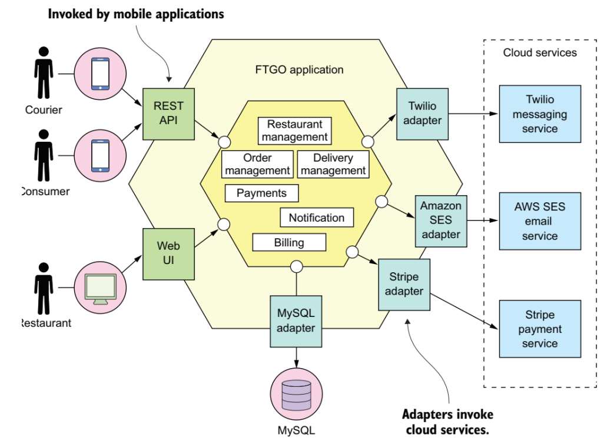
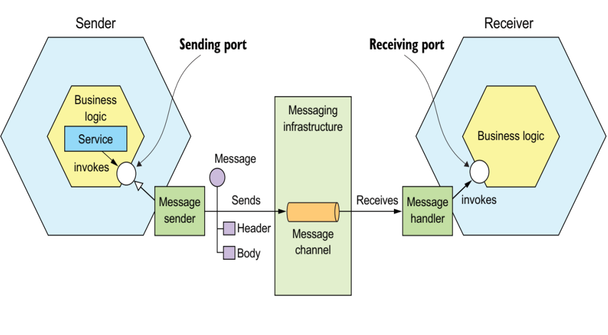

# Microservice Architecture

<div align="justify">

## Definition

- Microservice architecture is an approach to developing a single application as a suite of small services, each running in its own process and communicating through simple mechanisms, often HTTP.
- Each service implements a separate business requirement and can be deployed independently in a fully automated manner.
- There is minimal centralized management of these services, which can be written in different programming languages and use different data storage technologies.

## Comparison with Monolithic Architecture

- In earlier lessons, we discussed the architecture of an application built in three main parts: a client-side user interface (consisting of HTML pages and JavaScript executed in the user's browser), a database (composed of many tables embedded in a common and usually relational database management system), and a server-side application.
- The server-side application handles HTTP requests, executes domain logic, retrieves and updates data from the database, and selects and populates HTML views sent to the browser.
- This server-side application is a single logical unit. All system changes involve building and deploying a new version of the application on the server.

## Example of a Monolithic Application



## Maintaining a Monolithic Application


## Example of the Same Application as Microservices


## What is a Microservice?


## Maintaining Microservices


## Microservices vs Monolithic Architecture

### Advantages of Microservices

- **Clear module boundaries:** Microservices reinforce a modular structure, which is especially important for larger teams.
- **Independent deployment:** Simple services are easier to deploy, and since they are autonomous, they are less likely to cause system failures when they fail.
- **Technological diversity:** Development of microservices can combine multiple languages, frameworks, and data storage technologies.

### Costs of Microservices

- **Distributed nature:** Distributed systems are harder to program because remote calls are slow and always at risk of failure.
- **Eventual consistency:** Maintaining strong consistency is extremely difficult for distributed systems, meaning everyone must master eventual consistency.
- **Operational complexity:** A mature operations team is needed to manage a multitude of services that are regularly deployed and replace older versions.

## Comparison with (Earlier) Service-Oriented Architectures (SOA)

| Characteristic | SOA | Microservices |
| --- | --- | --- |
| Inter-service communication | Smart pipes, e.g., Enterprise Service Bus, using heavyweight protocols like SOAP and other WS* standards | "Dumb pipes," like message brokers, or direct service-to-service communication using lightweight protocols such as REST or gRPC |
| Data | Global data model and shared database | Local model and database for each service |
| Service size | Larger monolithic application | Smaller service |

## Communication Among Services

- Services must collaborate to fulfill a client's request.
- Communication issues include interaction styles (synchronous/asynchronous), direct or via a broker, API versioning, communication standards (REST, gRPC, GraphQL, etc.), service discovery, transactions, failure recovery, and more.
- The following sections briefly address these issues and provide examples of specific design patterns, protocols, and libraries for implementation.

## Communication Styles Among Services

### One-to-One Communication

| Synchronous | Asynchronous |
| --- | --- |
| Request/response | Asynchronous request/response |
| - | One-way notification |

### One-to-Many Communication

| Asynchronous |
| --- |
| Publish/subscribe |
| Publish/asynchronous responses |

### Types of One-to-One Communication

- **Request/response:** The client service makes a request to the service and waits for a response. The client expects a timely response and may block while waiting, resulting in tightly coupled services.
- **Asynchronous request/response:** The client sends a request to the service, which responds asynchronously. The client does not block while waiting, as the service may take a long time to send a response.
- **One-way notification:** The client service sends a request but does not expect a response.

### Types of One-to-Many Communication

- **Publish/subscribe:** The client sends a notification message received by zero or more interested services.
- **Publish/asynchronous responses:** The client publishes a message with a request and then waits for responses from interested services for a certain period.

## Synchronous Request-Response Communication

- This type of communication is often realized via REST or gRPC protocols.

### Representational State Transfer (REST)

- Uses HTTP verbs to manipulate resources referenced by URLs.
- A GET request returns a resource representation as a JSON object, among other formats.
- A POST request creates a new resource, a PUT request updates a resource, and a DELETE request removes a resource.
- For example, to update an invoice status in the Invoice microservice, you can send the following request:

```http
PUT localhost:8081/.../api/v1/invoices/{invoice_id}
Body: { "status": "waiting" }
```

#### REST Client Request Example

```python
import requests

def update_invoice(order_id, order_data):
    url = "https://example.com/api/orders/" + order_id
    headers = {"Content-Type": "application/json"}
    response = requests.put(url, data=order_data, headers=headers)
    if response.status_code == 200:
        return response.json()
    else:
        raise Exception(response.text)
```

#### REST Server Example

```python
from flask import Flask, request, jsonify

app = Flask(__name__)

@app.route("/api/orders/<order_id>", methods=["PUT"])
def update_order(order_id):
    order_data = request.get_json()
    if order_data and "items" in order_data and "total" in order_data:
        db.update(order_id, order_data)
        return jsonify({"message": "Order updated successfully", "order": order_data})
    else:
        return jsonify({"message": "Invalid order data"}), 400

if __name__ == "__main__":
    app.run()
```

## gRPC – An Alternative to REST

- In gRPC (a remote procedure call protocol developed by Google), a client application can directly call a method on a server application on another machine as if it were a local object, making it easier to create distributed applications and services.
- gRPC data exchange is based on Protocol Buffers, a language-neutral binary format for data exchange.
- It compresses data more efficiently than REST but requires HTTP/2, making it suitable for synchronous communication between microservices within the cloud but not as much between, e.g., a mobile client and service, since some firewalls do not support HTTP/2.
- It is also more complex to implement.

## Asynchronous Communication via Messaging

- Services can communicate asynchronously by exchanging messages.
- A message broker is usually used for message exchange, acting as an intermediary between services, although a brokerless architecture, where services communicate directly, is another option.
- The client sends a request to the service by sending a message. If the service is expected to respond to the message, it will do so by sending a separate message to the client.
- Because communication is asynchronous, the client is not blocked waiting for a response and can do something else.

## Asynchronous Communication via Messaging Example



## Asynchronous Communication via Messaging(2)

## Message Broker

- A message broker acts as an intermediary through which all messages pass. The sender writes a message to the message broker, and the broker delivers it to the recipient.
- An important advantage of using a message broker is that the sender does not need to know the recipient's network location. Another advantage is that the message broker buffers messages until the recipient is able to process them.
- Examples of popular brokers include RabbitMQ, ActiveMQ, and Apache Kafka.
- Each broker makes different trade-offs. For example, a low-latency broker may not preserve order, offer delivery guarantees, and may only store messages in memory.
- A message broker that guarantees delivery and reliably stores messages on disk will likely have higher latency.
- The choice of a message broker depends on the application's requirements. It is even possible for different parts of the application to have different messaging requirements.

## Service Discovery

- To make a request, the client code needs to know the network location (IP address and port) of the service instance.
- In a traditional application running on physical hardware, the network locations of service instances are usually static. For example, client code can read the network locations from a configuration file that is periodically updated.
- However, in a modern cloud-based environment, it is not usually that simple.
- Service instances have dynamically assigned network locations. Moreover, the set of service instances changes dynamically due to automatic scaling, failures, and upgrades.
- Therefore, the client code must use service discovery.

### Service Discovery Approaches

- **Application-Level Service Discovery:** The application itself provides service discovery. This is achieved by accessing a service registry that keeps track of active service instances and their addresses. Service instances must auto-register in the registry, which also periodically checks the health of each instance.
- **Environment-Level Service Discovery:** The environment has a service registry that tracks the addresses of service instances.


## Data Handling in Microservices

- Most services need to save data in some kind of database. There are two different approaches:
  - **Shared Database:** One solution is to use a single shared database for multiple services. Each service freely accesses its own and other services' data using local ACID transactions.
  - **Separate Database for Each Service:** Alternatively, each service owns its own database. Data is private to the service. Transactions performed by the service apply only to its local database. Non-local data is available exclusively through the service's API.

## Transaction Characteristics in Databases

- **ACID:** Stands for Atomicity, Consistency, Isolation, Durability.
  - **Atomicity:** The transaction is treated as an indivisible unit, either it succeeds completely or has no effect.
  - **Consistency:** The transaction preserves all database constraints and referential integrity.
  - **Isolation:** Ensures that concurrent transactions result in the same state as if the transactions were executed sequentially one after the other.
  - **Durability:** Once a transaction is successfully committed, the results are permanently saved, even in the event of a system failure.

### Transaction Characteristics in Distributed Architectures

- In microservices and generally distributed architectures (e.g., NoSQL databases), it is often not possible to ensure ACID transaction semantics.
- This is due to the CAP theorem, which states it is impossible to achieve both consistency and availability in a distributed system where data is spread across nodes and messages between nodes can be lost or delayed.
  - If a network failure occurs, the system can:
    - Return an error or timeout when it cannot guarantee up-to-date data, preferring consistency.
    - Always return some data (even if not guaranteed to be the most current) if availability is preferred.
- In NoSQL databases, high availability is preferred over consistency.

### BASE Transaction Model

- NoSQL databases often use the BASE transaction model, which stands for Basically Available, Soft state, Eventual Consistency.
  - **Basically Available:** Reads and writes usually succeed without consistency guarantees.
  - **Soft state:** Data values can change over time until all conflicts are resolved.
  - **Eventual Consistency:** The system will become consistent over time in the absence of new writes, ensuring that reads will eventually return the most current data.

## Example Usage

- **OrderService and CustomerService** freely access each other's tables. For example, OrderService can use the following ACID transaction to ensure a new order does not exceed the customer's credit limit:

```sql
BEGIN TRANSACTION
SELECT ORDER_TOTAL
FROM ORDERS WHERE CUSTOMER_ID = ?
SELECT CREDIT_LIMIT
FROM CUSTOMERS WHERE CUSTOMER_ID = ?
INSERT INTO ORDERS …
COMMIT TRANSACTION
```

- The database guarantees the credit limit is not exceeded even when simultaneous transactions try to create orders for the same customer.

## Drawbacks of Shared Databases

- **Development Conflicts:** A developer working on OrderService must coordinate schema changes with developers of other services accessing the same tables. This coupling and added coordination slow down development.
- **Undesirable Coupling During System Operation:** All services access the same database and can potentially interfere with each other. For example, if a long-running transaction in CustomerService holds a lock on the ORDER table, OrderService will be blocked.
- **Database Capacity and Performance:** A single database might not meet the storage and access requirements of all services.
- Due to these drawbacks, this approach is often called an anti-pattern in microservice architecture.

## Separate Databases for Each Service


### Advantages of Separate Databases

- **Loose Coupling:** Helps ensure services are loosely coupled. Changes in one service's database do not affect any other service.
- **Database Choice:** Each service can use the type of database that best fits its needs. For example, a service performing text search can use ElasticSearch. A service managing a social network could use Neo4j.

### Disadvantages of Separate Databases

- **Business Transactions:** Implementing business transactions that span multiple services is not straightforward. Many modern (NoSQL) databases do not support classic transactions.
- **Complex Queries:** Implementing queries that join data across multiple databases is challenging.
- **Managing Multiple Databases:** Managing a large number of SQL and NoSQL databases adds complexity.

## Designing Separate Databases

There are various design patterns for implementing transactions and queries that span multiple services:

- **Implementing Multi-Service Transactions:** Use the Saga pattern.
- **Implementing Queries Across Multiple Services:**
  - **API Composition:** Data combination is done in the service's code (or API gateway), not in the database.
  - **Command Query Responsibility Segregation (CQRS):** Maintains one or more materialized views containing data from multiple services. The views are maintained by services subscribing to events published by each service when it updates its data.

### API Composition Pattern


#### Considerations for API Composition Pattern

- **Who Acts as the Composer?** In the case of a fast LAN connection, it can be the application client. Alternatively, it could be an API gateway or a special application microservice.
- **Performance Improvement:** The composer sends queries to suppliers in parallel, avoiding blocking.
- **Service Availability Risk:** The composer may return either incomplete data from other suppliers or previously cached data from the currently unavailable supplier to handle the failure of a supplier service (or even if the supplier is available to improve performance).
- **No Data Consistency Guarantees:** Since more queries are executed across more databases, consistency is not guaranteed. If consistency is necessary, use the CQRS pattern instead.

### Command Query Responsibility Segregation (CQRS) Pattern


## Project Pattern: Separation of Responsibility for Commands and Queries (CQRS)

## Benefits of the CQRS Pattern

- Enables high performance for queries and system scalability.
- Suitable for event-based systems (if this is a core design characteristic of the system).

## Drawbacks of the CQRS Pattern

- Increased system complexity.
- In situations where there is a delay in updating data replicas, the system can only offer eventual consistency.

## Project Pattern: Saga

## Purpose of the Saga Pattern

- Addresses the problem of executing transactions that span multiple services with local databases when data consistency is required.


## Coordination Methods in Sagas

- **Choreography**: Each local transaction publishes events that trigger local transactions in other services.
- **Orchestration**: An orchestrator (a single service) instructs other services, participants in the saga, which local transactions to execute.

### Example of a Choreography-Based Saga


### Example of an Orchestration-Based Saga


## Benefits of the Saga Pattern

- Ensures data consistency across multiple services with local databases.

## Drawbacks of the Saga Pattern

- Increased complexity. For example, compensating transactions must be implemented to explicitly undo changes made within the saga.
- For reliable operation, a service must atomically update its database and publish an event. There are specific patterns for this (refer to the book listed at the end).
- This pattern does not provide isolation of concurrent transactions, which can lead to anomalies (e.g., one saga writes without reading changes made by another saga). Certain countermeasures must be applied, which we will not cover here.

## Application Interface to the External World

## Clients of Microservice Applications


### API Gateway (Application Interface Gateway)


## Responsibilities of the API Gateway

- **Routing**: Directs requests to the appropriate service. When it receives a request, the API gateway consults a routing map specifying which service to route the request to. The routing map can, for example, map an HTTP method and path to the HTTP URL of the service. This function is identical to reverse proxying functions provided by web servers like NGINX.
- **API Composition**: The API gateway often does more than simple reverse proxying. It can also provide a higher-granularity application interface. The client sends a single request to the API gateway, which composes the response by addressing multiple microservices.

## Additional Responsibilities of the API Gateway

- **Protocol Translation**: The gateway can provide clients with a RESTful interface, even though microservices internally use, for example, gRPC.
- **Edge Functions**: Edge functions, as the name suggests, are request processing functions implemented at the edge of the application. Examples include:
  - **Authentication**: Verifying the identity of the client submitting the request.
  - **Authorization**: Checking whether the client is authorized to perform a particular request.
  - **Rate Limiting**: Limiting the number of requests per second from a particular client or from all clients.
  - **Caching**: Caching responses to reduce the number of requests sent to the services.
  - **Metric Collection**: Collecting metrics on API usage for billing purposes.
  - **Request Logging**: Keeping records of requests from clients.

## Implementing an API Gateway

## Two Options

1. **Using an Off-the-Shelf Product or Service**: For example, AWS API Gateway, Kong, NGINX Plus, etc. This is usually the right approach.
2. **Developing Software Based on an Existing Framework**: Only if there are very specific requirements that standard gateways cannot meet, but this requires development and maintenance resources, and it can easily result in reduced performance or functionality.

## Deploying Microservices

## Deployment of Microservices

- Deployment of services into a production environment is defined by two interconnected concepts:
  - **System Architecture**: Defines the structure (hardware and software) of the system where the services are executed.
  - **Deployment Process**: Defines the steps that must be performed by people (developers and operators) to launch the service in a production environment.

## Evolution of Production Architectures


### Early Production Architectures

- Initially, software (web applications) was deployed on physical machine servers that were not easy to replace. The software was a collection of libraries and components dependent on a specific programming language (e.g., in the case of PHP, a collection of PHP scripts and auxiliary files; in the case of Java, a WAR file archive). Deployment was performed by a separate operations team, typically manually (e.g., in the administrative console of the application server).

### Evolution to Virtual Machines

- In the mid-2000s, web applications and services began to be deployed on virtual machines instead of physical servers. Virtualization allows the resources (CPU, memory, etc.) of a physical machine to be shared among multiple virtual software machines, each appearing as a complete physical machine with a full operating system (albeit with fewer physical resources).

### Evolution to Containers

- In the mid-2010s, Docker popularized operating system-level virtualization. A container image is a standalone executable software package that includes the code and all its dependencies (settings, system libraries, system tools). Since multiple containers (instances of container images) execute within the same operating system, they require fewer resources than virtual machines and thus fall into the lightweight category of virtualization. Microservice instances run in containers.

### Serverless Architecture

- The lightest category of production architecture is serverless (or FaaS, function as a service) where server-side application logic executes in stateless computing containers, triggered by events, short-lived (may exist for only one execution), and fully controlled by the provider. Serverless functions can be combined with traditional microservices for lower operational costs.

## Modern Production Environment


## Deploying Microservices in Docker Containers


## Literature

- Chris Richardson, *Microservices Patterns: With examples in Java*, 2019.

</div>
