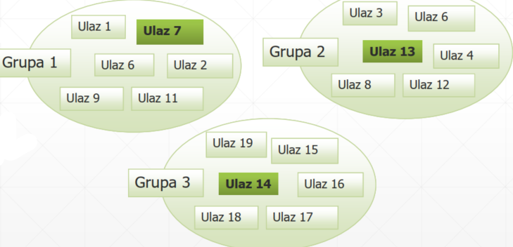

# Software Testing

## Terminology Related to Errors and Testing

- **Source:** Glossary of Software Engineering Terminology. ANSI/IEEE Std. 729–1983
- **Error** - A mistake made by a human, for example, during the specification of requirements or program coding.
- **Fault/Defect** - The consequence of an error (e.g., a missing function in the program or a malfunctioning feature - "Bug").
- **Failure** - The inability of a system to perform a required function, often occurring when executing defective code.
- **Incident** - A symptom that reveals a failure to the user.
- **Test Case** - Investigates specific program behavior; a test case contains a set of input values and expected results.
- **Testing** - The process of verifying the correctness of software by executing test cases. There are two main objectives of testing: to find failures or to demonstrate correct execution.

## Expected Test Results

- **Prediction/Test Oracle** - A mechanism, independent of the program itself, that can be used to verify the correctness of the program's operation for test cases.
- Conceptually, test cases are given to both the program and the oracle, and their outputs are compared.
- The test oracle can be a human or an automated tool.
- Humans use the program's specification to decide the correct program behavior. However, specifications are often faulty, incomplete, or ambiguous, and humans can make oversights.
- Automated oracles use formal specifications and are accurate as long as the specification is correct. Formal specifications often do not exist for a program (they are not easy to create).

## Test Case Design

- Almost every non-trivial system has an extremely large domain of input data => exhaustive testing for every conceivable combination of inputs is impossible or impractical.
- A randomly chosen test case may be meaningless if it exposes an error already detected by another test case.
- The number of test cases does not determine how effective testing is.
- To detect an error in the following code:

  ```c
  if(x > y) max = x; else max = x;
  {(x = 3, y = 2); (x = 2, y = 3)} satisfies
  {(x = 3, y = 2); (x = 4, y = 3); (x = 5, y = 1)} does not satisfy
  ```

- Each test case should reveal a different error.

## Software Testing (1)


## Testing Classifications

- **By Granularity Level:**
  - Unit Testing
  - Integration Testing
  - System Testing
- **By Testing Approach:**
  - Functional
  - Structural

## Functional Testing

- The program is viewed as a function that maps values from the input domain to the output domain.
- The implementation is not known; the program is a black box.
- The only information used to determine test cases is the program's specification.
- **Advantages of the functional approach:**
  - Test cases are independent of the specific implementation, so they are useful even if the implementation changes.
  - Test development can proceed in parallel with implementation development, reducing the required time.
- **Disadvantages of this approach:**
  - Often there is significant redundancy in the test series.
  - There is a possibility that part of the implementation is not covered by tests (e.g., it cannot be detected if the program is infected with a virus since it is not in the specification).


## Structural Testing

- Structural testing focuses on the implementation of the program.
- Also known as the white-box approach.
- The goal is not to execute all possible program functions but to execute/activate different program structures and data structures in the program.
- Various structural testing criteria define much more precisely than functional testing criteria which program structures need to be covered (e.g., statements, decisions, paths).
- This testing cannot detect whether an element of the specification is not implemented in the program since the specification is not considered for test selection.

## Equivalence Class Partitioning

- Input values are divided into equivalence classes.
- The division is done so that:
  - The program behaves similarly for all input values belonging to the same equivalence class.
  - Groups of equivalent input data produce the same result, from which one representative of the group is used during testing.


## Why and How to Define Equivalence Classes?

- **Why?** To test the program with one representative input value from each equivalence class.
  - Equally effective as testing with any other values from the same equivalence classes (will find the same errors).
- **Ideally, subsets are mutually disjoint and cover the entire set of inputs** (the "similarity" relation of inputs is an equivalence relation).
- **How to determine equivalence classes?**
  - All conditions related to the program's inputs and outputs arising from the specification are considered (variable types, explicit constraints).
  - For each condition, two groups of classes are considered based on the condition's satisfaction:
    - Legal classes encompass allowed situations.
    - Illegal classes encompass all other situations.

## Tips for Equivalence Class Partitioning

- **If the program's input condition is defined within a range of values:**
  - For example, a number between 1 and 5000.
  - Define one legal (1 ≤ number ≤ 5000) and two illegal equivalence classes: (number < 1) and (number > 5000).

- **If the program's input condition defines a fixed number:**
  - For example, a unique citizen identification number (JMBG) has 13 digits.
  - Define one legal (mbr_c = 13) and two illegal equivalence classes: (mbr_c < 13) and (mbr_c > 13).

## Tips for Equivalence Class Partitioning (2)

- **If the input data takes values from an enumerable set, and the program behaves differently for each value:**
  - For example: {a, b, c}
  - One class for each allowed input value (three classes).
  - One class for input values outside the allowed set (e.g., d).
  - For complex data types (records): Define equivalence classes for each component separately, considering combinations of equivalence classes as needed.
- Generally, if there is doubt that the program does not behave the same for every element of an already defined equivalence class, the class should be broken down into smaller ones.

## Guidelines for Generating Equivalence Classes for Variables: Ranges and Text (Strings)

| Type  | Equivalence Class  | Constraint  | Representative Classes - Examples  |
|-------|--------------------|-------------|------------------------------------|
| Range | One class with values within the range and two classes with values outside the range | speed ∈ [60 ... 90] | { {50}, {75}, {92} } |
|       |                     | area: float area ≥ 0 | { {-1.0}, {15.52} } |
|       |                     | age: int 0 ≤ age ≤ 100 | { {-1}, {56}, {122} } |
|       |                     | letter: char | { {J}, {3} } |
| Text  | One class containing legal text and one containing illegal text. Can also track string length. | name: string (text only) max_length = 8 | { {Drazen}, {Drazen5}, {#}, {PredugackoIme} } |
|       |                     | title: string (alphanumeric) | { {Drazen}, {BulevarKraljaAleks73} } |

## Guidelines for Generating Equivalence Classes for Variables: Enumerated Types and Arrays

| Type  | Equivalence Class  | Constraint  | Representative Classes - Examples  |
|-------|--------------------|-------------|------------------------------------|
| Enum  | Each value in a separate class | auto_color ∈ { red, blue, green } | { {red}, {blue}, {green} } |
|       |                     | condition: Boolean | { {true}, {false} } |
| Array | One class containing an array with legal elements, one class containing an empty array, and one class containing more elements than expected. | Java array: int[] array = new int[3] | { { [] }, { [-10, 20] }, { [-9, 0, 12, 15] } } |

## Boundary Value Analysis

- Programmers often overlook:
  - Special processing needed at the boundaries of equivalence classes.
  - For example, a programmer might incorrectly write `<` instead of `<=`.
- **Boundary Value Analysis:**
  - Choose test cases at the boundaries of different equivalence classes (one or multi-dimensional), or based on specified relationships among inputs.
  - One test case for each boundary value.

## Meyers' Recommendations for Boundary Values

1. **If the input condition specifies a range of values, write tests for the range's edges and tests for invalid inputs just beyond the legal edges.**
   - For example: if the input range is -1.0 to 1.0, test for -1.0, 1.0, -1.0001, 1.0001 (assuming the smallest delta making a difference in the program is 0.0001).
2. **If the input condition specifies the number of values, write tests for the minimum and maximum number of values, and one below and above these values.**
   - For example, if the input file can contain 1-255 records, write tests for 0, 1, 255, and 256 records.
3.

 **Apply boundary values to the program's output conditions.**

- If the program can generate values in a certain range, create a set of input values that will generate output values just inside and outside the range.
- If the program can generate 0-30 tables of results, create input data to generate 0, 1, 30, and 31 tables.

## Guidelines for Boundary Value Analysis

- For an input domain with values between [a ... b], test the elements a, a+1, a-1, b, b+1, and b-1.
- For an input domain containing n ordered elements: test the first and last elements and the two elements on either side of these boundaries.
- Similarly, if an ordered list of inputs is sorted in descending order, test the first and last elements and the two elements on either side of these boundaries.

## Guidelines for Generating Boundary Value Analysis for Variables: Ranges and Text (Strings)

| Type  | Boundary Value Classes | Constraint | Representative Classes - Examples |
|-------|------------------------|-------------|-----------------------------------|
| Range | One class with values within the range, one class with the smallest value greater than the range, and one class with the largest value less than the range. | speed ∈ [60 ... 90] | { {59}, {60}, {61}, {89}, {90}, {91} } |
|       |                        | area: float area ≥ 0 | { {-1.0}, {0.0}, {0.1} } |
|       |                        | age: int 0 ≤ age ≤ 100 | { {-1}, {0}, {1}, {99}, {100}, {101} } |
|       |                        | letter: char | { {'I'}, {'J'}, {'K'}, {'2'}, {'3'}, {'4'} } |
| Text  | One class containing legal text, one containing text just exceeding the maximum length, and one containing the maximum allowable text length. | name: string (text only) max_length = 8 | { {""}, {"Drazen"}, {"Drazen5"}, {"Drazen56"}, {"Drazen567"}, {"Drazen5678"}, {"PredugackoIme"} } |
|       |                        | title: string (alphanumeric) | { {"Drazen"}, {"BulevarKraljaAleks73"} } |

## Guidelines for Generating Boundary Value Analysis for Variables: Enumerated Types and Arrays

| Type  | Boundary Value Classes | Constraint | Representative Classes - Examples |
|-------|------------------------|-------------|-----------------------------------|
| Enum  | Each value in a separate class | auto_color ∈ { red, blue, green } | { {red}, {blue}, {green} } |
|       |                        | condition: Boolean | { {true}, {false} } |
| Array | One class containing an array with legal elements, one class containing an empty array, and one class containing more elements than expected. | Java array: int[] array = new int[3] | { { [] }, { [-10, 20] }, { [-9, 0, 12, 15] } } |

## Example: Electronic Item Purchase


## State and Transition Coverage

1. Adopt a rule where the test must start and where it must (or can) end. For example, the test must start in the initial state and can only end in the final state.
2. From the allowed initial state, define a sequence of event/state combinations that lead to an allowed final state. For each transition that will occur, record the expected action the system should take. This is the expected test result.
3. Mark each state and transition from the defined test as covered (e.g., on a test diagram).
4. Repeat steps 2 and 3 until all states and transitions are covered.
   - This procedure will generate logical test cases. To create concrete test cases, real input and output values must be adopted.

## Example of State/Transition Coverage

TP1. (browsing, click link, display, add to cart, selection dialog, continue shopping, display, add to cart, selection dialog, checkout, login dialog, login[bad], error, login[good], purchase dialog, purchase[bad], error, purchase[good], confirmation, resume shopping, display, abandon, left).


## Example of State/Transition Coverage (2)

Remaining TPs (experiential estimate for the total number is how many input branches there are into the final state):
2. (browsing, add to cart, selection dialog, abandon, <no action>, left)
3. (browsing, add to cart, selection dialog, checkout, login dialog, abandon, <no action>, left)
4. (browsing, add to cart, selection dialog, checkout, login dialog, login[good], purchase dialog, abandon, <no action>, left)
5. (browsing, add to cart, selection dialog, continue shopping, display, add to cart, selection dialog, checkout, login dialog, login[good], purchase dialog, purchase[good], confirmation, go elsewhere, <no action>, left)


## Transition Table

- The table shows all combinations of states with input events/conditions.
- Both allowed and disallowed combinations are shown.
- This way, it analyzes what happens in disallowed and undefined situations.
- First, list all states and all inputs/conditions shown in the state diagram.
- Then create a table that has a row for each state in combination with each input/condition:

| Current State | Input/Condition | Action | New State |

## Example: Electronic Purchase


## Example: Electronic Purchase (1)

- To cover the case: Browsing, checkout, undefined, undefined
- Start from the legal initial state:
  - TP4. (browsing, add to cart, selection dialog, checkout, login dialog, login[good], purchase dialog, abandon, <no action>, left)
- Modify it as follows:
  - (browsing, attempt: check out, action undefined, add to cart, selection dialog, checkout, login dialog, login[good], purchase dialog, abandon, <no action>, left)
- The idea is to cover each undefined row in the table with a separate transition, similar to equivalence classes, to avoid one error masking another (the question is whether the system would reach the second transition).

## Unit Testing

### Introduction

- Unit testing involves testing isolated units (components) in the system.
- The condition is that the component being tested can be viewed as an independent unit that can be extracted from the system context and tested in isolation from other components.
- Components can be considered as classes, modules, packages, or even code fragments.
- Components can be part of the user interface (pages or forms) or components that perform some actions and process results (e.g., components for implementing algorithms, data fetching, communication with other systems).

### Test Environment for Individual Component

- The component being tested is extracted from the system context where it communicates with other components and placed in a test context that simulates the real system, containing components that simulate the operation of real components.
- The example is shown in the picture – the component under test T in the real environment is called by components A and B, to which it returns some data when called, and it calls components C and D, which provide information when the component calls them.


### Test Environment for Individual Component (2)

- Instead of real components from its environment, the component in the test context communicates with simulated components that either call it or respond to its calls in the same way as real components. Depending on whether the simulated components call or are called, they are divided into two types:
  - **Drivers** – components that simulate the operation of real components that call other components and expect some response. These components initiate the test since they initiate calls to the component being tested. Tools from the xUnit family are often used for driver realization.
  - **Doubles** – components that simulate the operation of real components that receive calls and return the same results as real components.

### xUnit Unit Testing Frameworks

- These frameworks facilitate the automation of unit testing by allowing the writing of test scripts, specifying expected results, grouping tests into test suites, and executing one or a series of tests to get a test result report.


### xUnit Framework Architecture

- **TestRunner** is a command-line or GUI application that executes methods marked as tests and treats them as successful (pass) if no assertion is violated and no execution errors occur (so even an empty test is successful).
- Frameworks for different languages handle the discovery of test methods for execution in different ways, usually via metadata (annotations or attributes). In some languages, the method name must start with "test." In some, a test Factory must be created programmatically.
- The framework provides no guarantees about the order of execution of individual test methods (which means they must not be interdependent).

### Execution of Test Methods

- The execution of xUnit test methods takes place in four steps:
  1. For tests to be repeatable, unit tests must be run from a known initial state. The fixed state of program elements that the test depends on is called a test fixture, and the purpose of setup code is to establish it.
  2. The next step is to execute the system under test (SUT) and interact with it.
  3. Then, verify the behavior of the SUT, i.e., determine whether the system behaves as expected.
  4. After each test, teardown code is called to clean up the test fixture.

### Verification of Test Results “Theory”

- **Prediction, test result prediction (test oracle)**
- The test predictor is a mechanism, independent of the program itself, that can be used to verify the correctness of the program's operation for test cases.
- Conceptually, test cases are provided to the program and the predictor, and their outputs are then compared.
- The problem of determining expected outputs is the so-called test oracle problem.


### Verification of Test Results “Theory” (2)

- One way to implement a predictor is an alternative implementation of the same algorithm (then output values can be directly verified).
  - To avoid repeating the same mistakes, it is best for someone other than the original implementer to perform the alternative implementation or use an alternative algorithm (e.g., verify quick sort with insertion sort) or some entirely different programming language.
- If we lack resources for an alternative implementation, we will not directly verify the outputs but something less precise, only some properties of the output results.

### Verification of Test Results “Theory” (3)

- Examples of assertion checks that can be implemented in tests:
  - **Boundaries**: Test whether the result always falls within certain known boundaries. An earlier example was the generative test with insurance premiums.
  - **Errors and Exceptions**: Whether the input is processed without errors and exceptions. Whether the output is not null.
  - **Complex Optimizations**: If some code does something simple in a very complicated way to make it fast, a simple implementation can be included in the test to check whether the outputs match.
  - **Complementary Pairs**: If you have a pair of functions such as encoding and decoding, it can be checked whether encoding followed by decoding reproduces the original input.
  - **Idempotence**: It can be checked whether calling the function multiple times with the same input does not change its output (unless expected).
  - **Commutativity**: It can be checked whether the order of arguments affects the result. For example, the addition function should behave this way.
  - **Invariants**: Specific business logic invariants can be checked (things that should always hold, e.g., that some data in a class is not null, or if a date range is stored, that after each update, the start of the range is earlier than the end of the range).

## Test Doubles

### Introduction ()

- The class being tested (SUT) may depend on one or more other classes (the so-called depended-on component, DOC).


### Problem of Indirect Inputs

- The collaborator class (DOC) can return values or throw exceptions that affect the behavior of the SUT, but it may be difficult or impossible to cause certain behavior cases.
- Indirect inputs received from the DOC can be unpredictable (like the system clock or calendar).
- In other cases, the DOC may not be available in the test environment or may not even exist yet.
- Not all outputs from the SUT are directly visible to the test method. These so-called indirect outputs are sent to other components (DOC) in the form of method calls or messages.

### Control of Indirect Inputs and Outputs

- We will solve the problem of indirect inputs and outputs by replacing real DOCs with test doubles, i.e., their surrogate classes.
  - The class being tested will not know that it is not interacting with the real collaborator class.
  - The test itself controls what input the test double returns to the SUT, thus controlling the SUT's indirect inputs.
  - The test can also verify whether the SUT correctly called the DOC by verifying the messages the SUT sent to the test double.
  - The goal is to verify the SUT behavior in isolation from other classes.

### Types of Test Doubles

- **Dummy** objects
  - Implement only those methods that are necessary for the test to compile.
  - Do not simulate the actual behavior of the DOC.
  - Often replaced by a simpler means (e.g., a NULL value for references or 0 for primitive data types).
- **Fake** objects
  - Implement methods that have "normal" functionality, but some of it is not implemented.
  - Example: a fake database that stores data in memory, not in files.
- **Stub** objects
  - Implement methods that only return predefined values to the SUT.
- **Spy** objects
  - Have the same behavior as stub objects but also record additional information about calls to them.
- **Mock** objects
  - Replace the DOC and verify whether the SUT correctly called the DOC. Instead of returning predefined values, they contain predefined expectations about the calls and signal an error if those expectations are not met.

### How to Choose the Type of Test Double

- We use dummy objects for classes where the SUT does not use their methods (they only exist for compilation).
- We use fake objects for simple tests or in a system where there is no need for a real component (e.g., a fake DB for simple CRUD).
- Stubs, mocks, and spies can also implement methods that do not return anything.
- If the SUT interacts with other components, stub objects are the first choice (if the data needs to be passed).
- Spies and mocks are used to verify SUT behavior through calls to other components.

## Dummy Object

- A Dummy object is used to fill the place of a parameter that is passed to the SUT during testing but is not used (does not affect the test).

```java
public void testInvoice_addLineItem_DO() {
    final int QUANTITY = 1;
    Product product = new Product("Dummy Product Name", getUniqueNumber());
    Invoice inv = new Invoice(new DummyCustomer());
    LineItem expItem = new LineItem(inv, product, QUANTITY);
    // Exercise
    inv.addItemQuantity(product, QUANTITY);
    // Verify
    List lineItems = inv.getLineItems();
    assertEquals("number of items", lineItems.size(), 1);
    LineItem actual = (LineItem) lineItems.get(0);
    assertLineItemsEqual("", expItem, actual);
}
```

## Test Stub

- A Test Stub is an object that replaces a DOC to deliver values of indirect inputs to the SUT as return values when the SUT calls stub methods.


## Test Spy

- A Test Spy replaces a DOC during testing to record the method calls made by the SUT. During the verification phase, the values recorded by the test spy are compared with the expected values.


## Mock Object

- A Mock object replaces a DOC during testing to track indirect outputs. The mock object contains assertions to compare the calls from the SUT and its actual parameters with the expected values.


## Fake Object

- A Fake object is a simpler and often faster implementation of a real DOC that represents the DOC's functionality without the side effects we want to remove.


## Test-Driven Development (TDD)

### Test-Driven Development


### TDD Process

Steps in the TDD process are as follows:

1. **Choose an Increment of Required Functionality**: The increment should normally be small and programmable in a few lines of code.
2. **Write a Test**: Write a test for this functionality and implement it as an automated test. This means the test can be executed and will report whether it passed or failed.
3. **Run the Test**: Run the test along with all previously written tests. Initially, the functionality is not realized, so the new test will fail. This is intentional, as it shows that the test adds something to the test suite. This is the so-called red phase.
4. **Implement the Functionality**: Implement the functionality and run the test again. The goal is for the test to now pass. This is the so-called green phase.
5. **Refactor Existing Code**: The growing codebase must be regularly cleaned during TDD. The new code can be moved from where it was convenient to satisfy the test to where it logically belongs. Duplication must be removed. Object, class, module, variable, and method names should clearly represent their current purpose and use, as additional functionality is added. As functions are added, method bodies can grow, and class members added. It is useful to split and carefully name their parts to improve readability and maintainability later in the software lifecycle. Inheritance hierarchies can be rearranged to be more logical and to incorporate recognized design patterns.
6. **Proceed to the Next Increment**: When all tests pass successfully, move on to implementing the next increment of functionality.

### Test Writing Recommendations

It is desirable to write tests for new functionality in the following order:

1. **Boundary Case**: Start with a test that works on "empty" values such as zero, null, an empty string, or similar. This will help you satisfy the interface while ensuring it can be delivered very quickly.
2. **Happy Path Tests**: One or several tests of the basic successful scenario. Such a test/tests will lay the foundation for the implementation, while remaining focused on the basic functionality.
3. **Tests Providing New Information or Knowledge**: Do not dig in one place. Try to approach the solution from different angles by writing tests that activate different parts of it and teach you something new about the problem.
4. **Error Handling and Negative Tests**: These tests are crucial for correctness, but rarely for design. In many cases, they can safely be written at the end.

### Strategies for Moving from Red to Green

1. **Faking**: This is the simplest way to make the test pass. Just return or do whatever the specific test expected. If the test expected a certain value, then just return a constant. Tests that pass after faking usually fail when the next test wants something other than a constant value or fixed behavior.
2. **Obvious Implementation**: If you know what needs to be implemented, then just do it. The obvious implementation usually involves taking a slightly larger development step. However, if you go to extremes by typing the entire algorithm at once, it can result in a red phase, i.e., some tests failing. Then you must resort to development with error removal debugging, which is a return to old, bad habits.
3. **Triangulation**: Some algorithms can be implemented by giving a certain number of concrete examples and then generalizing the solution. This is called triangulation and has its roots in geometry. It is reasonable to make one test green by faking, while a larger number of tests with different parameters and expected results will push the code toward a general algorithm.

### Example of Triangulation Strategy

We want to write a program that will calculate the area of a square with a side length of `edge`.

We start with a boundary test, for a side length of 0.

```java
@Test
public void testAreaWithZeroEdge() throws Exception {
    Square s = new Square(0.0);
    assertEquals(0.0, s.area(), 0.0); // third parameter is delta
}
```

Faking satisfies the test:

```java
class Square {
    Square(double edge) {}
    public double area() {
        return 0.0;
    }
}
```

### Example of Triangulation Strategy (2)

Now we add a new boundary test, for a side length of 1.

```java
@Test
public void testAreaWithEdgeOfOne() throws Exception {
    Square s = new Square(1.0);
    assertEquals(1.0, s.area(), 0.0);
}
```

The test fails for the original solution. We need to come up with a solution that satisfies both tests. `Edge` equal to 0 gives an area of 0, `edge` equal to 1 gives an area of 1. We can write that the area is equal to `edge`, which will satisfy both tests.

```java
class Square {
    private double edge;
    Square(double edge) { this.edge = edge; }
    public double area() {
        return edge;
    }
}
```

### Example of Triangulation Strategy (3)

Continuing, now we add a new test, for a side length of 2.

```java
@Test
public void testAreaWithEdgeOfTwo() throws Exception {
    Square s = new Square(2.0);
    assertEquals(4.0, s.area(), 0.0);
}
```

The test fails for the current solution. Step by step, we started from nothing to `0.0`, then from `0.0` to `edge`, and finally we will replace `edge` with the formula `edge * edge`, thus obtaining the final general solution.

```java
class Square {
    private double edge;
    Square(double edge) { this.edge = edge; }
    public double area() {
        return edge * edge;
    }
}
```
