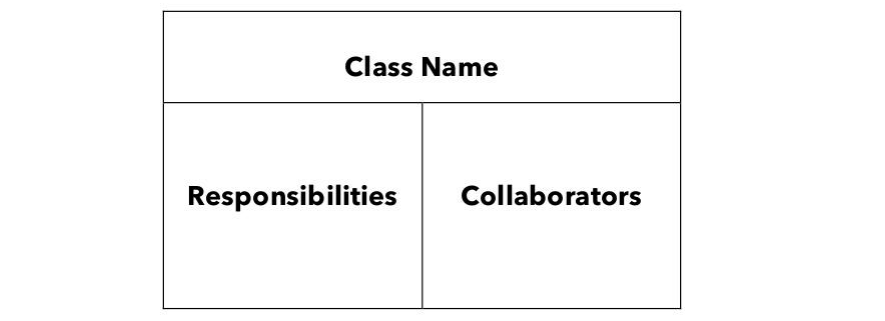
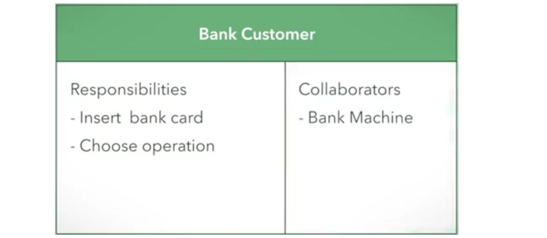
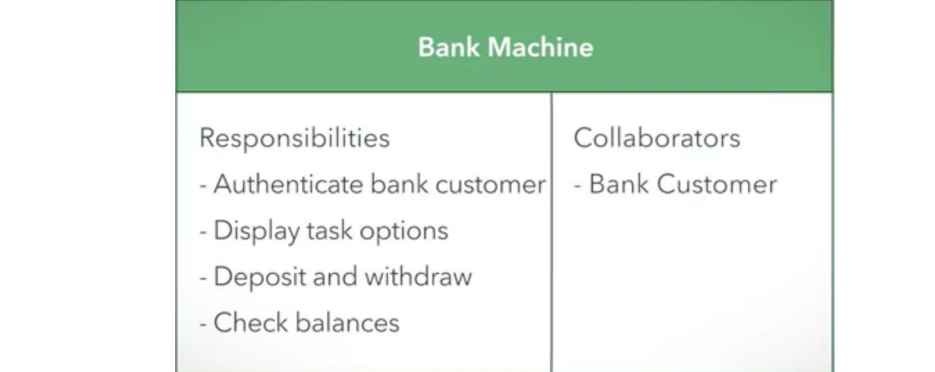
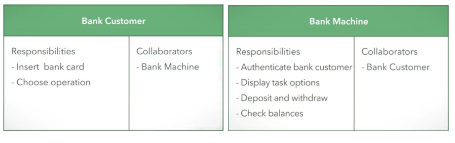
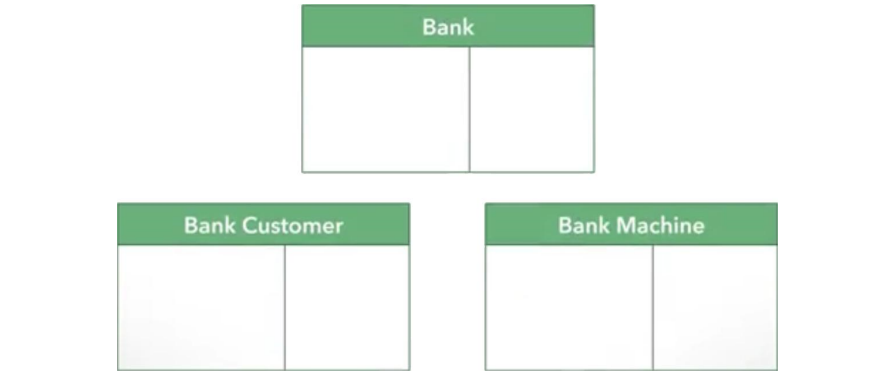
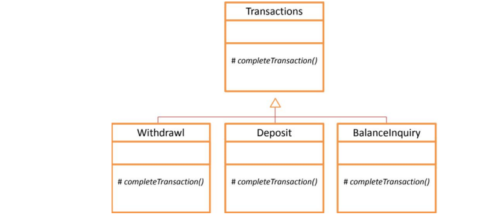

# Objektno orijentisano projektovanje
**Principi softverskog inženjerstva, Elektrotehnički fakultet Univerziteta u Beogradu**

## SADRŽAJ
- Šta ovaj kurs pokriva a šta ne
- Definicija i motivacija
- Konceptualno modelovanje CRC karticama
- SOLID principi objektno-orijentisanog projektovanja

## ŠTA OVAJ KURS NE POKRIVA IZ PROJEKTOVANJA
- Ova tema komplementarna je sa obaveznim kursom projektovanja softvera na SI smeru.
- Na tom kursu obrađuje se vizuelni jezik modelovanja UML i projektni obrasci prema knjizi “Gang of four” 
  - *Design Patterns: Elements of Reusable Object-Oriented Software*
- Kurs PSI podrazumeva znanje tih tema
- Obrađuje komplementarne teme vezane za objektno orijentisanu analizu i dizajn i fokusiran je na arhitekturne šablone i web aplikacije

## UVOD
- Objektno-orijentisano razmišljanje uključuje proučavanje relevantnih problema, razbijajući ih na sastavne delove i misleći na njih kao na objekte. Na primer, tvit na Twitteru ili proizvod na veb lokaciji za kupovinu na mreži mogu se smatrati objektima.
- Kada se prevede na objektno orijentisano modelovanje, objektno-orijentisano razmišljanje uključuje predstavljanje ključnih koncepata kroz objekte u softveru. Treba imati na umu da su koncepti opšti pojmovi. Čak i instance ljudi, mesta ili stvari mogu biti različiti objekti u softveru.
- Objekti mogu imati određene detalje povezane sa njima, a koji su od značaja za korisnike. Na primer, objekat osobe može imati detalje kao što su ime, starost, pol i zanimanje. Objekat mesta može imati veličinu ili ime. Neživi objekat može imati dimenzije ili boju.

## UVOD (Nastavak)
- Objekti takođe mogu imati ponašanje ili odgovornosti koje su im dodeljene. Na primer, sa osobom možemo povezati ponašanje poput sedenja ili kucanja. Neki elektronski uređaj može biti odgovoran za uključivanje i isključivanje, ili za prikazivanje slike. Upotrebom objekata za predstavljanje stvari u programskom kodu, kod ostaje organizovan, fleksibilan i pogodan za višestruku upotrebu (engl. reusable).

## UVOD (Nastavak 2)
- Objekti čine program organizovanim stavljanjem povezanih detalja i funkcija na mesta koja se lako mogu naći. Detalji objekata ostaju povezani sa samim objektima.
- Objekti čine program fleksibilnim, obzirom da se detalji mogu lako menjati na modularan način u okviru objekta, bez uticaja na ostatak koda. U primeru objekta osobe, detalji osobe kao što je zanimanje mogu se menjati, a ne utiču na ostatak koda.
- Objekti omogućavaju ponovnu upotrebu koda i time smanjuju količinu koda koja treba da se kreira od nule. Na taj način se obezbeđuju relativno jednostavni programi koji koriste sofisticirane biblioteke i aplikativne okvire.

## POJAM PROJEKTOVANJA SOFTVERA
- Kada je stvoren početni set zahteva, sledeći korak u procesu je izrada idejnog i detaljnog projekta (dizajna). Ovo rezultuje u stvaranju dve različite vrste artefakata:
  - konceptualni projektni nacrti i 
  - detaljni tehnički dijagrami.
- Napomena: neki autori drugih metodologija projektovanja, idejno projektovanje zovu objektno-orijentisanom analizom a detaljno projektovanje objektno-orijentisanim dizajnom.

## KONCEPTUALNI DIZAJN
- Idejni projekat (ili konceptualni dizajn) se stvara sa početnim setom zahteva kao osnovom. Idejnim projektom definišu se relevantne komponente, veze i odgovornosti softverskog proizvoda. Međutim, određeni tehnički detalji odlažu se do faze detaljnog projekta. Konceptualni nacrti odslikavaju koncepte višeg nivoa konačnog softverskog proizvoda.
- Postoje različiti načini izražavanja konceptualnog dizajna. Mi ćemo proučiti manje formalnu, ali vrlo efektnu tehniku CRC kartica, koja je pogodna za agilne metodologije razvoja softvera.

## DETALJNI DIZAJN
- Detaljni dizajn se gradi na idejnom projektu i zahtevima koji definišu tehničke detalje rešenja. Detaljni dizajn dovodi te informacije do sledeće faze - opisa kako se ispunjavaju odgovornosti iz idejnog projekta. Detaljni dizajn nije gotov dok svaka komponenta nije precizirana da bude specifična dovoljno da bude detaljno osmišljen.
- U detaljnom dizajnu koriste se poznati koncepti objektno-orijentisanih jezika, apstrakcija, enkapsulacija, hijerarhija nasleđivanja, polimorfizam, zatim tehnički dijagrami kao što su različiti UML dijagrami (klasa, sekvence, aktivnosti, stanja itd), projektni uzorci i principi projektovanja da bi se do detalja opisali statički i dinamički aspekti sistema koji se razvija.
- Detaljni dizajn je proučavan u predmetu Projektovanje softvera, mi ćemo navesti samo principe projektovanja i fokusirati se na aspekte arhitekture softvera.

## ARHITEKTURA SOFTVERA
- Definiše celokupnu strukturu sistema, glavne komponente i način na koji međusobno interaguju; daje opšti pregled sistema i definiše kako komponente međusobno sarađuju da bi ostvarile funkcionalnosti sistema.
- Predstavlja deljeno razumevanje dizajna sistema od strane programera, zajednički rečnik i razumevanje strukture i ponašanja sistema.
- Arhitektonske odluke u projektovanju sistema: (važne) odluke o opštoj strukturi i organizaciji sistema, dodela odgovornosti pojedinim komponentama sistema i definisanje načina komunikacije među njima.
- O arhitektonskim stilovima i šablonima koji se koriste u veb aplikacijama biće više reči u sledećoj lekciji.

## Konceptualni dizajn

## Tehnika CRC kartica

### CRC kartice
- **CRC** je skraćenica od tri reči: Class, Responsibilities, Collaborators odnosno Klasa, Odgovornost, Saradnici.
- Ove kartice mogu se uporediti sa beleškama koje pomažu da se organizuje javni govor (prezentacija). CRC kartice pomažu da se komponente sistema organizuju u klase, identifikuju njihove odgovornosti i odredi sa kojim klasama komuniciraju, to jest sarađuju da bi ispunile svoje odgovornosti.



### Primer upotrebe CRC kartica
- Razmotrimo primer bankomata (često korišćen u opisivanju OOAD tehnika). Klijent banke ubacuje svoju bankovnu karticu u bankomat, a zatim će od njega bankomat zatražiti da unese PIN radi provere prava pristupa. Nakon toga, klijent se može odlučiti za depozit, podizanje ili proveru stanja. Ovaj scenario sugeriše osnovne zahteve za sistem. Doduše, to je nepotpun skup zahteva, ali to je dobar početak. U realnosti su zahtevi često nepotpuni i rešavaju se daljim interakcijama sa klijentom i krajnjim korisnicima.
- U ovom primeru, primarni korisnik bio bi klijent banke koji bi otišao na prvu CRC karticu. Klijenta banke postavljamo u odeljak sa imenom klase. Odgovornosti klijenta banke su da umetne bankovnu karticu ili odabere operaciju, poput depozita, podizanja ili provere stanja računa. Navedimo ih u odeljku odgovornosti na CRC kartici.

### Primer upotrebe CRC kartica (Nastavak)
- Sve ove obaveze klijenata uključuju bankomat. Klijent može ubaciti bankovnu karticu u bankomat i odabrati operaciju. Budući da je bankomat potreban da bi naša komponenta klijenta banke ispunila svoj zadatak, bankomat smo postavili kao saradnika na bankovnoj kartici klijenta.



### Primer upotrebe CRC kartica (Nastavak 2)
- Zatim napravimo drugu komponentu, bankomat na drugoj CRC kartici. Bankomat pišemo u odeljku sa imenom klase. Odgovornosti mašine uključuju autentifikaciju klijenta banke, prikazivanje opcija zadatka, depozit, podizanje i proveru stanja. A pošto ova kartica komunicira sa komponentom klijenta banke, dodajemo klijenta banke u odeljak sa saradnicima na kartici bankomata.



### Primer upotrebe CRC kartica (Nastavak 3)
- Ključna prednost upotrebe CRC kartica je ta što omogućavaju da se fizički reorganizuje dizajn. Mogu se staviti srodne kartice zajedno ili locirati kartice da se sugeriše povezanost. Na primer, stavićemo jednu pored druge CRC karticu klijenta banke i CRC karticu bankomata.



### Primer upotrebe CRC kartica (Nastavak 4)
- Sa poređanim CRC karticama, može se simulirati prototip dizajna sistema. Sada razmotrimo scenario autentifikacije klijenta od strane bankomata. Klijent banke ima odgovornost za umetanje kartice. Ova akcija sarađuje sa bankomatom i pokreće njegovu odgovornost za autentifikaciju klijenta banke. Nakon uspešne autentifikacije, bankomat preuzima odgovornost za prikazivanje opcija zadatka.
- CRC kartice su lake za uređivanje i za jednokratnu upotrebu, pa podstiču na eksperimentisanje i razmatranje alternativnog dizajna.

### Primer upotrebe CRC kartica (Nastavak 5)
- U simulaciji koju smo upravo uradili, postavlja se pitanje, kako bankomat potvrđuje identitet klijenta banke? Ovo pitanje sugeriše dodavanje druge komponente, banke, sa kojom bankomat komunicira radi autentifikacije klijenta banke. Na ovaj način rad sa CRC karticama može pomoći u prepoznavanju potrebnih komponenti u dizajnu.



### Primer upotrebe CRC kartica (Nastavak 6)
- Mogu se pronaći i druge kandidatske komponente koristeći CRC kartice za simuliranje različitih scenarija. Na primer, budući da će bankomat komunicirati preko mreže prema banci, može se dodati CRC kartica Mreža između njih. Pošto mrežna komunikacija treba da bude sigurna, Mreža će sarađivati sa novom komponentom koja se zove šifrovanje. Ova komponenta obezbeđuje sigurnu komunikaciju sa bankom.

# Simulacija prototipa sa CRC karticama

- Takođe, može se primetiti da i sam bankomat sadrži nekoliko različitih komponenti, koje bi mogle biti pojedinačne klase za programiranje. Na primer, postoji čitač kartica, tastatura, displej i izdavač gotovine. Svaka od ovih klasa sa njihovim odgovornostima i saradnicima, može se opisati na posebnoj CRC kartici.
- Na projektnom sastanku tima za razvoj softvera mogu se poređati sve kartice na sto i razgovarati o simulaciji rada ovih klasa sa drugim klasama kako bi se postigle njihove odgovornosti. Kao i ranije, ove simulacije mogu otkriti nedostatke u dizajnu i može se eksperimentirati sa alternativama uvođenjem odgovarajućih kartica.
- Alternativa fizičkim karticama je korišćenje softvera za rad sa CRC karticama.

# CRC kartice – dodatne napomene

- U pronalaženju komponenata kandidata za CRC kartice može pomoći popisivanje imenica iz zahteva.
- Potrebno je razmotriti opseg sistema (šta je u sistemu, a šta je izvan sistema) i eliminisati “duhove” tj. klase koje ne pripadaju opsegu sistema. Za primer sa bankomatom, bankomat može imati (sa druge strane) tastaturu i ekran za administriranje, ali oni nisu relevantni za klijenta banke.
- Klasa imaju dva tipa odgovornosti: znanje i ponašanje. Znanje se odnosi na informacije koje klasa može da obezbedi o sebi (na primer, klasa račun u banci može da ima odgovornost Zna Svoje Stanje), a ponašanje na aktivnosti koje klasa čini da bi ispunila zahteve.

# CRC kartice – dodatne napomene (Nastavak)

- U nekim varijantama ove tehnike, CRC kartice mogu da se organizuju u hijerarhiju nasleđivanja (imaju podatak o natklasama i potklasama u Saradnicima). Klase na vrhu hijerarhije mogu biti konkretne, ali češće su apstraktne. Klase na vrhu odslikavaju zajedničke odgovornosti klasa (veza je tipa kind-of). U principu tokom rada sa CRC karticama treba težiti identifikaciji ovih zajedničkih odgovornosti, mada to može i u detaljnom dizajnu.



# CRC kartice – dodatne napomene (Nastavak 2)

- Projektni šabloni su generalna, višestruko upotrebljiva rešenja čestih problema u projektovanju softvera. Poznavanje projektnih šablona može pomoći u identifikovanju klasa i kolaboracija ako se uoči da pripadaju određenom definisanom šablonu.
- Aplikativni okviri (engl. Frameworks) su gotove kolekcije klasa koje opisuju arhitekturu i osnovno ponašanje nekog aplikativnog sistema. Za većinu problema može se koristiti neki gotov okvir. Korišćenje okvira pomaže u identifikaciji klasa. Upotreba okvira znači da se njegove klase nasleđuju da bi se prilagodile konkretnim zahtevima.

## SOLID principi projektovanja

## SOLID dizajnerski principi

- U objektno orijentisanom projektovanju, SOLID je akronim koji opisuje 5 principa kojih se treba pridržavati da bi softver bio pogodniji za razumevanje i naknadnu izmenu (održavanje).
- Radi se o sledećim principima:
  - princip jedne odgovornosti (eng. Single responsibility principle, SRP)
  - princip otvoreno-zatvoreno (eng. Open-closed principle, OCP)
  - princip zamene Liskove (eng. Liskov substitution principle, LSP)
  - princip odvajanja interfejsa (eng. Interface segregation principle, ISP)
  - princip inverzije zavisnosti (eng. Dependency inversion principle, DIP)

## SRP: Princip jedne odgovornosti

"Klasa treba da ima jedan i samo jedan razlog za promenu."

- Prema ovom principu klasa treba da ima jednu odgovornost u posmatranom softverskom sistemu (ukoliko postoji više odgovornosti posmatrane klase postoji i više razloga za izmenu posmatrane klase). Stoga je neophodno da svi atributi i metode klase treba da budu u funkciji realizacije te odgovornosti.
- Ukoliko posmatrana klasa ima više odgovornosti treba razmotriti mogućnost podele posmatrane klase na više klasa, pri čemu bi svaka klasa imala tačno jednu odgovornost.

## Princip jedne odgovornosti - primer

- Klasa `Circle` odgovara za osobine geom. slike kruga kao što su poluprečnik i površina. Takođe zna da vrednosti ovih osobina na izlazu izda formatirano kao json string.

```python
import math
import json

class Circle:
    def __init__(self, radius):
        self.radius = radius
    
    def getRadius(self):
        return self.radius
    
    def getArea(self):
        return math.pi * self.radius**2
    
    def outputJSON(self):
        params = {'rad':self.getRadius(),'area':self.getArea()}
        return json.dumps(params)

circle = Circle(5.0)
print(circle.outputJSON())
```

## Princip jedne odgovornosti - primer (Nastavak)

- Šta se, međutim, događa ako želimo promeniti izlaz json niza ili dodati drugu vrstu izlaza npr. xml? Morali bismo da izmenimo klasu ili da dodamo drugu metodu ili da promenimo postojeću metodu u skladu sa tim. Ovo je u redu za ovako jednostavnu klasu, ali ako sadrži više svojstava, formatiranje bi bilo složenije promeniti.
- Bolji pristup tome je modifikacija klase `Circle` tako da zna samo za osobine kruga. Zatim kreiramo sekundarnu klasu koja se zove `CircleFormatter` koja se koristi za formatiranje objekata `Circle` u json format, ili dodavanjem nove metode, još u neki format po potrebi.

## Princip jedne odgovornosti – primer (Nastavak 2)

```python
import math
import json
import xmlrpc.client

class Circle:
    def __init__(self, radius):
        self.radius = radius
    
    def getRadius(self):
        return self.radius
    
    def getArea(self):
        return math.pi * self.radius**2

class CircleFormatter:
    def outputJSON(self, circle):
        params = {'rad':circle.getRadius(), 'area':circle.getArea()}
        return json.dumps(params)
    
    def outputXML(self, circle):
        params = {'rad':circle.getRadius(), 'area':circle.getArea()}
        return xmlrpc.client.dumps((params,))

circle = Circle(5.0)
circleFormatter = CircleFormatter()
print(circleFormatter.outputJSON(circle))
print(circleFormatter.outputXML(circle))
```

## Princip jedne odgovornosti – drugi primer

- Metodima klase Z koje se izvršavaju nad različitim skupom atributa nedostaje kohezivnost, to jest, posmatrana klasa ima dve različite odgovornosti, što može da oteža njen dalji razvoj i održavanje.

```python
class X:
    def f1(self):
        pass

class Y:
    def f1(self):
        pass

class Z:
    def __init__(self):
        self.x = X()
        self.y = Y()
    
    def xf1(self):
        self.x.f1()
    
    def yf1(self):
        self.y.f1()
```

## Princip jedne odgovornosti – drugi primer (Nastavak)

- Problem se rešava podelom klase Z na dve nove klase, Z1 i Z2. Svaka od ovih klasa ima tačno jednu odgovornost.

```python
class X:
    def f1(self):
        pass

class Y:
    def f1(self):
        pass

class Z1:
    def __init__(self):
        self.x = X()
    
    def xf1(self):
        self.x.f1()

class Z2:
    def __init__(self):
        self.y = Y()
    
    def yf1(self):
        self.y.f1()
```

## Simulacija prototipa sa CRC karticama

- Takođe, može se primetiti da i sam bankomat sadrži nekoliko različitih komponenti, koje bi mogle biti pojedinačne klase za programiranje. Na primer, postoji čitač kartica, tastatura, displej i izdavač gotovine. Svaka od ovih klasa sa njihovim odgovornostima i saradnicima može se opisati na posebnoj CRC kartici.
- Na projektnom sastanku tima za razvoj softvera mogu se poređati sve kartice na sto i razgovarati o simulaciji rada ovih klasa sa drugim klasama kako bi se postigle njihove odgovornosti. Kao i ranije, ove simulacije mogu otkriti nedostatke u dizajnu i može se eksperimentirati sa alternativama uvođenjem odgovarajućih kartica.
- Alternativa fizičkim karticama je korišćenje softvera za rad sa CRC karticama.

# CRC kartice – dodatne napomene

- U pronalaženju komponenata kandidata za CRC kartice može pomoći popisivanje imenica iz zahteva.
- Potrebno je razmotriti opseg sistema (šta je u sistemu, a šta je izvan sistema) i eliminisati “duhove” tj. klase koje ne pripadaju opsegu sistema. Za primer sa bankomatom, bankomat može imati (sa druge strane) tastaturu i ekran za administriranje, ali oni nisu relevantni za klijenta banke.
- Klasa ima dva tipa odgovornosti: znanje i ponašanje. Znanje se odnosi na informacije koje klasa može da obezbedi o sebi (na primer, klasa račun u banci može da ima odgovornost Zna Svoje Stanje), a ponašanje na aktivnosti koje klasa čini da bi ispunila zahteve.
- U nekim varijantama ove tehnike, CRC kartice mogu da se organizuju u hijerarhiju nasleđivanja (imaju podatak o natklasama i potklasama u Saradnicima). Klase na vrhu hijerarhije mogu biti konkretne, ali češće su apstraktne. Klase na vrhu odslikavaju zajedničke odgovornosti klasa (veza je tipa kind-of). U principu tokom rada sa CRC karticama treba težiti identifikaciji ovih zajedničkih odgovornosti, mada to može i u detaljnom dizajnu.
- Projektni šabloni su generalna, višestruko upotrebljiva rešenja čestih problema u projektovanju softvera. Poznavanje projektnih šablona može pomoći u identifikovanju klasa i kolaboracija ako se uoči da pripadaju određenom definisanom šablonu.
- Aplikativni okviri (engl. Frameworks) su gotove kolekcije klasa koje opisuju arhitekturu i osnovno ponašanje nekog aplikativnog sistema. Za većinu problema može se koristiti neki gotov okvir. Korišćenje okvira pomaže u identifikaciji klasa. Upotreba okvira znači da se njegove klase nasleđuju da bi se prilagodile konkretnim zahtevima.


# SOLID principi projektovanja

## SOLID dizajnerski principi

- U objektno orijentisanom projektovanju, SOLID je akronim koji opisuje 5 principa kojih se treba pridržavati da bi softver bio pogodniji za razumevanje i naknadnu izmenu (održavanje).
- Radi se o sledećim principima:
  - **Princip jedne odgovornosti** (Single responsibility principle, SRP)
  - **Princip otvoreno-zatvoreno** (Open-closed principle, OCP)
  - **Princip zamene Liskove** (Liskov substitution principle, LSP)
  - **Princip odvajanja interfejsa** (Interface segregation principle, ISP)
  - **Princip inverzije zavisnosti** (Dependency inversion principle, DIP)

## SRP: Princip jedne odgovornosti

"Klasa treba da ima jedan i samo jedan razlog za promenu."

- Prema ovom principu klasa treba da ima jednu odgovornost u posmatranom softverskom sistemu (ukoliko postoji više odgovornosti posmatrane klase postoji i više razloga za izmenu posmatrane klase). Stoga je neophodno da svi atributi i metode klase treba da budu u funkciji realizacije te odgovornosti.
- Ukoliko posmatrana klasa ima više odgovornosti treba razmotriti mogućnost podele posmatrane klase na više klasa, pri čemu bi svaka klasa imala tačno jednu odgovornost.

### Princip jedne odgovornosti - primer

- Klasa `Circle` odgovara za osobine geom. slike kruga kao što su poluprečnik i površina. Takođe zna da vrednosti ovih osobina na izlazu izda formatirano kao JSON string.

```python
import math
import json

class Circle:
    def __init__(self, radius):
        self.radius = radius

    def getRadius(self):
        return self.radius

    def getArea(self):
        return math.pi * self.radius ** 2

    def outputJSON(self):
        params = {'rad': self.getRadius(), 'area': self.getArea()}
        return json.dumps(params)

circle = Circle(5.0)
print(circle.outputJSON())
```

- Šta se, međutim, događa ako želimo promeniti izlaz JSON niza ili dodati drugu vrstu izlaza npr. XML? Morali bismo da izmenimo klasu ili da dodamo drugu metodu ili da promenimo postojeću metodu u skladu sa tim. Ovo je u redu za ovako jednostavnu klasu, ali ako sadrži više svojstava, formatiranje bi bilo složenije promeniti.
- Bolji pristup tome je modifikacija klase `Circle` tako da zna samo za osobine kruga. Zatim kreiramo sekundarnu klasu koja se zove `CircleFormatter` koja se koristi za formatiranje objekata `Circle` u JSON format, ili dodavanjem nove metode, još u neki format po potrebi.

```python
import math
import json
import xmlrpc.client

class Circle:
    def __init__(self, radius):
        self.radius = radius

    def getRadius(self):
        return self.radius

    def getArea(self):
        return math.pi * self.radius ** 2

class CircleFormatter:
    def outputJSON(self, circle):
        params = {'rad': circle.getRadius(), 'area': circle.getArea()}
        return json.dumps(params)

    def outputXML(self, circle):
        params = {'rad': circle.getRadius(), 'area': circle.getArea()}
        return xmlrpc.client.dumps((params,))

circle = Circle(5.0)
circleFormatter = CircleFormatter()
print(circleFormatter.outputJSON(circle))
print(circleFormatter.outputXML(circle))
```

### Princip jedne odgovornosti – drugi primer

- Metodima klase `Z` koje se izvršavaju nad različitim skupom atributa nedostaje kohezivnost, to jest, posmatrana klasa ima dve različite odgovornosti, što može da oteža njen dalji razvoj i održavanje.

```python
class X:
    def f1(self):
        pass

class Y:
    def f1(self):
        pass

class Z:
    def __init__(self):
        self.x = X()
        self.y = Y()

    def xf1(self):
        self.x.f1()

    def yf1(self):
        self.y.f1()
```

- Problem se rešava podelom klase `Z` na dve nove klase, `Z1` i `Z2`. Svaka od ovih klasa ima tačno jednu odgovornost.

```python
class X:
    def f1(self):
        pass

class Y:
    def f1(self):
        pass

class Z1:
    def __init__(self):
        self.x = X()

    def xf1(self):
        self.x.f1()

class Z2:
    def __init__(self):
        self.y = Y()

    def yf1(self):
        self.y.f1()
```

## OCP: Princip otvoreno-zatvoreno

"Klasa treba da bude otvorena za izvođenje (proširivanje), ali zatvorena za menjanje."

- Iako se princip naziva „zatvoren“, to ne znači da se promene ne mogu vršiti tokom početnog razvoja. Klase bi trebalo da se slobodno menjaju tokom faze analize i dizajna. „Zatvorena“ klasa nastaje kada je dostignuta tačka u razvoju kada je većina dizajnerskih odluka finalizovana i nakon što je implementiran i testiran najveći deo sistema.
- Tokom životnog ciklusa softvera, pojedine klase bi trebalo da budu zatvorene za dalje promene kako bi se izbeglo unošenje neželjenih nuspojava. „Zatvorenu“ klasu i dalje treba popraviti ako se pojave greške.
- Ako je sistem potrebno proširiti ili mu dodati više funkcija, tada ulazi u igru „otvorena“ strana principa. Postoje dva različita načina za proširenje sistema otvorenim principom.

###

 Princip otvoreno-zatvoreno

- Prvi način je nasleđivanjem natklasa (superklasa). Nasleđivanje se može koristiti za jednostavno proširenje klase koja se smatra zatvorenom kada se želi dodati više atributa i ponašanja. Potklase će imati originalne funkcije natklasa, ali u potklase će se moći dodati dodatne funkcije. Ovo pomaže da se očuva integritet natklase, tako da ako dodatne funkcije potklasa nisu potrebne, originalna klasa se i dalje može koristiti. Potklase se takođe mogu naslediti. To omogućava da se sistem proširuje koliko god se želi.
- Drugi način na koji klasa može biti otvorena je ako je klasa apstraktna. Apstraktna klasa može deklarisati apstraktne metode samo s potpisima metoda. Svaka konkretna potklasa mora obezbediti sopstvenu implementaciju ovih metoda. Metodi u apstraktnoj natklasi su sačuvani i sistem može biti proširen pružanjem različitih implementacija za svaki apstraktni metod. Ovo je korisno za funkcije poput sortiranja ili pretraživanja.
- Umesto apstraktne superklase moguće je koristiti interfejs sa sličnim efektima, jedino što tada nema mogućnosti definisanja zajedničkih atributa za podklase.

### Princip otvoreno-zatvoreno - primer

- Posmatrajmo sledeće dve klase. Imamo klasu `Rectangle` koja sadrži podatke za pravougaonik i klasu `Board` koja se koristi kao kolekcija objekata `Rectangle`. Površina ploče se računa tako što se iterira kroz stavke kolekcije `rectangles`, izračuna površina stavke i doda u zbir.

```python
class Rectangle:
    def __init__(self, width, height):
        self.width = width
        self.height = height

class Board:
    def __init__(self, rectangles):
        self.rectangles = rectangles

    def calculateArea(self):
        area = 0
        for rectangle in self.rectangles:
            area += rectangle.width * rectangle.height
        return area
```

- Problem sa ovim je što smo ograničeni vrstama objekata koje možemo proslediti klasi `Board`. Na primer, ako želimo da prosledimo objekt `Circle` klase, morali bismo da menjamo klasu `Board` da dodamo uslov za detekciju ovakvog objekta i računanje njegove površine.

### Princip otvoreno-zatvoreno - primer

Rešenje problema je u premeštanju koda za proračun površine u klase za geom. oblike i da sve klase oblika implementiraju interfejs `Shape`. Sada možemo da stvorimo klase oblika pravougaonika i kruga koje će izračunati sopstvenu površinu kada se to od njih zatraži.

```python
from math import pi

class Shape:
    def area(self):
        pass

class Rectangle(Shape):
    def __init__(self, width, height):
        self.width = width
        self.height = height

    def area(self):
        return self.width * self.height

class Circle(Shape):
    def __init__(self, radius):
        self.radius = radius

    def area(self):
        return self.radius * self.radius * pi
```

### Princip otvoreno-zatvoreno - primer

- Klasa `Board` sada se može preraditi tako da nije važno koji oblik joj se prenosi, sve dok oni implementiraju metod `area()`.
- Sada smo ove objekte postavili na način koji znači da ne treba da menjamo klasu `Board` ako imamo neku drugačiju vrstu geometrijskog oblika. Samo kreiramo novu klasu objekta koja implementira interfejs `Shape` i prosleđujemo objekat nove klase u kolekciju na isti način kao i ostale.

```python
class Board:
    def __init__(self, shapes):
        self.shapes = shapes

    def calculateArea(self):
        area = 0
        for shape in self.shapes:
            area += shape.area()
        return area
```

## LSP: Princip zamene Liskove

"Objekti bazne klase treba da budu zamenljivi objektima potklasa bez izmene u ponašanju programa."

- Posledica nepridržavanja ovog principa je da funkcija koja ima referencu na objekat bazne klase mora da se menja kada god se kreira nova potklasa bazne klase.
- Lako uočljivo narušavanje LSP principa je kod funkcija koje koriste operator `instanceof` i vrše takozvani downcast, to jest konvertuju bazni tip u neki od izvedenih tipova. Ovakve stvari su vrlo loša praksa u OO programiranju i treba ih izbegavati.

### Princip zamene Liskove - primer

- Funkcija `sound()` će raditi ispravno, ali kôd ove funkcije mora da se menja svaki put kada se doda neka nova životinja.

```python
class Animal:
    pass

class Dog(Animal):
    def bark(self):
        pass

class Cat(Animal):
    def miau(self):
        pass

def sound(a):
    if isinstance(a, Dog):
        a.bark()
    else:
        a.miau()

dog = Dog()
sound(dog)
```

### Princip zamene Liskove - primer

- U prethodnom primeru, narušavanje LSP principa bilo je lako uočiti. Međutim, postoje situacije kada se LSP narušava na suptilniji način.
- Sledeći kod definiše klasu `Rectangle` koju možemo koristiti da kreiramo instance i računamo njihovu površinu.

```python
class Rectangle:
    def setWidth(self, w):
        self.width = w

    def setHeight(self, h):
        self.height = h

    def getArea(self):
        return self.height * self.width
```

### Princip zamene Liskove - primer

- Klasu `Rectangle` možemo proširiti klasom `Square`. Budući da je kvadrat malo drugačiji od pravougaonika, moramo redefinisati deo nasleđenog koda da bismo omogućili da se kvadrat pravilno ponaša. Deluje da na ovaj način možemo “prevariti” svaki kod koji je koristio objekat `Rectangle` da se isto ponaša za objekat `Square`.

```python
class Square(Rectangle):
    def setWidth(self, w):
        self.width = w
        self.height = w

    def setHeight(self, h):
        self.height = h
        self.width = h
```

### Princip zamene Liskove - primer

- Međutim, šta ako neki deo koda, na primer funkcija koja testira ispravnost računanja površine pravougaonika, podrazumeva da nezavisno može postavljati dimenzije visine i širine?

```python
def testRectangleArea(r):
    r.setWidth(5)
    r.setHeight(4)
    assert r.getArea() == 20

square = Square()
testRectangleArea(square)
```

Pošto u ovom kontekstu obe dimenzije objekta ostaju 4 kao poslednja primenjena vrednost, površina će biti 16 i dobija se izlaz:

```
Traceback (most recent call last):
File "<string>", line 23, in <module>
File "<string>", line 20, in testRectangleArea
AssertionError
```

- Zaključujemo da Kvadrat ipak nije vrsta Pravougaonika u OO projektovanju jer se ne može obezbediti identično ponašanje objekata u svakom zamislivom kontekstu.
- Generalno, u situacijama kada se redefiniše veliki broj funkcija, postoji velika šansa da je hijerarhija pogrešno osmišljena.

### Princip zamene Liskove - primer

- Jedno moguće rešenje situacije pravougaonika i kvadrata je kreiranje interfejsa zvanog Četvorougao i njegovo implementiranje u odvojenim klasama Pravougao i Kvadrat. U ovoj situaciji dopuštamo klasama da budu odgovorne za svoje podatke, ali namećemo postojanje određenih metoda.

```python
class Quadrilateral:
    def setHeight(self, h):
        pass

    def setWidth(self, w):
        pass

    def getArea(self):
        pass

class Rectangle(Quadrilateral):
    pass

class Square(Quadrilateral):
    pass
```

## ISP: Princip odvajanja interfejsa

"Klasu ne treba prisiljavati da zavisi od metoda koje ne koristi. Interfejse treba podeliti na takav način da mogu pravilno odslikati odvojene funkcionalnosti sistema."

- Uzmimo primer `Worker` interfejsa. On definiše nekoliko različitih metoda koje se mogu primeniti na radnika u tipičnoj softverskoj firmi.

```python
class Worker:
    def takeBreak(self):
        pass

    def code(self):
        pass

    def callToClient(self):
        pass

    def attendMeetings(self):
        pass

    def getPaid(self):
        pass
```

### Princip odvajanja

 interfejsa – primer

- Problem je što je interfejs `Worker` previše uopšten, pa smo primorani da stvaramo metode u klasama koje implementiraju ovaj interfejs samo da bi zadovoljili interfejs.
- Na primer, ako kreiramo klasu `Manager` onda smo primorani da implementiramo metodu `code()`, jer to interfejs zahteva. Budući da menadžeri uglavnom ne kodiraju, metod ne radi ništa i samo vraća `False`.

```python
class Manager(Worker):
    def code(self):
        return False
```

### Princip odvajanja interfejsa – primer

- Takođe, ako imamo klasu `Developer` koja implementira interfejs `Worker`, onda smo primorani da implementiramo `callToClient()` metodu jer to interfejs zahteva.
- Imati predimenzionisani interfejs znači da moramo implementirati metode koje ne rade ništa.

```python
class Developer(Worker):
    def callToClient(self):
        print("I'll ask my manager.")
```

# Princip odvajanja interfejsa – primer

Ispravno rešenje za to je podeliti interfejs na posebne delove, od kojih se svaki bavi određenom funkcionalnošću. Ovde možemo odvojiti `Coder` i `ClientFacer` interfejse iz našeg generičkog `Worker` interfejsa.

```python
class Worker:
    def takeBreak(self):
        pass

    def getPaid(self):
        pass

class Coder:
    def code(self):
        pass

class ClientFacer:
    def callToClient(self):
        pass
```

Uz ove nove interfejse, možemo implementirati naše klase bez potrebe za pisanjem koda koji nam nije potreban. Dakle, naše klase za programere i menadžere izgledale bi ovako. Imati puno određenih interfejsa znači da ne moramo pisati kod samo da bismo podržali interfejs.

```python
class Developer(Worker, Coder):
    pass  # Implement methods takeBreak, getPaid, code

class Manager(Worker, ClientFacer):
    pass  # Implement methods takeBreak, getPaid, callToClient, attendMeetings
```

# DIP: Princip inverzije zavisnosti

- Moduli visokog nivoa ne bi trebalo da zavise od modula niskog nivoa. Oba tipa treba da zavise od apstrakcija.
- Apstrakcije ne treba da zavise od detalja. Detalji treba da zavise od apstrakcija.

U softverskoj aplikaciji moduli nižeg nivoa su klase koje sprovode osnovne i primarne operacije i koje sadrže detalje, a moduli visokog nivoa su klase koje sadrže složenu logiku. Kada moduli visokog nivoa zavise od modula nižeg nivoa, promene modula nižeg nivoa mogu imati direktne efekte na module višeg nivoa i uzrokovati njihove izmene. Pored toga, module visokog nivoa koji zavise od modula nižeg nivoa postaje teško ponovo koristiti, dok bi trebalo biti suprotno (želimo da moduli visokog nivoa mogu ponovo da se koriste u različitim kontekstima).

## Princip inverzije zavisnosti

Najbolji način da se izbegne neželjena sprega između klasne hijerarhije različitih nivoa je korišćenje apstrakcija. Svaka od klasa na različitim nivoima treba da koristi interfejs koji implementira sledeća niža klasa. Na taj način klase visokog nivoa ne zavise direktno od klasa nižeg nivoa, već one nižeg nivoa zavise od interfejsa deklarisanih u klasama visokog nivoa (koje one koriste da se obrate klasama nižeg nivoa).

Ako se princip primenjuje, na klase visokog nivoa ne utiču nikakve promene klasa niskog nivoa. Pored toga, klase visokog nivoa mogu se ponovo koristiti u bilo kojem kontekstu koji definiše klase nižeg nivoa tako da implementiraju interfejs definisan u klasama visokog nivoa.

## Princip inverzije zavisnosti - primer

Razmotrimo primer klase `UserRepository` koja koristi klasu `PostgresDatabase` da bi čuvala podatke o korisnicima. Možemo kreirati klase tako da se objekat klase `PostgresDatabase` prenese u konstruktor klase `UserRepository`.

```python
class PostgresDatabase:
    def __init__(self, db_name: str):
        self.db_name = db_name

    def connect(self) -> str:
        return "Connected to Postgres database " + self.db_name

    def disconnect(self) -> str:
        return "Disconnected from Postgres database " + self.db_name
```

```python
class UserRepository:
    def __init__(self, db: PostgresDatabase):
        self.db = db

    def add_user(self, name: str) -> None:
        print("Adding user " + name + " to the database")
        self.db.connect()
        # Add user to the database
        self.db.disconnect()
        print("User " + name + " added to the database")
```

U ovom primeru, klasa `UserRepository` je zavisna od klase `PostgresDatabase`. Ovo je problematično jer ova zavisnost pravi klasu `UserRepository` teškom za testiranje i nefleksibilnom u slučaju da želimo da promenimo tip baze u kojoj čuvamo podatke.

Rešenje je u kreiranju interfejsa pod nazivom `Database` i zatim implementacija ovog interfejsa u klasi `PostgresDatabase`. Primer koristi type hintove da bi se videla poenta.

```python
# define an abstract base class for Database
from abc import ABC, abstractmethod

class Database(ABC):
    @abstractmethod
    def connect(self) -> str:
        pass

    @abstractmethod
    def disconnect(self) -> str:
        pass
```

```python
# define a subclass for PostgresDatabase
class PostgresDatabase(Database):
    def __init__(self, db_name: str):
        self.db_name = db_name

    def connect(self) -> str:
        return "Connected to Postgres database " + self.db_name

    def disconnect(self) -> str:
        return "Disconnected from Postgres database " + self.db_name
```

Zatim, umesto da se oslanjamo na `PostgresDatabase` objekat koji se prenosi u klasu `UserRepository`, mi se umesto toga oslanjamo na bilo koju klasu koja implementira interfejs `Database`. Ovo je bolje jer sada `UserRepository` zavisi samo od interfejsa `Database`, a ne od konkretne implementacije. To znači da možemo lako zameniti `PostgresDatabase` sa drugom klasom koja implementira interfejs `Database`, bez da moramo da menjamo klasu `UserRepository`.

```python
class UserRepository:
    def __init__(self, db: Database):
        self.db = db

    def add_user(self, name: str) -> None:
        print("Adding user " + name + " to the database")
        self.db.connect()
        # Add user to the database
        self.db.disconnect()
        print("User " + name + " added to the database")
```

Na primer, možemo napraviti klasu `MysqlDatabase` koja takođe implementira interfejs `Database`.

```python
class MysqlDatabase(Database):
    def __init__(self, db_name: str):
        self.db_name = db_name

    def connect(self) -> str:
        return "Connected to MySQL database " + self.db_name

    def disconnect(self) -> str:
        return "Disconnected from MySQL database " + self.db_name
```

Sada možemo koristiti `MysqlDatabase` umesto `PostgresDatabase` bez da menjamo klasu `UserRepository`, što značajno smanjuje zavisnosti između različitih delova koda.

```python
user_repository = UserRepository(MysqlDatabase("my_db"))
user_repository.add_user("Pera")
```

Ovaj pristup nas takođe prisiljava da pišemo kod na takav način koji sprečava pojavu određenih detalja implementacije u klasama koje to ne zanima. Ne smemo pisati Postgres specifične SQL upite u klasi `UserRepository`. Ako to ne možemo izbeći, dodati u interfejs `Database` neku `query()` funkciju čijom implementacijom ćemo to postići za svaki menadžer baze podataka na specifičan način.

Na principu inverzije zavisnosti stvoren je opšti arhitekturni šablon Ubacivanje zavisnosti koji ćemo obraditi u narednoj lekciji.

# Kako uočiti da postojeći kod nije SOLID-an?

Evo nekoliko načina da identifikujete da li određeni programski kod nije u skladu sa SOLID principima:

1. **Kod krši princip jedinstvene odgovornosti (SRP)**: Ako klasa ili modul ima previše odgovornosti, to može biti indikacija da ne prati SRP. Potražite klase ili module koji obavljaju više nepovezanih zadataka.
   
2. **Kod krši princip otvorenog-zatvorenog (OCP)**: Ako je kod teško proširiti ili zahteva modifikaciju svaki put kada se doda nova funkcija, možda ne zadovoljava OCP. Potražite klase ili module koji zahtevaju modifikaciju kada se doda nova funkcija, umesto da samo proširujete ili redefinišete postojeću funkcionalnost.
   
3. **Kod krši Liskov princip zamene (LSP)**: Ako podklase nisu u stanju da zamene svoje roditeljske klase bez “pucanja” koda, to može ukazivati na kršenje LSP-a. Potražite podklase koje imaju drugačije ponašanje od njihovih roditeljskih klasa ili koje zahtevaju dodatne provere da bi se osiguralo da rade ispravno.
   
4. **Kod krši princip segregacije interfejsa (ISP)**: Ako interfejs sadrži previše metoda koje ne koriste svi klijenti, to može ukazivati na kršenje ISP-a. Potražite interfejse koji imaju mnogo metoda koje ne implementiraju svi klijenti ili koji zahtevaju od klijenata da implementiraju metode koje im nisu potrebne.
   
5. **Kod krši princip inverzije zavisnosti (DIP)**: Ako klase ili moduli zavise od konkretnih implementacija umesto apstrakcija, to može ukazivati na kršenje DIP-a. Potražite klase ili module koji zavise od specifičnih implementacija, a ne od interfejsa ili apstraktnih klasa.

Tražeći ove indikatore, možete identifikovati kod koji možda ne prati SOLID principe i preduzeti korake da ga refaktorišete kako biste poboljšali njegov dizajn i mogućnost održavanja.

# Literatura

- Robert C. Martin, *Agile Software Development, Principles, Patterns, and Practices*, Pearson, 2014.
- Object-Oriented Design Course, University of Alberta via Coursera


# My BFF's GPT summary

The SOLID principles are a set of design principles in object-oriented programming that help developers create more maintainable, understandable, and flexible software. SOLID is an acronym representing five key principles: Single Responsibility Principle (SRP), Open/Closed Principle (OCP), Liskov Substitution Principle (LSP), Interface Segregation Principle (ISP), and Dependency Inversion Principle (DIP). Here are detailed explanations and examples for each:

### Single Responsibility Principle (SRP)

**Definition:**
A class should have only one reason to change, meaning it should only have one job or responsibility.

**Example:**
Consider a class that handles both user authentication and file storage.

```python
class UserManager:
    def authenticate_user(self, username, password):
        # Authentication logic
        pass
    
    def store_user_file(self, file):
        # File storage logic
        pass
```

Applying SRP, we separate these responsibilities into two classes:

```python
class Authenticator:
    def authenticate_user(self, username, password):
        # Authentication logic
        pass

class FileManager:
    def store_user_file(self, file):
        # File storage logic
        pass
```

### Open/Closed Principle (OCP)

**Definition:**
Software entities (classes, modules, functions, etc.) should be open for extension but closed for modification.

**Example:**
Consider a class that calculates the area of different shapes.

```python
class AreaCalculator:
    def calculate_area(self, shape):
        if isinstance(shape, Circle):
            return 3.14 * shape.radius * shape.radius
        elif isinstance(shape, Rectangle):
            return shape.width * shape.height
```

To apply OCP, we can use polymorphism to allow for extension without modifying the existing code:

```python
class Shape:
    def area(self):
        pass

class Circle(Shape):
    def __init__(self, radius):
        self.radius = radius
    
    def area(self):
        return 3.14 * self.radius * self.radius

class Rectangle(Shape):
    def __init__(self, width, height):
        self.width = width
        self.height = height
    
    def area(self):
        return self.width * self.height

class AreaCalculator:
    def calculate_area(self, shape):
        return shape.area()
```

### Liskov Substitution Principle (LSP)

**Definition:**
Objects of a superclass should be replaceable with objects of a subclass without affecting the correctness of the program.

**Example:**
Consider a class hierarchy for birds:

```python
class Bird:
    def fly(self):
        pass

class Sparrow(Bird):
    def fly(self):
        print("Sparrow flying")

class Penguin(Bird):
    def fly(self):
        raise Exception("Penguins can't fly")
```

Penguin violates LSP because it cannot perform the action of flying. Instead, we should design the hierarchy to respect the principle:

```python
class Bird:
    def move(self):
        pass

class FlyingBird(Bird):
    def move(self):
        self.fly()

    def fly(self):
        pass

class Sparrow(FlyingBird):
    def fly(self):
        print("Sparrow flying")

class Penguin(Bird):
    def move(self):
        print("Penguin swimming")
```

### Interface Segregation Principle (ISP)

**Definition:**
Clients should not be forced to depend on interfaces they do not use.

**Example:**
Consider an interface for various printers:

```python
class Printer:
    def print_document(self, document):
        pass
    
    def scan_document(self, document):
        pass
    
    def fax_document(self, document):
        pass
```

A simple printer that can only print shouldn't be forced to implement all methods:

```python
class SimplePrinter(Printer):
    def print_document(self, document):
        print("Printing document")
    
    def scan_document(self, document):
        pass  # Not applicable
    
    def fax_document(self, document):
        pass  # Not applicable
```

Applying ISP, we split the interface into smaller, more specific ones:

```python
class Printer:
    def print_document(self, document):
        pass

class Scanner:
    def scan_document(self, document):
        pass

class Fax:
    def fax_document(self, document):
        pass

class SimplePrinter(Printer):
    def print_document(self, document):
        print("Printing document")
```

### Dependency Inversion Principle (DIP)

**Definition:**
High-level modules should not depend on low-level modules. Both should depend on abstractions. Abstractions should not depend on details. Details should depend on abstractions.

**Example:**
Consider a class that directly depends on a concrete implementation of a database:

```python
class Database:
    def get_data(self):
        pass

class DataManager:
    def __init__(self):
        self.database = Database()
    
    def get_data(self):
        return self.database.get_data()
```

Applying DIP, we introduce an abstraction:

```python
class DataSource:
    def get_data(self):
        pass

class Database(DataSource):
    def get_data(self):
        pass

class DataManager:
    def __init__(self, data_source: DataSource):
        self.data_source = data_source
    
    def get_data(self):
        return self.data_source.get_data()
```

By following the SOLID principles, you can create software that is more robust, flexible, and easier to maintain.

# How to Identify If Existing Code is Not SOLID?

Here are several ways to identify if a particular piece of code does not adhere to the SOLID principles, along with examples for each:

#### Violates the Single Responsibility Principle (SRP)

**Indicator:**
If a class or module has too many responsibilities, it may not follow SRP. Look for classes or modules performing multiple unrelated tasks.

**Example:**
```python
class UserManager:
    def create_user(self, username, password):
        # Create a user in the database
        pass
    
    def authenticate_user(self, username, password):
        # Authenticate the user
        pass
    
    def send_welcome_email(self, user_email):
        # Send a welcome email to the new user
        pass
```
**Issue:**
`UserManager` has multiple responsibilities: user creation, authentication, and email sending.

**Refactored:**
```python
class UserCreator:
    def create_user(self, username, password):
        # Create a user in the database
        pass

class Authenticator:
    def authenticate_user(self, username, password):
        # Authenticate the user
        pass

class EmailSender:
    def send_welcome_email(self, user_email):
        # Send a welcome email to the new user
        pass
```

#### Violates the Open/Closed Principle (OCP)

**Indicator:**
If the code is hard to extend or requires modification every time a new feature is added, it might not satisfy OCP. Look for classes or modules that need modification when adding new features, instead of just extending or redefining existing functionality.

**Example:**
```python
class ReportGenerator:
    def generate_report(self, report_type):
        if report_type == "PDF":
            # Generate PDF report
            pass
        elif report_type == "Excel":
            # Generate Excel report
            pass
```
**Issue:**
Modifying the class is necessary to add a new report type.

**Refactored:**
```python
class Report:
    def generate(self):
        pass

class PDFReport(Report):
    def generate(self):
        # Generate PDF report
        pass

class ExcelReport(Report):
    def generate(self):
        # Generate Excel report
        pass

class ReportGenerator:
    def generate_report(self, report: Report):
        report.generate()
```

#### Violates the Liskov Substitution Principle (LSP)

**Indicator:**
If subclasses cannot replace their parent classes without causing the code to break, this may indicate a violation of LSP. Look for subclasses that behave differently from their parent classes or that require additional checks to ensure they work correctly.

**Example:**
```python
class Bird:
    def fly(self):
        pass

class Sparrow(Bird):
    def fly(self):
        print("Sparrow flying")

class Penguin(Bird):
    def fly(self):
        raise Exception("Penguins can't fly")
```
**Issue:**
`Penguin` cannot substitute `Bird` without breaking the code.

**Refactored:**
```python
class Bird:
    def move(self):
        pass

class FlyingBird(Bird):
    def move(self):
        self.fly()

    def fly(self):
        pass

class Sparrow(FlyingBird):
    def fly(self):
        print("Sparrow flying")

class Penguin(Bird):
    def move(self):
        print("Penguin swimming")
```

#### Violates the Interface Segregation Principle (ISP)

**Indicator:**
If an interface contains too many methods that are not used by all clients, it may indicate a violation of ISP. Look for interfaces with many methods that not all clients implement or that require clients to implement methods they don't need.

**Example:**
```python
class MultiFunctionDevice:
    def print_document(self, document):
        pass
    
    def scan_document(self, document):
        pass
    
    def fax_document(self, document):
        pass
```
**Issue:**
Clients that only need to print documents are forced to implement scan and fax methods.

**Refactored:**
```python
class Printer:
    def print_document(self, document):
        pass

class Scanner:
    def scan_document(self, document):
        pass

class Fax:
    def fax_document(self, document):
        pass

class MultiFunctionPrinter(Printer, Scanner, Fax):
    def print_document(self, document):
        # Print logic
        pass
    
    def scan_document(self, document):
        # Scan logic
        pass
    
    def fax_document(self, document):
        # Fax logic
        pass
```

#### Violates the Dependency Inversion Principle (DIP)

**Indicator:**
If classes or modules depend on concrete implementations instead of abstractions, this may indicate a violation of DIP. Look for classes or modules that depend on specific implementations rather than interfaces or abstract classes.

**Example:**
```python
class Database:
    def get_data(self):
        pass

class DataManager:
    def __init__(self):
        self.database = Database()
    
    def get_data(self):
        return self.database.get_data()
```
**Issue:**
`DataManager` depends on a specific implementation of `Database`.

**Refactored:**
```python
class DataSource:
    def get_data(self):
        pass

class Database(DataSource):
    def get_data(self):
        pass

class DataManager:
    def __init__(self, data_source: DataSource):
        self.data_source = data_source
    
    def get_data(self):
        return self.data_source.get_data()
```

By identifying these indicators, you can pinpoint code that may not follow SOLID principles and refactor it to improve its design and maintainability.