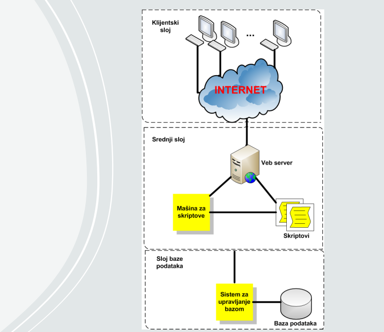
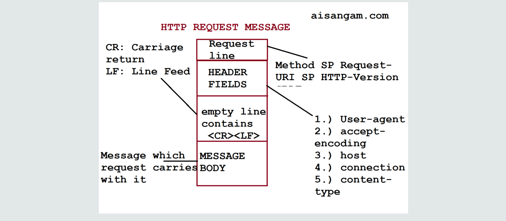
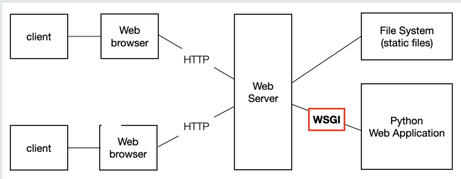
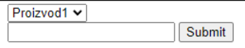

# Arhitektura troslojne veb aplikacije

Većina veb aplikacija koje rade sa bazama podataka poseduju tzv. troslojnu arhitekturu koju čine sledeći slojevi:
- klijentski sloj
- aplikacioni sloj
- sloj baze podataka



## Struktura HTTP zahteva



## Struktura URL

URL se može podeliti na tri osnovna dela:
- identifikator protokola
- identifikator ciljnog računara i servisa na njemu (port)
- putanja (koja može da sadrži još i parametre)

Struktura URL-a:
```
scheme://host:port/path?parameter=value#anchor
```

### Scheme - Identifikator protokola

Prvi deo URL-a (scheme) služi da se identifikuje aplikacioni protokol.
Najčešće korišćeni protokoli:
- `http` - HyperText Transfer Protocol (protokol za prenos hiperteksta)
- `https` - HyperText Transfer Protocol with SSL (protokol za prenos hiperteksta putem veza zaštićenim SSL protokolom)
- `ftp` - File Transfer Protocol (protokol za prenos fajlova)

### Host - Identifikator ciljnog računara

- Drugi deo URL-a (host) identifikuje ciljni računar (server).
- Host se može zadati preko imena ili kao IP adresa.
- Primeri:
  - www.w3.org
  - 18.29.1.35

### Port - Identifikator servisa na ciljnom računaru

- Treći deo URL-a (port) specifiše TCP port number i služi za identifikaciju servisa na ciljnom računaru.
- Na internetu postoji konvencija da se dobro poznati priključak koristi na serveru koji pruža dobro poznati tip usluge (HTTP server očekuje zahteve na priključku 80, FTP server na priključku 21, itd).
- TCP priključak (port) nije fizički uređaj, već identifikator koji služi TCP softveru i omogućava uspostavljanje više virtuelnih veza sa istom mašinom za različite aplikacije.

### Primeri GET parametara:

- `p1=Beograd`
- `p1=Beograd&p2=2003`

### Anchor - Identifikator fragmenta

Šesti deo URL-a (anchor) predstavlja identifikator fragmenta koji se koristi za pozicioniranje na određeno mesto u okviru dokumenta.
Ova mogućnost se koristi u slučaju velikih dokumenata.
Mesto "skoka" mora biti registrovano u okviru dokumenta.

## Sloj baze podataka

Sloj baze podataka se sastoji od sistema za upravljanje bazom podataka (Database Management System - DBMS).
DBMS omogućava:
- Čitanje podataka iz baze
- Ažuriranje podataka u bazi (unos, brisanje i izmena)

CRUD - Create, Read, Update, Delete

Organizacija prema objektima (entitetima) i odnosima koje postoje u sistemu na koji se baza podataka odnosi.
Krajnji cilj integrisanosti je minimalna redundansa (višestruko pojavljivanje) podataka.

## Veb server u Python-u

- Za implementaciju servera koristiće se WSGI (Web Server Gateway Interface) server.
- Biblioteka koja će se koristiti za ovo je `wsgiref`.

### WSGI server i wsgiref

- Prati WSGI standard specifikiran u PEP 0333
- Biblioteka `wsgiref` obrađuje zahteve sa klijentske strane i prosleđuje ih serverskoj aplikaciji koja služi za poslovnu logiku (backend)



Here is the converted GitHub Markdown (`.md`) file with Python code and explanatory comments:

# Kreiranje WSGI servera

```python
# Kreiranje WSGI servera
if __name__ == '__main__':
    # Kreiranje WSGI servera koristeći wsgiref biblioteka
    w_s = wsgiref.simple_server.make_server(
        host="localhost",  # Adresa gde se podiže server. Localhost je sinonim za lokalni server, tj. računar gde se aplikacija pokreće trenutno.
        port=8021,         # Alternativna localhost imenu je IP adresa 127.0.0.1.
        app=application    # Aplikacija koja će obraditi zahteve.
    )
    w_s.handle_request()    # Server se pokreće i prestaje da radi nakon tačno jednog primljenog HTTP zahteva.
```

```python
# Kreiranje WSGI servera
if __name__ == '__main__':
    w_s = wsgiref.simple_server.make_server(
        host="localhost",
        port=8021,
        app=application
    )
    w_s.handle_request()    # Server se pokreće i prestaje da radi nakon tačno jednog primljenog HTTP zahteva.
```

```python
# Alternativa za beskonačno servisiranje zahteva
w_s.serve_forever()  # Server radi beskonačno, odnosno dok ne bude prekinut iz nekog razloga eksplicitno.
```

# Izgled proste veb aplikacije

```python
def application(environ, start_response):
    response = b"Hello World"  # Odgovor koji će biti poslat klijentu
    status = "200 OK"          # HTTP status odgovora
    headers = [("Content-Type", "text/html")]  # HTTP zaglavlja odgovora
    start_response(status, headers)  # Poziv start_response funkcije sa statusom i zaglavljima
    return [response]  # Povratna vrednost funkcije, HTTP telo odgovora u vidu niza bajtova
```

- Svaka WSGI aplikacija mora da ima tačno dva parametra:
  - `environ` – Environment Dictionary, gde stoje sve bitne informacije o HTTP zahtevu
  - `start_response` – Callback funkcija koja se obavezno zove da bi se ispravno izgenerisao HTTP odgovor

- Poziv `start_response` funkcije, koja prima dva argumenta: 
  - status HTTP odgovora (`status`), i 
  - zaglavlja HTTP odgovora (`headers`)

- Status označava informaciju servera klijentu o “vrsti” HTTP odgovora, odnosno kako klijent treba da ga protumači

## HTTP statusi

Propisana je konvencija značenja statusnih kodova po RFC 9110, gde su odgovori grupisani u pet klasa: 
- Informational responses (statusi 100-199)
- Successful responses (statusi 200-299)
- Redirection messages (statusi 300-399)
- Client error responses (statusi 400-499)
- Server error responses (statusi 500-599)

## HTTP konkretne vrednosti statusa

Od interesa će biti samo nekoliko statusnih kodova odgovora, a to su (detaljnije na linku):
- `200 OK` – Zahtev je uspešno procesiran
- `404 Not Found` – Server ne može da pronađe zahtevani resurs (Zahtevana je nepostojeća slika npr.)
- `500 Internal Server Error` – Server je naišao na grešku koju ne zna kako da obradi (najčešće je došlo do greške u kodu, tj. implementaciji)

```python
headers = [("Content-Type", "text/html")]  # HTTP odgovor ima različite vrste zaglavlja koji se definiše u vidu niza Tuple-ova sa tačno dve vrednosti: prva je samo zaglavlje koje se definiše, a drugo vrednost
```

### Izgled proste veb aplikacije

```python
def application(environ, start_response):
    response = b"Hello World"  # HTTP telo odgovora, u vidu niza bajtova
    status = "200 OK"  # HTTP status odgovora
    headers = [("Content-Type", "text/html")]  # HTTP zaglavlja odgovora
    start_response(status, headers)  # Poziv start_response funkcije sa statusom i zaglavljima
    return [response]  # Povratna vrednost funkcije u vidu niza bajtova. U ovom primeru se vraća HTML stranica sa "Hello World" sadržajem.
```


# Izgled malo naprednije, ali opet proste veb aplikacije

```python
def application(environ, start_response):
    # Dobijanje putanje iz zahteva
    path = environ["PATH_INFO"]
    
    # Provera da li je putanja korena (root)
    if path == "/":
        # Učitavanje sadržaja index.html fajla
        with open("index.html", "r") as f:
            response = f.read().encode()
        status = "200 OK"
    else:
        # Vraća se stranica sa informacijom o greški za sve ostale putanje
        response = b"<h1>Not Found</h1><p>Entered path not found</p>"
        status = "404 Not Found"
    
    headers = [
        ("Content-Type", "text/html"),
        ("Content-Length", str(len(response)))
    ]
    start_response(status, headers)
    return [response]

# Radi lakše implementacije, učitan je sadržaj same stranice iz fajla i prebačen u niz bajtova
# Pod ključem PATH_INFO stoji informacija o putanji (ruti) koju klijent zahteva na serveru.
```

- `if path == "/"`: Možemo onda proverom da vidimo da li je korena putanja u pitanju, i samo u tom slučaju da vratimo sadržaj `index.html` stranice.
- `response = b"<h1>Not Found</h1><p>Entered path not found</p>"`: U slučaju bilo koje druge zahtevane rute (/aa npr), vratiće se stranica sa informacijom o greški. I status će biti 404, jer ne postoji zaista zahtevani resurs na toj putanji.

## Primer forme u index.html stranici

```html
<form action="/results" method="post">
    <select name="proizvodi">
        <option value="p1">Proizvod1</option>
        <option value="p2">Proizvod2</option>
    </select>
    <br>
    <input type="number" name="broj">
    <input type="submit" value="Dodaj proizvod">
</form>
```



- `action="/results"`: Ruta na serveru koja se gađa (u ovom slučaju `http://localhost:8021/results`).
- `method="post"`: Način (metod) kako se prosleđuju podaci u HTTP zahtevu. Postoje dve osnovne vrste: GET i POST.

## HTTP GET i POST zahtevi

U zavisnosti od toga da li je za HTTP zahtev specificirano da li je GET ili POST zavisi kako će se prosleđivati parametri serveru (u ovom slučaju oni uneti u formi).
- Ako je GET – prosleđuju se kroz URL serveru (npr. `http://localhost:8021/results?proizvodi=p1&broj=1`)
- Ako je POST – prosleđuju se kroz telo HTTP zahteva (npr. telo zahteva će imati sadržaj: `proizvodi=p1&broj=1`)

### Ostali HTTP metodi

Osim ove dve vrste, HTTP još nekoliko različitih vrsta metoda:
- CONNECT, DELETE, HEAD, OPTIONS, PATCH, PUT, TRACE
- Uglavnom rade slično kao POST metod i imaju samo semantičku razliku

### GET vs POST

Kada koristiti koji?
- GET koristiti za situacije gde se šalje manje podataka serveru, jer je dužina URL-a limitirana, za razliku od tela HTTP zahteva
- POST koristiti kad se šalje veliki broj podataka (uglavnom forme) i kada se šalju poverljive informacije (lozinke npr.)

## Naprednija aplikacija koja obrađuje POST zahteve

```python
def application(environ, start_response):
    path = environ["PATH_INFO"]
    method = environ["REQUEST_METHOD"]
    
    if method == "POST":
        request_body_size = int(environ['CONTENT_LENGTH'])
        request_body_raw = environ['wsgi.input'].read(request_body_size).decode('utf-8')
        request_body = dict(re.findall(r'([^=.]+)=([^=.]+)(?:&|$)', request_body_raw))
        
        # Obrada POST podataka...
    
    # Ključ pod kojim se na serveru dohvata informacija o metodu HTTP zahteva
    # Međutim, to se prosleđuje kao niz bajtova, pa je zato neophodno znati koliko bajtova je potrebno pročitati.
```

# Napredni primer web aplikacije

```python
import re

def application(environ, start_response):
    path = environ["PATH_INFO"]
    method = environ["REQUEST_METHOD"]

    if method == "POST":
        # Čitanje veličine tela zahteva
        request_body_size = int(environ['CONTENT_LENGTH'])
        # Čitanje sirovih podataka tela zahteva
        request_body_raw = environ['wsgi.input'].read(request_body_size).decode('utf-8')
        # Konvertovanje sirovih podataka tela zahteva u rečnik
        request_body = dict(re.findall(r'([^=.]+)=([^=.]+)(?:&|$)', request_body_raw))
        
        # Mapiranje ruta na HTML fajlove
        routes = {
            '/': "index.html",
            '/results': "results.html"
        }
        
        try:
            # Učitavanje odgovarajućeg HTML fajla za traženu putanju
            with open(routes[path], "r") as f:
                response = f.read().encode()
            status = "200 OK"
        except KeyError:
            # Obrada slučaja gde tražena putanja nije pronađena
            response = b"<h1>Not Found</h1><p>Entered path not found</p>"
            status = "404 Not Found"

        headers = [
            ("Content-Type", "text/html"),
            ("Content-Length", str(len(response)))
        ]
        start_response(status, headers)

        if path == '/results':
            # Priprema podataka za stranicu rezultata
            data = dict()
            data['proizvod'] = request_body['proizvodi']
            data['num'] = request_body['broj']
            response = response.format(**data).encode()
        
        return [response]

# Konvertovanje sirovog tela zahteva u rečnik
# Korišćenje regex-a za izdvajanje parova ključ-vrednost iz stringa tela zahteva
request_body = dict(re.findall(r'([^=.]+)=([^=.]+)(?:&|$)', request_body_raw))
# Regex izdavaja stringove pre i posle '=' i razdvaja ih '&' ili krajem stringa.
# Ovo će biti svi parovi polja u formi i njihovih vrednosti.
# Primer: 'proizvodi=p1&broj=1' prevodi se u {'proizvodi': 'p1', 'broj': '1'}
```

## Mapiranje Ruta i Služenje HTML Fajlova

1. **Mapiranje rute i stranice koja se vraća korisniku**:
2. **Dinamičko generisanje HTML sadržaja na osnovu parametara**:

```python
try:
    with open(routes[path], "r") as f:
        response = f.read().encode()
    status = "200 OK"
except KeyError:
    response = b"<h1>Not Found</h1><p>Entered path not found</p>"
    status = "404 Not Found"

headers = [
    ("Content-Type", "text/html"),
    ("Content-Length", str(len(response)))
]
start_response(status, headers)
return [response]

# Učitavanje HTML sadržaja iz fajla dinamički i integrisanje prosleđenih parametara.
# Obrada ruta i odgovarajućih HTML fajlova korišćenjem rečnika.
routes = {
    '/': "index.html",
    '/results': "results.html"
}
```

## Dinamičko Ubacivanje Sadržaja u HTML

- **Ukoliko ne postoji ključ u routes-u, dešava se izuzetak**:
- **Sadržaj ne treba učitavati predefinisano kao ovde iz fajla, već nekako “uglaviti” prosleđene parametre**:

```python
response = response.format(**data)
# 'data' argument predstavlja sadržaj u formi rečnika koji treba da se prosledi stringu koji se formatira (u ovom slučaju, HTML stranici).
```

## Primer HTML Stranice (results.html)

```html
<!DOCTYPE html>
<html lang="en">
    <head>
        <meta charset="UTF-8">
        <title>Results</title>
    </head>
    <body>
        <h1>Second Page! {proizvod} </h1>
        <p> Number: {num} </p>
    </body>
</html>
```

- **Stvari koje stoje u `{ }` su zamišljene da budu zamenjene odgovarajućim vrednostima prosleđenog rečnika putem format metode**:

```python
data = dict()
data['proizvod'] = request_body['proizvodi']
data['num'] = request_body['broj']
response = response.format(**data)

# Priprema rečnika na osnovu strukture results.html
# Ključevi 'proizvod' i 'num' moraju biti obezbeđeni u rečniku za formatiranje.
```

